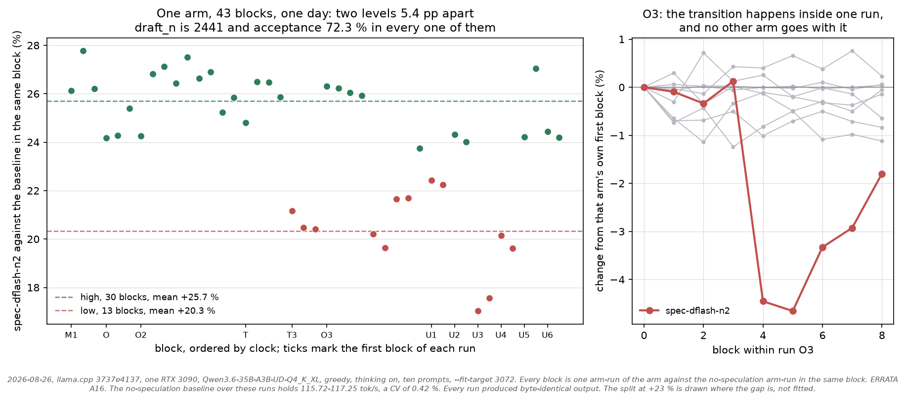

# ERRATA — audit of 2026-08-25

This file lists every claim in this repository that the 2026-08-25 audit found
to be wrong, unsupported, or materially misleading, together with the evidence
that settles it. Nothing in `results/`, `v2_3090_followup/`, or
`v3_dflash_2026_05_07/data/` was edited: the raw measurements stand, and every
item below is derived from files that were already committed. What changed is
the wording, the statistics, and the causal claims built on top of them.

Reproduce the numeric items with:

```bash
python analysis/plot.py                 # request-mean, pooled, median, activation
python analysis/verbose_accounting.py   # the acceptance-counter reconstruction
```

Severity: **A** changes the headline conclusion · **B** changes the reported
statistics · **C** is a naming or scope defect · **D** invalidates a follow-up
experiment's stated treatment · **E** is a theory error · **F** is metadata.

---

<!-- A contents block, because these documents are linked into by section name from each other and a reader arriving cold had no way to orient but to scroll. Generated from the headings; `analysis/check_links.py` validates every anchor here, so a heading renamed without this list fails the static job rather than rotting quietly. -->

## Contents

- [A — findings that change the headline conclusion](#a--findings-that-change-the-headline-conclusion)
  - [A1. "100 % draft acceptance" is a counter artefact, not a measurement](#a1-100--draft-acceptance-is-a-counter-artefact-not-a-measurement)
  - [A2. The draft model was not vocabulary-compatible; the run used the token-translation fallback](#a2-the-draft-model-was-not-vocabulary-compatible-the-run-used-the-token-translation-fallback)
  - [A3. The tested build had a known-broken speculative path for this model class, and the fix was never merged](#a3-the-tested-build-had-a-known-broken-speculative-path-for-this-model-class-and-the-fix-was-never-merged)
  - [A4. A measured cost decomposition was in the repository the whole time and was never used](#a4-a-measured-cost-decomposition-was-in-the-repository-the-whole-time-and-was-never-used)
  - [A5. Three quarters of v1's requests returned no answer at all — only truncated thinking](#a5-three-quarters-of-v1s-requests-returned-no-answer-at-all--only-truncated-thinking)
  - [A7. With acceptance measured properly, there is no anomaly left to explain](#a7-with-acceptance-measured-properly-there-is-no-anomaly-left-to-explain)
  - [A8. The audit's own matrix has an uncontrolled difference from the archive: p_min](#a8-the-audits-own-matrix-has-an-uncontrolled-difference-from-the-archive-p_min)
  - [A10. The single-regressor law is falsified out of sample, and p_min is the lever that matters](#a10-the-single-regressor-law-is-falsified-out-of-sample-and-p_min-is-the-lever-that-matters)
  - [A9. Upstream already documents two of the mechanisms this audit "found"](#a9-upstream-already-documents-two-of-the-mechanisms-this-audit-found)
  - [A6. llama-server plus a draft model aborts on this model at bcb5eeb64](#a6-llama-server-plus-a-draft-model-aborts-on-this-model-at-bcb5eeb64)
  - [A11. Speculative decoding is not output-preserving on this build, and the engine is deterministic enough to prove it](#a11-speculative-decoding-is-not-output-preserving-on-this-build-and-the-engine-is-deterministic-enough-to-prove-it)
  - [A12. What the checkpoint path costs, measured with timers in the source](#a12-what-the-checkpoint-path-costs-measured-with-timers-in-the-source)
  - [A13. There are two acceptance counters, they disagree, and the disagreement is exactly the checkpoint path](#a13-there-are-two-acceptance-counters-they-disagree-and-the-disagreement-is-exactly-the-checkpoint-path)
  - [A14. Within-run repeats are not an error bar](#a14-within-run-repeats-are-not-an-error-bar)
  - [A15. The recorded server_sha256 was a launcher, not the code that ran](#a15-the-recorded-server_sha256-was-a-launcher-not-the-code-that-ran)
  - [A16. Two runs, identical in every recorded respect and byte-identical in output, differ by 3.4 % on one arm](#a16-two-runs-identical-in-every-recorded-respect-and-byte-identical-in-output-differ-by-34--on-one-arm)
  - [A17. The thinking-off comparisons are not comparisons of the same amount of work](#a17-the-thinking-off-comparisons-are-not-comparisons-of-the-same-amount-of-work)
  - [A18. Run C's spread claim excluded five arms without saying so](#a18-run-cs-spread-claim-excluded-five-arms-without-saying-so)
  - [A19. How much of what this repository publishes would notice if it were wrong](#a19-how-much-of-what-this-repository-publishes-would-notice-if-it-were-wrong)
- [B — statistics that were reported incorrectly](#b--statistics-that-were-reported-incorrectly)
  - [B1. mean tok/s was the request-mean only; pooled throughput is materially worse](#b1-mean-toks-was-the-request-mean-only-pooled-throughput-is-materially-worse)
  - [B2. The ± column was across-prompt spread, not repeated-run uncertainty](#b2-the--column-was-across-prompt-spread-not-repeated-run-uncertainty)
  - [B3. "all completions reach the cap" is false for the 1000-token variants](#b3-all-completions-reach-the-cap-is-false-for-the-1000-token-variants)
  - [B4. "every configuration hits a bimodal tail reaching as low as 59–67 tok/s" is false](#b4-every-configuration-hits-a-bimodal-tail-reaching-as-low-as-5967-toks-is-false)
  - [B5. "the regression is entirely bimodal by prompt class" is false for the ngram-mod family](#b5-the-regression-is-entirely-bimodal-by-prompt-class-is-false-for-the-ngram-mod-family)
  - [B6. "19-config speculative-decoding matrix" overstates the denominator](#b6-19-config-speculative-decoding-matrix-overstates-the-denominator)
  - [B7. The fp16-KV row is a one-sided control — now closed by measurement](#b7-the-fp16-kv-row-is-a-one-sided-control--now-closed-by-measurement)
  - [B8. Every request-mean here counts one token fewer than it timed](#b8-every-request-mean-here-counts-one-token-fewer-than-it-timed)
  - [B9. The checkpoint restore share was published as 30.5 %, and it is 30.4 %](#b9-the-checkpoint-restore-share-was-published-as-305--and-it-is-304-)
- [C — artefact and scope naming](#c--artefact-and-scope-naming)
  - [C1. The target quantisation is UD-Q4_K_XL, not Q4_K_M](#c1-the-target-quantisation-is-ud-q4_k_xl-not-q4_k_m)
  - [C2. The zh_cn prompt is Traditional Chinese](#c2-the-zh_cn-prompt-is-traditional-chinese)
  - [C3. multi_turn_1 / multi_turn_2 are not multi-turn](#c3-multi_turn_1--multi_turn_2-are-not-multi-turn)
  - [C4b. "Stock clocks" was measured once, before the load](#c4b-stock-clocks-was-measured-once-before-the-load)
  - [C4. GPU 0 was running another workload](#c4-gpu-0-was-running-another-workload)
- [D — follow-up experiments whose stated treatment was not applied](#d--follow-up-experiments-whose-stated-treatment-was-not-applied)
  - [D1 / D2. -no-cnv was rejected and /no_think did not disable thinking](#d1--d2--no-cnv-was-rejected-and-no_think-did-not-disable-thinking)
  - [D3. Exp 2 cannot be audited, so it cannot refute anything](#d3-exp-2-cannot-be-audited-so-it-cannot-refute-anything)
  - [D3b. Workload shape does matter — and Exp 2 pointed the wrong way](#d3b-workload-shape-does-matter--and-exp-2-pointed-the-wrong-way)
  - [D4. v3 DFlash compares two different binaries](#d4-v3-dflash-compares-two-different-binaries)
  - [D5. The committed v2 script does not produce the committed v2 directories](#d5-the-committed-v2-script-does-not-produce-the-committed-v2-directories)
  - [D6. --spec-type is not "missing from master"; it is server-only](#d6---spec-type-is-not-missing-from-master-it-is-server-only)
- [E — theory errors](#e--theory-errors)
  - [E1. The coverage threshold is 95, and it is a heuristic](#e1-the-coverage-threshold-is-95-and-it-is-a-heuristic)
  - [E2. Qwen3.5-122B-A10B has the same routing, so the same threshold](#e2-qwen35-122b-a10b-has-the-same-routing-so-the-same-threshold)
  - [E3. PR #20075 is not "the same ngram-mod machinery", and is not srogmann's](#e3-pr-20075-is-not-the-same-ngram-mod-machinery-and-is-not-srogmanns)
- [F — metadata](#f--metadata)
  - [F1. Upstream statuses, checked 2026-08-25 via the GitHub API](#f1-upstream-statuses-checked-2026-08-25-via-the-github-api)
  - [F2. "Cross-validated on current master bcb5eeb64"](#f2-cross-validated-on-current-master-bcb5eeb64)
  - [F3. "first public benchmark / first public datapoint"](#f3-first-public-benchmark--first-public-datapoint)
  - [F4. Licence conflict](#f4-licence-conflict)
  - [F5. The reproduce section could not reproduce the result](#f5-the-reproduce-section-could-not-reproduce-the-result)
- [What the audit did not change](#what-the-audit-did-not-change)

## A — findings that change the headline conclusion

### A1. "100 % draft acceptance" is a counter artefact, not a measurement

**Claimed.** v1 README: "every tested config returning **100 % acceptance** …
the classical intuition 'high acceptance → high speedup' fails here. This is
not a measurement artifact; it is MoE expert-loading overhead on every drafted
token." v2 SUMMARY: "100 % `n_acc_tokens / n_gen_tokens` is genuine. Verified
by source read of `common/speculative.cpp` … and a `--verbose` run emitting
`draft acceptance rate = 1.00000 (115 accepted / 115 generated)`."

**Actual.** The ratio is 1.0 by construction for this model on this build. In
`tools/server/server-context.cpp` at commit `97895129e`, the per-request
counters are updated *after* an early `continue`:

```cpp
// check for partial draft acceptance
if (accepted.size() < slot.spec_draft.size() + 1) {
    if (slot.ctx_seq_rm_type == COMMON_CONTEXT_SEQ_RM_TYPE_FULL) {
        slot.spec_draft = std::move(accepted);      // truncate to the accepted prefix
        ... llama_state_seq_set_data_ext(...) ...   // restore the checkpoint
        continue;                                   // <-- counters never reached
    }
}
common_speculative_accept(slot.spec.get(), accepted.size() - 1);
...
slot.n_draft_accepted += ids.size() - 1;            // only full accepts land here
slot.n_draft_total    += n_draft;
```

Qwen3.6-35B-A3B is a hybrid Gated-DeltaNet / MoE model, so
`common_context_can_seq_rm()` returns `COMMON_CONTEXT_SEQ_RM_TYPE_FULL`. The
committed log records exactly that:

```
common_context_can_seq_rm: the target context does not support partial sequence removal
```
`v2_3090_followup/v2_oleg_suggestions/verbose.log:2758`

Every partially accepted round therefore takes the `continue`, is dropped from
both numerator and denominator, and is re-verified next pass against the
truncated, already known-accepted, prefix. Only rounds accepted in full ever
reach the counter, so `draft_n_accepted / draft_n` can only be 1.0.

**The same log contradicts the headline on the very next line.** The drafter
keeps its own counters:

```
draft acceptance rate = 1.00000 (  115 accepted /   115 generated)
statistics draft: #calls(b,g,a) = 1 82 33, #gen drafts = 81, #acc drafts = 33,
                  #gen tokens = 214, #acc tokens = 115, dur(b,g,a) = 0.001, 999.634, 0.005 ms
```
`verbose.log:8841-8842`

| counter | value | meaning |
|---|---:|---|
| server `draft_n_accepted / draft_n` | **115 / 115 = 100.0 %** | tokens re-verified after truncation to the accepted prefix |
| drafter `#acc tokens / #gen tokens` | **115 / 214 = 53.7 %** | true token-level acceptance |
| drafter `#acc drafts / #gen drafts` | **33 / 81 = 40.7 %** | true draft-sequence acceptance |

Round-level accounting over the same run, every quantity cross-checked against
an independent path in the log:

| quantity | value | independent check |
|---|---:|---|
| drafts generated | 81 (214 tokens) | `called impl` log lines = `#gen drafts`; sum of `gen=` = `#gen tokens` |
| dropped by `--draft-min 2` before any verification | 49 drafts (48 tokens) | 1 empty + 48 of size 1; 82 generate calls - 49 = 33 |
| reached verification as a fresh draft | 33 drafts (166 tokens) | 214 - 48 = 166 |
| verification attempts | 53 | 33 fresh + 20 re-verifies |
| partially accepted -> discarded and redone | 20 | equals the checkpoint-restore count |
| longest verify chain | 2 | no draft needed more than one re-verification |
| server counter | 115 / 115 | sum of `n_draft` over the 33 fully accepted rounds |

Three separate derivations close on the same numbers, so the reconstruction is
not an inference: 130 (partial proposals) + 36 (first-try-full) = 166 tokens
reaching verification, and 79 (re-verified) + 36 = 115 reaching the counter.

**Consequence.** `draft_n` in `analysis/summary.csv` is not "draft tokens
generated". It is "draft tokens in verification rounds that were accepted in
full", a quantity guaranteed to equal `draft_n_accepted`. A row with `draft_n =
0` means "no fully accepted round was recorded", **not** "speculation did not
run". Every "100 %" in the v1/v2/v3 write-ups has been removed or relabelled,
and `analysis/plot_accept_vs_speed.png` (whose entire x-axis was that artefact,
with all 140 points at exactly 100 %) has been deleted and replaced by
`analysis/plot_acceptance_accounting.png`.

**Upstream fixed this, and the audit's post-merge acceptance figures rest on
the fix.** Every acceptance percentage this audit reports from master — 29.7 %
for `spec-draft-n8`, 55.8 % for `spec-dflash-n4` — would be meaningless if the
same tautology were still in place, so the counter path was read at the tested
commit `3737e4137` rather than assumed to have changed:

| | `97895129e` (v1) | `3737e4137` (audit) |
|---|---|---|
| denominator | after the early `continue` | `server-context.cpp:2939`, at draft **generation** |
| numerator | after the early `continue` | `server-context.cpp:3859`, with a replay correction |
| replayed tokens | re-entered both counters | excluded from the denominator |

The partial-accept branch still returns early (`:3835`) (a hybrid target still
cannot roll back part of a sequence) but the denominator no longer lives behind
it. `slot.stats.n_draft_tokens += draft.size()` runs when the draft is
*produced*, and a slot replaying a truncated draft never reaches that line,
because `drafting.push_back(&slot)` at `:2921` sits inside the `else` of `if
(!slot.spec_draft.empty())` at `:2893`. The numerator then subtracts one on a
replay (`:3851`) so the token carried over from the truncated draft is not
counted twice.

Worked through: a round drafts 8 tokens and 3 are accepted. The denominator
takes all 8 at generation; the partial branch truncates and returns without
touching the numerator; the replay round re-verifies the 4-token remainder,
reaches the numerator with `n_accepted = 4`, decrements to 3 for the replay, and
the ratio is 3/8. That is the honest quantity, and it is why master reports
values like 29.7 % where `97895129e` could only ever report 1.00000.

**That fix is narrower than it looks, and [A13](#a13-there-are-two-acceptance-counters-they-disagree-and-the-disagreement-is-exactly-the-checkpoint-path)
measures how narrow.** The denominator moved; the early return did not. A round
that takes the checkpoint branch still leaves the numerator alone, so on paths
where that branch fires the server counter under-counts: by 11.6 pp for
`spec-draft-n8`, by 53.3 pp for `ngram-map-k4v-m8`. Where it never fires, at
every DFlash and MTP arm measured here, the server counter and the drafter's
own counter agree to within 0.5 pp across 31 arm-runs.

---

### A2. The draft model was **not** vocabulary-compatible; the run used the token-translation fallback

**Claimed.** Everywhere: "classic draft with the **vocab-matched**
`Qwen3.5-0.8B` (vocab 248320)", "correct-vocab classic SD".

**Actual.** The vocabulary *sizes* match: `Qwen/Qwen3.6-35B-A3B`
`text_config.vocab_size = 248320` and `Qwen/Qwen3.5-0.8B`
`text_config.vocab_size = 248320`, both verified against the model cards. But
llama.cpp's compatibility test is stricter, and it fails:

```
common_speculative_are_compatible: vocab_type tgt: 1
common_speculative_are_compatible: vocab_type dft: 1
common_speculative_are_compatible: draft model special tokens must match target model to use speculation
vocab_cmpt = 0
the target and draft vocabs are not compatible - tokens will be translated between the two
```
`v2_3090_followup/v2_oleg_suggestions/verbose.log:2759-2763`

The check that fails is the special-token gate in
`common/speculative.cpp:69-77` (`add_bos` / `add_eos` / `bos` / `eos`), which
runs *before* the size and per-token-text checks. llama.cpp then enables the
translation path, visible per drafting round as

```
draft: main->draft detokenized string: '<|im_start|>user …'
```

so every speculation round detokenises the context to a string and re-tokenises
it for the draft model.

**Root cause, established 2026-08-25.** The two tokenizers are identical: same
`tokenizer.ggml.model = gpt2`, same `pre = qwen35`, same 248320 tokens, same
247587 merges, same `eos_token_id = 248046`, same `padding_token_id = 248055`.
Exactly one key differs, and it is one the draft GGUF does not have at all:

| | target `UD-Q4_K_XL` | draft `0.8B-Q4_K_M` |
|---|---|---|
| `tokenizer.ggml.bos_token_id` | `248044` | **absent** |
| `tokenizer.ggml.add_bos_token` | `false` | absent (default `false`) |
| BOS as resolved by llama.cpp | `248044 '<\|endoftext\|>'` | **`11 ','`** |

`Qwen/Qwen3.5-0.8B` has **no `generation_config.json` upstream**, HTTP 404 on
both the Qwen and unsloth repos, so `convert_hf_to_gguf.py` had no
`bos_token_id` to write. `src/llama-vocab.cpp:1838` then supplies the
hard-coded GPT-2 legacy default `special_bos_id = 11`, and the KV loop at line
2313 never overrides it. Meanwhile **both** models declare `bos_token = None`
and `add_bos_token = false` in their upstream `tokenizer_config.json`, so
neither ever prepends a BOS token. The field that gates speculation is one that
neither model uses when tokenising.

Of the gate's four conditions, exactly one fails:

| condition | target | draft | |
|---|---|---|---|
| `llama_vocab_get_add_bos` | false | false (default) | pass |
| `llama_vocab_get_add_eos` | false (default) | false (default) | pass |
| `llama_vocab_bos` | 248044 | **11** | **fail** |
| `llama_vocab_eos` | 248046 | 248046 | pass |

Adding `--override-kv tokenizer.ggml.bos_token_id=int:248044` at load time (no
file edit, and a no-op for the target, which already carries that value) flips
`vocab_cmpt` from `0` to `1` and removes the warning. That also proves the two
token arrays are byte-identical, because the gate's per-token text comparison
from id 5 to 248320 runs only once the special-token check passes.

**Does it explain the slowdown? Tested, and no.** A same-binary, same-file A/B
on 2026-08-25 (`llama-server` @ `bcb5eeb64`, `--draft-max 8 --draft-min 4`,
greedy, the ten v1 prompts, ABBA-ordered, three arms interleaved):

> **`request-mean` is llama.cpp's own `predicted_per_second`, averaged.** That field divides `n − 1` generated tokens by the time for `n`, in 30 300 of 30 344 committed request rows, so every request-mean here is low by `(n − 1) / n`: 0.33 % at 300 tokens and more at shorter lengths. It is uniform across arms on a run where every request hits the same cap, and it is NOT uniform where the arms stop at different lengths, so it must not carry a cross-arm comparison in the thinking-off runs. Every headline figure and every published delta is a **pooled** rate computed from `predicted_n` and `predicted_ms` directly and contains none of this. See [B8](#b8-every-request-mean-here-counts-one-token-fewer-than-it-timed).

| binary | arm | request-mean | drafted / accepted |
|---|---|---:|---|
| `bcb5eeb64` | translation fallback, as published | 113.9 | 194 / 194 |
| `bcb5eeb64` | matched via `--override-kv` | 113.5 | 194 / 194 |
| master `3737e4137` | translation fallback | 33.6 | 16590 / 4926 |
| master `3737e4137` | matched via `--override-kv` | 33.7 | 16590 / 4926 |

The drafted and accepted totals are **byte-identical** across arms on both
binaries, per prompt as well as in aggregate (`154/576`, `140/647`, `211/404`,
…). Throughput differs by +0.2 % pooled over both binaries, and from
−2.2 % to +3.7 % across the sixteen (binary, prompt) cells: noise. The
translation path was not changing what got drafted. Full data:
[`v4_audit_2026_08_25/`](v4_audit_2026_08_25/).

**Consequence.** The repository's "vocab-matched" and "correct-vocab classic
SD" claims were false and have been removed; vocabulary *size* equality was
treated as proof of compatibility, and it is not. But the negative finding
survives the fix, and is now measured on a genuinely matched path, which makes
it stronger rather than weaker.

---

### A3. The tested build had a known-broken speculative path for this model class, and the fix was never merged

The `COMMON_CONTEXT_SEQ_RM_TYPE_FULL` fallback in A1 is not incidental. The
same string ("the target context does not support partial sequence removal") is
the symptom llama.cpp PR #20075 was opened to fix. From its body:

> Speculative decoding on hybrid SSM/MoE models is broken right now. With a
> draft model you either crash immediately ("the target context does not
> support partial sequence removal") or end up with garbage loops. … On top of
> that, `llama_memory_recurrent` has no rollback mechanism at all for the SSM
> state when draft tokens get rejected, which is what causes the state drift.

PR #20075 was **closed without merge on 2026-04-25**. The README described it
as a peripheral "may change these numbers" note and, at v3, still labelled it
`OPEN`. It is in fact the most relevant upstream item to this benchmark: the
measured configuration is the pre-fix state of a path its author considered
broken for exactly this model family.

---

### A4. A measured cost decomposition was in the repository the whole time and was never used

`verbose.log` carries a per-run breakdown that bounds the draft-side cost
directly, without any appeal to MoE expert-union theory. For the
`--draft-min 2 --draft-max 32` run on prompt 1, 200 generated tokens at the
reported 63.2 tok/s (≈ 3165 ms of generation):

| term | value | source |
|---|---:|---|
| drafter `generate()` time | **999.6 ms ≈ 31.6 % of generation wall-clock** | `dur(b,g,a)` field |
| speculative checkpoints created | 33 × 62.8 MiB = **2.02 GiB written** | `created speculative checkpoint` |
| checkpoints restored after a partial accept | 20 = **1.23 GiB read back** | `restoring speculative checkpoint` |
| verification rounds thrown away and redone | **20 of 53 (37.7 %)** | round accounting |

Roughly a third of the generation wall-clock is the draft model alone, and
about 38 % of verification rounds are paid for twice. These terms account for
the observed slowdown without invoking expert-union loading. They do not rule
that mechanism out, nothing here measures expert routing, but the repository
previously presented the expert-union story as the explanation while this
decomposition sat unread in its own committed log.

---

### A5. Three quarters of v1's requests returned no answer at all — only truncated thinking

`bench_runner.py` stored `content[:120]` and nothing else. Re-reading that field
during the audit shows it is **empty for 144 of the 190 v1 requests (75.8 %)**:

| prompt | requests with empty `message.content` |
|---|---|
| `reasoning` | **19 / 19** |
| `code_small` | **19 / 19** |
| `short_q`, `medium_chat`, `medium_rec`, `long_explain`, `multi_turn_1`, `multi_turn_2`, `zh_cn` | 15 / 19 each |
| `short_greet` | 1 / 19 |

With `--jinja` and a reasoning model, llama-server routes `<think>` content to
`message.reasoning_content` and the answer to `message.content`. An empty
`content` with `predicted_n == 300` means the cap was reached **inside the
thinking block**. v1 never captured `reasoning_content`, so this was invisible.

The two prompts carrying the entire published slow tail, `code_small` and
`reasoning`, are 19/19 thinking-only. v1 therefore measured decode throughput
on truncated chain-of-thought traces, not on answers, and the "structured
prompts collapse" narrative is really "the drafter matched inside a long
reasoning trace". v1 never attempted to disable thinking; v2, v3 and Exp 2
attempted it and failed (D1/D2). The defect is common to all four experiments.

### A7. With acceptance measured properly, there is no anomaly left to explain

This repository's central claim was an *anomaly*: 100 % acceptance yet slower,
therefore something MoE-specific must be destroying the speedup. Upstream has
since made the partial-accept path reachable, so the counter now reports real
ratios, and the anomaly disappears.

**The contrast matters, so name it.** Two different comparisons are available
and they point in opposite directions. Reporting either without saying which
one it is would repeat the mistake this audit exists to correct.

**Contrast 1: within one configuration, across prompts.** Prompts the drafter
predicts well run faster, almost exactly in proportion. On post-merge master
`3737e4137`, five repeats of a thirteen-arm matrix, every draft-model
configuration reproduces this independently:

| configuration | Pearson r | acceptance range across prompts |
|---|---:|---|
| `--spec-draft-n-max 1` | **+0.998** | 55.7 – 83.2 % |
| `--spec-draft-n-max 2` | **+0.999** | 49.8 – 77.9 % |
| `--spec-draft-n-max 4` | **+0.996** | 34.4 – 65.8 % |
| `--spec-draft-n-max 8` | **+0.999** | 20.4 – 52.2 % |
| `--spec-draft-n-max 16` | **+0.999** | 9.8 – 32.3 % |
| `--spec-draft-n-max 32` | **+0.999** | 5.2 – 15.7 % |
| v1's configuration (max 8, min 4) | **+0.999** | 20.4 – 52.2 % |

**Six distinct draft lengths**, spanning acceptance from 5 % to 83 %, all at r
≥ +0.996. The seventh row is not an independent configuration and should not be
counted as one: v1's setting differs from `n_max 8` only in `n_min`, and at
this draft length that changes almost nothing, 32.27 against 32.10 pooled
tok/s, 29.69 % against 29.67 % acceptance, and three of ten prompts drafting a
byte-identical number of tokens. What it does establish is that `n_min` is not
the knob that matters here.

A control makes the correlation harder to explain away: with no speculation the
prompt barely affects speed at all. `baseline` spans **122.1 – 123.8 tok/s
across the ten prompts, a 1.4 % total spread**, so the large per-prompt
variation inside every speculative arm is driven by speculation rather than by
some prompts being intrinsically faster to decode.

**Contrast 2: across configurations.** Here the sign flips: r = **−0.544** over
the eleven speculative arms. That is not a contradiction, it is a different
question. A configuration that drafts aggressively achieves *higher* acceptance
per attempt while paying for far more drafted tokens, so across methods the
total cost dominates. Draft volume against speed gives r = −0.603, and the
ordering makes the mechanism plain:

| arm | draft tokens per generated token | pooled tok/s | acceptance |
|---|---:|---:|---:|
| ngram-simple | 0.06 | 118.1 | 4.3 % |
| ngram-mod n=24 | 0.21 | 115.0 | 4.8 % |
| ngram-cache | 0.42 | 74.0 | 1.8 % |
| draft model, n_max 1 | 0.50 | 31.1 | 68.7 % |
| draft model, n_max 8 | 1.85 | 32.1 | 29.7 % |
| draft model, n_max 32 | 6.84 | 17.3 | 8.0 % |

Note the fourth row. An external draft model proposing **0.50** tokens per
generated token runs at 31.1 tok/s, while ngram-cache proposing **0.42** runs
at 74.0. Volume alone does not explain that, so there is a third term: the
**per-round cost of the method itself**. An external 0.8 B drafter needs a
forward pass every round; an ngram lookup is nearly free.

**The honest model therefore has three terms**, not one: the fixed per-round
cost of the drafting method, the volume of tokens drafted, and the fraction of
that work accepted. Within a fixed method and draft length, acceptance predicts
speed almost perfectly. Across methods it does not, because the other two terms
change.

**The draft-length sweep is not monotone.** Sweeping `--spec-draft-n-max` with
`n_min` pinned to 1 and matched vocabulary:

| n_max | pooled tok/s | vs baseline | drafted | acceptance |
|---:|---:|---:|---:|---:|
| 1 | 31.1 | −74.8 % | 7 450 | 68.7 % |
| 2 | 34.2 | −72.2 % | 11 070 | 60.3 % |
| **4** | **35.6** | **−71.1 %** | 16 855 | 45.4 % |
| 8 | 32.1 | −74.0 % | 27 735 | 29.7 % |
| 16 | 23.7 | −80.8 % | 53 740 | 15.0 % |
| 32 | 17.3 | −86.0 % | 102 575 | 8.0 % |

There is an optimum, at n_max = 4, and it is still 71 % below the
no-speculation baseline. The peak is real but shallow: per-repeat SD is 0.055
for n_max 2 and 0.076 for n_max 4, against a 1.4 tok/s gap between them.

**The sweep was extended past the threshold, so this is now answered by
measurement.** Run E adds `n_max` 64, 96 and 128 on the same pinned binary,
three repeats each, run-to-run SD 0.05, 0.16 and 0.11 tok/s. The sweep now spans
**3.1 % to 98.3 % expected routed-expert coverage** and crosses the 95-token
point MoESD's argument is about.

| `n_max` | coverage | acceptance | draft/gen | pooled tok/s |
|---:|---:|---:|---:|---:|
| 32 | 63.8 % | 8.0 % | 6.84 | 17.3 |
| 64 | 86.9 % | 4.3 % | 12.74 | 12.4 |
| **96** | **95.3 %** | 3.1 % | 17.80 | 10.0 |
| 128 | 98.3 % | 2.5 % | 22.04 | 8.9 |

Throughput declines monotonically straight through the threshold. More usefully,
one regressor accounts for the whole sweep:

```
ms per generated token = 27.00 + 4.040 × (draft tokens per generated token)
R² = 0.99303,  n_max = 1 … 128
```

No expert term, 99.3 % of the variance, and the slope reads sensibly: 4.04 ms
per speculated position against a measured 8.11 ms no-speculation decode step,
almost exactly half a target step per drafted token, which is what an
autoregressive 0.8 B drafter plus its share of the verify pass should cost.

> [!IMPORTANT]
> **Read this law inside its scope.** Every arm of the sweep ran at `p_min =
> 0`, post-merge master's default, which means the drafter emitted the full
> `n_max` every round regardless of confidence. Every archived number in this
> repository ran at `p_min = 0.75` instead ([A8](#a8-the-audits-own-matrix-has-an-uncontrolled-difference-from-the-archive-p_min)).
> The law is fitted, and holds, only in the first regime. Tested out of sample
> in the second it fails; see [A10](#a10-the-single-regressor-law-is-falsified-out-of-sample-and-p_min-is-the-lever-that-matters).

**The step in the residuals at the 95.3 % coverage point is −0.39 percentage
points**: −0.27 % mean below it, −0.67 % at or above, in the same
`(measured − predicted) / predicted` convention as [A10](#a10-the-single-regressor-law-is-falsified-out-of-sample-and-p_min-is-the-lever-that-matters)'s
residual column, against an arc of about ±11 % across the sweep. There is no
knee, no break, and nothing left for a coverage threshold to explain on this
hardware. Recomputed by `analysis/past_threshold_fit.py`.

Two tempting wrong answers were eliminated getting here, and both are recorded
in [`v4_audit_2026_08_25/PREREGISTERED_PREDICTION.md`](v4_audit_2026_08_25/PREREGISTERED_PREDICTION.md):
that per-drafted-token cost amortises past the threshold (an artefact of
fitting only the sub-threshold points, which are dominated by `n_max` 1–4), and
that speculative state checkpointing dominates (refuted by its own test,
checkpoint traffic per generated token *falls* as cost *rises*, correlation
−0.52).

The model's predictions for 64/96/128 were registered in git **before** those
measurements existed. They held to −7.5 %, −5.7 % and 0.0 %, though the
agreement is partly two errors cancelling, which that file states rather than
claims as a clean win.

**Conclusion. No MoE-specific pathology is needed to explain any of this**, and
this repository never had evidence for one. The slowdown is the per-round cost
of drafting, multiplied by how much is drafted, divided by how much is
accepted.

Aggregate for the original three-arm run, 3 repeats: baseline request-mean
132.9 / pooled 133.3; with a draft model 33.7 / 32.6 and **4926 of 16590 draft
tokens accepted (29.7 %)**. The counter reporting 29.7 % rather than 1.00000 is
independent upstream confirmation of A1. Data:
[`v4_audit_2026_08_25/`](v4_audit_2026_08_25/).

### A8. The audit's own matrix has an uncontrolled difference from the archive: `p_min`

Found by reading upstream rather than by reasoning, which is the point of
checking.

`--spec-draft-p-min` truncates a draft as soon as the drafter's confidence for
the next position falls below it. **The default changed between the binaries
this repository has used:**

| build | `p_min` default | what ran on it |
|---|---:|---|
| `9789512` † | 0.75 | the entire v1 matrix |
| `bcb5eeb64` † | 0.75 | v2, Exp 2, v3, and audit run A |
| master `3737e4137` | **0.00** | **every other audit run: 76 of the 77 directories** |

† The two older defaults are upstream source values and nothing here
re-derives them. What is measured is master's: run H drafts 16641 tokens on
`spec-draft-n8` with no `--spec-draft-p-min` flag and 5535 on the same arm at
0.75, so the default is not 0.75; it also drafts more than the 8424 at 0.50,
so it is below that. No arm in any other run passes the flag, so every one of
them ran at its build's default. The row said "runs B, C, D, E" until
2026-08-29, which was the audit as it stood when the entry was written.

So every archived number was measured with draft truncation **on**, and every
number the audit's own matrix produced was measured with it **off**, by default,
without either being stated. That is exactly the class of silent
configuration difference this file exists to catch, and it is in my own work.

It matters most at long draft lengths. With `p_min = 0`, the drafter emits the
full `n_max` every round regardless of confidence, which is why draft volume
reaches 22 tokens per generated token at `n_max` 128 and acceptance falls to
2.5 %. With `p_min = 0.75` the draft stops early when the drafter is unsure, so
volume and acceptance both behave differently.

Consequences:

- **Cross-binary absolute comparisons are confounded** by this on top of the
  binary change already noted. Within-matrix arm contrasts are unaffected:
  every arm in a run shares the same `p_min`.
- **The draft-length sweep in A7 measures "always draft `n_max`", not "draft
  until unsure".** The single-regressor law and the absence of a coverage-
  threshold step both stand, because they are within-matrix, but the sweep
  should not be read as the best speculative decoding can do.
- A `p_min` sweep is queued to measure the difference rather than argue about
  it: `n_max` 8 at `p_min` ∈ {0, 0.5, 0.75, 0.9}, plus `n_max` 32 and 128 at
  0.75.

### A10. The single-regressor law is falsified out of sample, and `p_min` is the lever that matters

A7's law was fitted entirely at `p_min = 0`. A8 flagged that as a confound. The
sweep that measures it is now done (7 arms, 3 repeats, run-to-run SD 0.13 to
0.36 tok/s across the six speculative arms) and it does two things at once: it
**falsifies the law** and it produces the cleanest version of this repository's
original claim. The no-speculation arm scatters far more, 3.16 tok/s on a mean
of 123.8, because it is four times faster and the same absolute jitter buys a
larger share; every figure below is pooled over all three repeats and is
recomputed by `analysis/past_threshold_fit.py`.

| arm | draft/gen | real acceptance | pooled tok/s | vs baseline | law residual |
|---|---:|---:|---:|---:|---:|
| baseline | — | — | 123.8 | — | — |
| `n_max` 8, **`p_min` 0.75** | 0.61 | **80.2 %** | **42.8** | **−65.5 %** | −20.7 % |
| `n_max` 8, `p_min` 0.90 | 0.46 | **88.2 %** | 42.5 | −65.6 % | −18.5 % |
| `n_max` 128, `p_min` 0.75 | 0.68 | 70.9 % | 42.0 | −66.1 % | −20.0 % |
| `n_max` 32, `p_min` 0.75 | 0.68 | 70.9 % | 42.0 | −66.1 % | −20.0 % |
| `n_max` 8, `p_min` 0.50 | 0.94 | 58.8 % | 39.6 | −68.0 % | −17.9 % |
| `n_max` 8, `p_min` 0 (the whole audit matrix) | 1.85 | 29.7 % | 32.7 | −73.6 % | −11.4 % |

**The law fails.** `ms/tok = 27.00 + 4.040 × draft/gen`, fitted at `p_min = 0`,
over-predicts cost by a mean of **19.4 %** on every arm with `p_min > 0`, all in
the same direction. A7's law holds in the regime it was fitted in and nowhere
else, which is now stated there.

The cleanest demonstration needs no regression at all. Two configurations draft
almost exactly the same number of tokens per generated token and cost wildly
different amounts:

| configuration | draft/gen | rounds/gen | ms/token |
|---|---:|---:|---:|
| `n_max` 1, `p_min` 0 | 0.50 | 0.55 | 32.16 |
| `n_max` 8, `p_min` 0.90 | 0.46 | **0.19** | **23.51** |

Volume differs by 9 %, cost by **37 %**, and rounds by **186 %**. Whatever is
driving the cost, it is not the number of drafted tokens. `n_max` 1 pays a
drafter forward pass for every single token it proposes; `p_min` 0.90 proposes
several per round and stops early when unsure.

**And this partly rehabilitates the term A7 discarded.** The two-term model,
rounds and volume, was demoted because rounds earned only 0.064 percentage
points of R² on the `p_min = 0` sweep. That sweep could not separate them:
rounds per generated token sat at 0.25–0.26 across almost its whole range. The
`p_min` sweep varies rounds independently, and refitting across both families,
14 configurations spanning `p_min` 0–0.90 and `n_max` 1–128:

| model | bias on `p_min > 0` arms | bias on `p_min = 0` arms | separation |
|---|---:|---:|---:|
| volume only | −10.8 % | +5.0 % | **15.7 pp** |
| rounds + volume | −5.2 % | +1.6 % | **6.9 pp** |

R² is useless for this: volume alone still reaches 0.988 because `ms/token`
spans 23 to 112 and a 36 % error at the low end barely registers. The family
separation is the metric that matters: a model that captured the physics would
show none. Adding rounds cuts it by 56 % and does not remove it, so **neither
model is right**, and the coefficients of either should be read as descriptive
rather than physical.

> [!NOTE]
> **This table, the two-configuration comparison above it and the 0.064
> percentage points were computed from repeat 0 alone until 2026-08-27**, and
> said so: the drafter's round counts were only extracted from the rep-0 server
> logs. That constraint was removed when
> `analysis/compare_acceptance_counters.py` was corrected to read every repeat
> (the dump went from 73 arm-runs to 517) and this entry was not revisited.
> Pooled, the separation is 15.7 pp and 6.9 pp rather than 14.7 and 5.7, the R²
> the rounds term earns on the `p_min = 0` sweep is 0.064 points rather than
> 0.096, and the two configurations cost 32.16 and 23.51 ms per token rather
> than 32.09 and 23.62. Every conclusion is unchanged; the round counts
> themselves are identical across repeats, because the drafter is
> deterministic.

**`p_min` is the dominant knob, not `n_max`.** Going from 0 to 0.75 at fixed
`n_max` 8 halves draft volume, raises real acceptance from 29.7 % to 80.2 %,
and lifts throughput by **31 %**. Meanwhile `n_max` 32 and `n_max` 128 at
`p_min = 0.75` are not merely similar; they are **identical**, 6159 drafted
tokens each, 70.9 % acceptance each, 42.0 tok/s each. Above the confidence
threshold, `n_max` is inert.

That last point retires a question rather than answering it. On the default and
historical configuration the MoESD coverage threshold is not just un-crossed,
it is **unreachable**: the drafter stops on confidence long before a draft
approaches 95 tokens. The threshold-crossing sweep in A7 could only exist
because `p_min = 0` disabled the mechanism that would otherwise prevent it.

**And this is where the repository's original claim finally gets honest
evidence.** The published version was "100 % acceptance yet slower, therefore
an MoE pathology". The 100 % was a counter artefact (A1). But at `p_min = 0.90`
the acceptance rate is a genuine, correctly counted **88.2 %** — and throughput
is still **−65.6 %**. So the *intuition* was right all along: high acceptance
does not imply speedup here. It was the evidence that was wrong, and the
conclusion that was overreached. Nine drafted tokens in ten are accepted and
the configuration is still nearly three times slower than not speculating.

Best speculative configuration measured anywhere in this audit: `n_max` 8 with
`p_min` 0.75, at 42.8 tok/s against a 123.8 baseline. **−65.5 %.**

### A9. Upstream already documents two of the mechanisms this audit "found"

Credit where it belongs. Reading llama.cpp PR #22105's description turns up
both of the mechanisms this audit arrived at independently, stated by the
implementer:

> For MoE targets, DFlash speedup is generally smaller than for dense attention
> targets because **more experts get activated during the parallel verification
> step than during single-token autoregressive decoding** (same observation as
> in #18039 for gpt-oss EAGLE3).

That is the expert-union effect this repository's original write-up asserted,
and the implementer cross-references a second PR observing it for EAGLE3.

**The cross-check behind that cross-reference is the strongest external
evidence this repository has ever had, and it was never cited.** In [PR #18039](https://github.com/ggml-org/llama.cpp/pull/18039#issuecomment-3755925892)
the same maintainer reran the comparison on **SGLang**, a different engine, on
**DGX Spark** with **gpt-oss-120b + EAGLE3**, to check whether llama.cpp was at
fault:

| prompt | baseline | EAGLE3, draft 8 | speedup | EAGLE3, draft 3 | speedup |
|---|---:|---:|---:|---:|---:|
| quicksort in Python | 52.50 t/s | 36.4 | **0.69×** | 37.36 | 0.71× |
| explain the Pythagorean theorem | 52.64 t/s | 24.4 | **0.46×** | 27.96 | 0.53× |
| plan a one-day trip to DC | 52.69 t/s | 24.7 | **0.47×** | 26.53 | 0.50× |

Different engine, different hardware, different model, different speculative
method, and speculative decoding is still a **29–54 % net loss** on a MoE
target at batch 1. That is this repository's finding, reproduced independently
by someone who had every incentive to find the opposite.

He also names the lever, and it is not draft length:

> A larger batch size means more experts are already activated during native
> decoding, so activating additional experts in the target model may not become
> a bottleneck during the Eagle3 verification stage.

and notes that lmsys's published gpt-oss speedups used tensor parallelism across
four H200s, so the positive results live at multi-GPU, multi-batch scale.

This sharpens rather than softens the audit's position. The narrow findings
stand: no *coverage-threshold* signature appears in the sweep, and a single
regressor in draft volume accounts for 99.3 % of the cost across `n_max` 1 →
128. But "no MoE effect exists" was never the claim, upstream evidence for a
qualitative one predates this repository, and **the untested dimension is
batching** — which the original README listed as caveat (iv) and never pursued.
Single-stream is exactly the regime where the effect is expected to be worst.

> Speedup is intrinsically limited on hybrid target models … each rejected step
> may require one extra target forward … A more fundamental future improvement
> would be target-side deferred commit: verify would compute temporary
> recurrent states, and only the accepted-prefix state would be committed.
> **That would remove replay from the hybrid path.**

That is the replay path behind A1's counter artefact and A6's abort. It is a
known upstream limitation with a proposed fix, not a discovery of this audit.
What this audit adds is the measurement: 1639 state checkpoints, which the
server reports at 82.079 MiB each in one `n_max` 1 arm-run of ten 300-token
requests (163.9 per request, not 1639, which is what this line said until
2026-08-27) the counter being unreachable because of it, and the abort it
caused at `bcb5eeb64`.

### A6. `llama-server` plus a draft model aborts on this model at `bcb5eeb64`

An audit retest on 2026-08-25, on the v2/v3 host with the same binary v2 used,
aborted reproducibly:

```
ggml/src/ggml-cuda/ggml-cuda.cu:97: CUDA error
CUDA error: an unsupported value or parameter was passed to the function
  in function ggml_cuda_op_mul_mat_cublas at ggml-cuda.cu:1618
  cublasSgemm_v2(..., CUBLAS_OP_T, CUBLAS_OP_N, row_diff, src1_ncols, ne10, ...)
  #14 server_context_impl::update_slots()
```

It fires immediately after a partial-accept checkpoint restore:

```
slot update_slots: n_draft=6, accepted=6          <- 6 < 6+1, so partial
slot update_slots: restoring speculative checkpoint (size = 65864420)
slot update_batch:  generate_draft: #tokens=60, #draft=6
srv  update_slots: decoding batch, n_tokens = 7
                                                  <- cublasSgemm gets a bad dimension
```

Reproduced 3 / 3 on the `code_small` prompt, in **both** the translation and the
matched-vocabulary arm, so the vocabulary fallback does not cause it. The
no-speculation arm completes all ten prompts every time.

This bears on two published claims. First, v2's "cross-checked on master
`bcb5eeb64`, identical results" is a `llama-cli` cross-check only; the
`llama-server` path that produced every v1 number does not survive on that
commit with a draft model attached. Second, the abort sits in the checkpoint
machinery introduced by PR #22227, in exactly the hybrid-SSM rollback area PR
#20075 was opened to fix and which was closed unmerged (A3). Whether it
persists on post-merge master was then tested: it does **not**. All thirty
requests complete on `3737e4137`. The abort is specific to the tested
historical commit. Evidence: [`v4_audit_2026_08_25/data/abort_evidence_bcb5eeb64.txt`](v4_audit_2026_08_25/data/abort_evidence_bcb5eeb64.txt).

---

### A11. Speculative decoding is not output-preserving on this build, and the engine is deterministic enough to prove it

Speculative decoding is normally described as exact: at temperature 0 the
verified tokens are the tokens the target would have produced alone, so the
method buys speed and changes nothing else. Every throughput comparison in this
repository has quietly assumed that. It is false here.

Run J logs the full text and the token ids for all 150 requests, so the claim is
checkable against committed data. Against the no-speculation arm, request by
request and repeat by repeat:

| arm | token streams identical to no speculation |
|---|---|
| `spec-dflash-n4` | 3 / 30 |
| `spec-dflash-n8` | 0 / 30 |
| `spec-dflash-n16` | 3 / 30 |
| `spec-draft-n8` | 0 / 30 |

**The control that makes this readable.** Divergence only means something if the
engine reproduces itself, and it does, exactly:

- every arm is byte-identical across its own three repeats: 10 / 10 prompts for
  all five arms;
- the no-speculation baseline is byte-identical across two *different runs* with
  different `-fit` settings: 30 / 30;
- and the control extends much further than run J could show. Runs T and T3 are
  two hours apart, with the llama.cpp tree reverted to stock and rebuilt twice
  in between, and all three of their arms (no speculation, an external drafter
  and DFlash) reproduce **10 / 10 prompts byte-identically**, token ids,
  `content` and `reasoning_content` alike. Determinism for a fixed
  configuration is not a within-run property here; it survives a rebuild. ([A16](#a16-two-runs-identical-in-every-recorded-respect-and-byte-identical-in-output-differ-by-34--on-one-arm)
  is what those two runs do *not* reproduce: the time.)

So the engine is deterministic for a fixed configuration, and turning
speculation on is what changes the output. The divergence is not early noise
either: the first differing token sits at index 40 at the earliest, median
110–126 of 300.

**The cause was not isolated, and an earlier version of this item overstated
it.** It said the mechanism was "ordinary and not a llama.cpp defect": batched
verification computing the target's logits at a different shape, floating-point
addition not being associative, a near-tie in the argmax resolving the other
way. That remains the most likely explanation and it is consistent with what
follows, but it is a hypothesis, and calling it "not a defect" is stronger than
this data supports. The same upstream area has produced real correctness bugs:
PR #20075 described a soft rollback that restored position without restoring
SSM tensor state, and issue #27705 landed a regression test for a
token-row/output-row permutation mismatch after the commit tested here. Nothing
here rules those out; nothing here implicates them either.

What this measures is that the configurations are **not token-stream
equivalent**. The benchmark therefore compares end-to-end throughput at equal
generated-token counts, not acceleration of an identical token trajectory; once
the streams diverge the arms are decoding different text, with different
context, different draft candidates and potentially different expert routing.

**That mechanism makes a prediction, and the prediction holds.** If divergence
is per-token near-ties accumulating, its probability should rise with output
length. Across every run of 2026-08-26:

| run | output length | token streams identical to no speculation |
|---|---|---|
| J | 300 (capped) | 6 / 120 |
| K1 | 300 (capped) | 0 / 180 |
| L, thinking on | 300 (capped) | 0 / 200 |
| L, thinking off | median 96 | **85 / 200** |

and within run L's thinking-off half, split at its own median: outputs under 96
tokens diverge 37.5 % of the time, outputs at or above it 70.8 %. The
determinism control holds everywhere: 70/70 self-reproducible prompts in K1 and
50/50 in each half of L, on top of J's original 50/50.

So the effect is not a quirk of one run, and it is not constant: at a 300-token
cap it is effectively certain, and at short answers it is a coin toss weighted by
length.

**What it changes here.** It does not invalidate run J's +18.7 %: every arm
generates exactly 300 tokens, so the throughput comparison counts the same
work, and the no-speculation arm's decode rate varies by only 0.8 % across ten
very different prompts, content-driven variation of that size cannot produce an
18.7 % difference. What it changes is the description. This is not a lossless
speedup of the same computation; it is a faster computation that lands on
slightly different text.

It also explains an observation v3 recorded without a cause: "outputs were not
token-identical between conditions" was listed there as a limitation of that
run (D4). It is a property of speculation on this build, and it reproduces.

---

### A12. What the checkpoint path costs, measured with timers in the source

Two earlier versions of this item over-reached and were corrected. This one is
measured: llama.cpp was rebuilt with `ggml_time_us()` around the checkpoint
calls themselves, because log timestamps could not recover the figure and
upstream had already left the create-side timer in place, commented out, at
`server-context.cpp:2963`. The patch is archived at
[`v4_audit_2026_08_25/patches/checkpoint_timers.patch`](v4_audit_2026_08_25/patches/checkpoint_timers.patch);
it is 15 insertions in one file and changes no control flow.

**The instrumented build is not stock, so it was used as its own control
first.** Run T repeats three of run O2's arms with the same configuration:

| arm | O2, stock, 9 blocks | T, instrumented, 4 blocks | difference |
|---|---|---|---|
| no speculation | 115.7 | 116.3 | +0.53 % |
| `spec-draft-n8` | 30.9 | 30.9 | **−0.00 %** |
| `spec-dflash-n2` | 146.2 | 146.5 | +0.22 % |

The timers cost nothing measurable, so the attribution below is not paying for
its own instrumentation.

> [!IMPORTANT]
> **What the boundary is.** The timers surround `ckpt.update_tgt`,
> `ckpt.update_dft`, `ckpt.load_tgt` and `ckpt.load_dft`, and those call
> `llama_state_seq_get_data_ext` / `set_data_ext`, which at `3737e4137` begin
> with `ctx->synchronize()`: verified in the tested tree, `llama-context.cpp`
> lines 4083–4092. So every figure in this section is **elapsed time inside the
> instrumented checkpoint API calls**, and that includes waiting for backend
> work queued before the call to finish, as well as the serialisation, the
> host/device copying, the container resize and the API's own bookkeeping.
>
> That was raised as a reason to distrust the 54.7 %: if the wait were large, it
> would be an attribution to the API boundary rather than to the copying, and
> some of it would be paid elsewhere on a path with no checkpoints rather than
> disappearing. **Run T4 measures it, and it is not.**
>
> `bench/apply_split_timers.py` drains the queue explicitly, immediately before
> each of the four calls, and times the drain; the call's own internal
> `synchronize()` then finds nothing outstanding, so what is left is the state
> work. Total work is unchanged (the wait happened either way, a microsecond
> earlier) and the field names are kept, so `update_tgt` still means the whole
> call and the total must still reproduce 39.07 s. Six repeats, the same three
> arms, `--fit-target 3072`, thinking on, on a build whose only difference from
> the one A12 used is the extra timers:
>
> | | seconds | share of the 71.49 s excess |
> |---|---:|---:|
> | inside the checkpoint calls | **39.09** | **54.7 %** |
> | of which, waiting on `synchronize()` | **0.002** | **0.003 %** |
> | of which, state work | **39.09** | **54.7 %** |
>
> Two milliseconds of thirty-nine seconds. The queue is already drained when
> the checkpoint is taken, which is what one would expect: the sampler has just
> read the logits back. Every component reproduces — `update_tgt` 17.336 s
> against 17.34, `load_tgt` 16.346 against 16.33, `load_dft` 5.412 against 5.41
> — and so do the event counts, 785 creates and 728 restores in every one of
> six repeats. The excess itself lands at 71.49 s against 71.4.
>
> So the boundary question is answered by measurement rather than by wording:
> **the 54.7 % is post-drain checkpoint state-save/restore API work.** It is
> not raw copy cost, and this section does not claim it is: the residual
> still holds serialisation, container allocation and resize, host/device
> transfer, state traversal and the API's own bookkeeping, and nothing here
> separates those. What T4 rules out is that the 39 seconds were spent
> waiting on target work queued before the call. The patch is archived at
> [`v4_audit_2026_08_25/patches/checkpoint_timers_split.patch`](v4_audit_2026_08_25/patches/checkpoint_timers_split.patch),
> 31 insertions in one file; the instrumented library hashes to `0ff03b30…` and
> the tree was restored to stock afterwards, verified by the library returning
> to `a0cbe4d0…`.

**The accounting.** One ten-prompt arm-run, 3000 generated tokens, decode time
only, mean of four:

| | seconds | share of the excess |
|---|---|---|
| no speculation, decode | 25.8 | — |
| `spec-draft-n8`, decode | 97.2 | — |
| **excess to account for** | **71.4** | **100 %** |
| `update_tgt` — 785 checkpoint creates | 17.34 | 24.3 % |
| `load_tgt` — 728 restores | 16.33 | 22.9 % |
| `load_dft` — 728 restores | 5.41 | 7.6 % |
| **speculative checkpoint, total** | **39.07** | **54.7 %** |
| drafter `generate()` | 17.27 | 24.2 % |
| **unattributed** | **15.05** | **21.1 %** |

The three components above are each rounded to two places, so they add to 39.08
while the total, rounded once from the raw microseconds, is **39.07**. The total
is the correct one; an earlier version of the extractor summed the four rounded
component fields and published 39.08.

Median cost of one create is **21.9 ms** and of one `load_tgt` **22.4 ms**. The
total is reproducible to two hundredths of a second: 39.10, 39.07, 39.06, 39.07
across the four arm-runs, and the event counts are identical in all four, 785
creates and 728 restores every time.

**Both controls were measured at the same depth.** All twelve logs of run T are
extracted, four repeats per arm, not one log per control: `baseline` and
`spec-dflash-n2` emit **0** `AUDIT_US` records in every one of their four
arm-runs, and `spec-draft-n8` emits exactly **1513** (785 + 728) in every one
of its four. The first version of `analysis/extract_checkpoint_timers.py`
stripped only the literal `__rep0.log` when deriving the arm name, so repeats
1–3 were filed under `spec-draft-n8__rep1` and the like, and the controls
(which were extracted for rep0 alone) rested on a single log each. The
extractor now strips `__rep\d+` and records the repeat index separately;
per-log SHA-256 sums are in `v4_audit_2026_08_25/data/checkpoint_timers_sha256.txt`.

The corresponding volume, at the 82.079 MiB the server reports per checkpoint:
`common_prompt_checkpoint::size()` returns `data_tgt + data_dft + data_spec`,
so that figure is already the total and the separately logged 19.266 MiB draft
component is part of it, not additional:

| | creates | restores | combined, GiB |
|---|---|---|---|
| **run T**, the source-timed run above | 785 → 62.92 | 728 → 58.35 | **121.27** |
| run J, the earlier log-counted run | 772 → 61.88 | 709 → 56.83 | **118.71** |

The two runs are the same arm on the same build and differ by 13 creates and 19
restores, 1.7 % and 2.6 %, which is the run-to-run variation in how often the
sampler diverges from the draft, not a discrepancy. They are separated here
because an earlier version of this section quoted run T's event counts in the
timing table and run J's in the volume table without saying so, which read as
one measurement and was two. **The timing table above and the run T row here
come from the same twelve logs**; the run J row is retained because the figure
118.71 GiB appears in `README.md`, `CHANGELOG.md` and the pull request.

That is an event-count × reported-size estimate, not measured memory traffic; no
profiler or memory-controller counter was read. An earlier version added the
draft component a second time on every create and reported 76.4 and 133.2 GiB.
Both were wrong and appeared in this file, in `README.md` and in the pull-request
description.

**So the withdrawn estimate was not merely unsound, it was low, and the reason
is now quantified.** The retracted figure said 24.2 s, from the interval after
each checkpoint log line. The create message is emitted *after* `update_tgt()`
and the restore message *before* `load_tgt()`, so that rule could only see the
restore direction: 16.33 + 5.41 = **21.7 s**, against the 24.2 s it reported.
What it missed is the entire create side, 17.34 s. The error was not noise; it
was exactly the half of the operation the log placement hides.

**Three scope notes, none of which the numbers depend on.**

- `update_dft` on the speculative checkpoint **never fires**, 0 of 785, because
  it is gated on the draft context reporting `SEQ_RM_TYPE_FULL` and it does not.
  The 19.266 MiB of draft state inside each checkpoint is written by the
  *prompt*-checkpoint path at `:2248`, which is ungated, and the restore side
  loads it unconditionally. That 5.41 s is therefore the speculative path paying
  to restore state a different mechanism saved.
- That other mechanism, context checkpoints, fires **26 times in every arm** —
  baseline, `spec-draft-n8` and `spec-dflash-n2` alike. It is not instrumented
  here, and it does not need to be: being identical across arms, it cancels in
  the excess, which is the quantity being attributed.
- The 21.1 % that remains unattributed contains the verification of drafted
  tokens that are then discarded, and anything else the two instrumented
  mechanisms do not cover. It is not claimed to be any one thing.

**And the contrast that matters is unchanged.** `spec-dflash-n2` on the same
prompts, same build: **zero** checkpoint operations, 3.41 s of drafter time, and
a decode time **5.3 s faster than no speculation at all** where the external
drafter is 71.4 s slower.

---

### A13. There are two acceptance counters, they disagree, and the disagreement is exactly the checkpoint path

Every acceptance figure this repository has ever published comes from the
server's `timings.draft_n_accepted / timings.draft_n`. llama.cpp keeps a second
counter and prints it one line away in the `-v` log: the speculator's own
`statistics <type>: #gen tokens / #acc tokens`. Until 2026-08-26 nobody here
had compared them.

Across **517 single-request arm-runs** for which both survive, the split is
absolute and there are no exceptions either way:

| | arm-runs | largest / smallest gap between the two counters |
|---|---|---|
| speculative checkpoints **never taken** | 248 | agree to within **0.80 pp** |
| speculative checkpoints **taken** | 269 | disagree by at least **1.00 pp** |

The two groups do not overlap, by 0.20 pp.

> This was first published over **73** arm-runs, at 0.5 pp against 1.0 pp: a
> 0.5 pp separation. The comparison script read only `*__rep0.log`, so each arm
> contributed one arm-run however many repeats it had, and it predated runs O2,
> O3, T, T3, U and V entirely. Over every repeat of every run the split
> survives on seven times the data and the margin narrows to 0.20 pp: the
> widest agreement is `matrix_V_hardcap`'s `spec-dflash-n2` at 0.80 pp with no
> checkpoints, and the narrowest disagreement is run E's `spec-draft-n128` at
> 1.00 pp with 737 of them.

Representative rows:

| arm | server counter | drafter's own counter | gap | checkpoints |
|---|---|---|---|---|
| `spec-dflash-n2` | 72.8 % | 73.0 % | 0.2 pp | 0 |
| `spec-mtp-n2` | 78.4 % | 78.6 % | 0.2 pp | 0 |
| `spec-draft-n8` | 29.7 % | 41.3 % | 11.6 pp | 772 |
| `ngram-cache` | 1.8 % | 19.1 % | 17.3 pp | 236 |
| `ngram-map-k4v-m8` | **0.0 %** | **53.3 %** | 53.3 pp | 2 |
| `spec-draft-n1` | 68.7 % | **100.0 %** | 31.3 pp | 1639 |

**This narrows what A1 says about the upstream fix.** A1 records that master
moved the denominator out from behind the early `continue`, and it did: for
rounds that reach the counters. Rounds that take the checkpoint-and-restore
branch still return before the numerator, so on any path where that branch
fires the server counter is an under-count, and the size of the under-count is
the size of that branch.

**Which counter is right is not settled here.** `spec-draft-n1` reports **100.0
%: 1639 of 1639 —** from the drafter and 68.7 % from the server. An earlier
version of this item argued that 100 % cannot be real on an arm running at a
quarter of the baseline. **That inference does not hold**: a drafter can have
every proposal accepted and still be slower than not drafting at all, because
producing the proposal and verifying it both cost time. Throughput is not a
validity test for an acceptance counter.

What the data does establish is a **path-dependent difference in accounting
semantics** between the two counters; they agree where no full checkpoint is
taken and diverge where one is. Deciding which is ground truth needs
instrumentation at the verification step: the proposed prefix and the accepted
prefix, per round. That is not in these logs.

**What this changes, and what it does not.**

- Every DFlash and MTP acceptance figure in this repository is on a path that
  takes no checkpoints, where the two counters agree to 0.5 pp. Those numbers
  stand.
- Every external-drafter and n-gram acceptance figure is on a path that does.
  Those numbers are quoted from the server counter throughout, they are
  under-counts of unknown size, and they should not be read as measurements of
  how often the target agreed with the drafter. Where it matters they are now
  reported alongside the drafter's counter.
- It does **not** touch any throughput number. Tokens generated and wall-clock
  are measured independently of both counters.
- It strengthens rather than weakens the falsification in run O: `spec-draft-n1`
  is 75 % slower at a *server-reported* 68.7 % acceptance, and its own drafter
  claims 100 %. Whichever is closer to the truth, no acceptance rate rescues
  that arm.

Committed evidence:
[`v4_audit_2026_08_25/data/acceptance_counter_comparison.json`](v4_audit_2026_08_25/data/acceptance_counter_comparison.json),
produced by
[`analysis/compare_acceptance_counters.py`](analysis/compare_acceptance_counters.py).

---

### A14. Within-run repeats are not an error bar

Every table in this repository prints a run-to-run SD computed from repeats
**inside one run**. Those repeats share a server start, a memory layout, a
thermal state and a position in the arm order. What a reader needs is the
spread when the same arm at the same configuration is measured again in a
**different** run, and until 2026-08-26 nothing here had measured it.

Twelve (arm, configuration) groups were measured independently two or three
times. A configuration is what that arm ran with: the memory policy, the
context, the workload, the concurrency, the prompt count and the model that arm
itself loads. Groups measured more often than three times are the designed
replications, which have their own entries (A16 for run U, A17 for V2, V3 and
W), and are excluded here. Every one is listed, so a reader can check any of
them:

| arm | measured in | between-run spread |
|---|---|---:|
| **`spec-mtp-n4`, Q8_0 head** | M1, Q | **8.57 pp** |
| `ngram-mod-n24` | O, O2, O3 | 0.74 pp |
| `ngram-cache` | O, O2, O3 | 0.74 pp |
| `spec-dflash-n4` | K1, L | 0.63 pp |
| `spec-draft-n8` | C, H, I2 | 0.63 pp |
| `spec-dflash-n6` | K1, L | 0.62 pp |
| `ngram-map-k4v-m8` | O, O2, O3 | 0.49 pp |
| `spec-mtp-n2`, Q4_K_M head | M4, Q | 0.42 pp |
| `spec-draft-n1` | O, O2, O3 | 0.30 pp |
| `spec-dflash-n2` | K1, L | 0.23 pp |
| `spec-draft-n32` | C, E | 0.03 pp |
| `spec-mtp-n4`, Q4_K_M head | M4, Q | 0.00 pp |

Median **0.55 pp**, six of the twelve at or under 0.6 pp. So the dataset
generally reproduces well, better than the size of any effect it reports, and
**one group does not**.

This replaces a four-row histogram that said ten pairs, a median of 0.56 pp and
a 2.1 pp row for `spec-dflash-n2`. Those pairs were chosen by hand and this
file said so: it recorded that they "are not enumerated anywhere, which is why
only the row that names its pair could be checked". They are not recoverable
from the data, and the 2.1 pp is what M1 and run O read for that arm, one of
several pairings available. The definition above is stated so the table can be
recomputed; what survives the change is the shape, a median near half a point
and one group an order of magnitude above it.

The top row read 8.5 pp until 2026-08-29, from rounding each of the two figures
to a tenth before subtracting them: +10.5 and +2.0 differ by 8.5, the
measurements behind them by 8.57. Every other difference this repository
publishes subtracts first and rounds once, and
[A12](#a12-what-the-checkpoint-path-costs-measured-with-timers-in-the-source)
already corrects the same double rounding in the checkpoint total, where four
rounded components added to 39.08 and the figure is 39.07. Every row above is
re-derived by `analysis/verify_claims.py` now, which is what enumerating them
bought: the histogram they replace could only be checked on the one row that
named its pair.

**That one was chased down and is unexplained.** `spec-mtp-n4` under the Q8_0
head reads +10.5 % in run M1 (3 repeats, within-run SD 0.53) and +2.0 % in run Q
(5 repeats). Each is internally tight; the two intervals do not come close to
overlapping. Everything that could differ was checked and does not:

| checked | M1 | run Q |
|---|---|---|
| server binary sha256 | `b6a5c490…` | same |
| drafter file sha256 | `5b1e4937…` | same |
| recorded argv | 30 tokens | identical but for the listening port |
| what the memory fitter chose | `n_ctx 8192`, 41/41 + 42/42 layers; `n_batch 2048, n_ubatch 512` † | identical |
| draft tokens per prompt | 331, 369, 368, 310, 290, 360, 324, 383, 377, 344 | identical |
| draft acceptance | 61.4 % | 61.4 % |
| temperature under load | 66.1 °C mean | 65.8 °C |
| SM clock under load | 1938 MHz mean | 1934 MHz |
| the no-speculation baseline beside it | 115.8 pooled | 116.6 |

† `n_ctx` and the placement are in the manifest and in
[`data/matrix_M.log`](v4_audit_2026_08_25/data/matrix_M.log), which was
ignored by `.gitignore` until 2026-08-29 and is committed now, because a figure
whose evidence is not in the repository cannot be checked by anyone who clones
it.
The two batch sizes were read from the `-v` server log, which is not committed
([BENCHMARK_ENV](BENCHMARK_ENV.md)), so they are the one pair of figures in
this table that `analysis/verify_claims.py` cannot re-derive; it holds them to
the other place this file states them instead.

Identical work, identical configuration, identical thermal state, and the
speculative arm is uniformly 6–8 % slower in run Q on **all ten prompts**,
while the baseline measured beside it is not. A third measurement of the same
arm, on the extended prompt set, reads +2.7 %, so M1's is the outlier and the
effect is not a property of run Q.

**What follows for every number here.** A delta measured over three repeats in
a single run should be read as accurate to about a point, not to the two
decimal places its SD suggests, and one case in ten was off by eight. Where a
figure matters, this repository now measures it in more than one run and says
so: `spec-dflash-n2` at +24.6 % and +26.7 %, `spec-mtp-n2` at +21.6 %, +22.1 %
and +21.0 % across three, `spec-draft-n8` at −74.3 % and −74.2 %. The headline
ordering (self-speculation above no speculation above external speculation, by
factors, not points) is far larger than this and is unaffected.

Committed evidence: the manifests and per-request JSON of every run named above;
the reproducibility table is recomputed from them by `analysis/verify_claims.py`.

---

### A15. The recorded `server_sha256` was a launcher, not the code that ran

Every run directory in this repository carries a manifest with

```
"server_sha256": "b6a5c490bb932ffa9bf8a0d887f15eb0aade1d00a5e29b177a27249a2c539903"
```

and that field exists to pin the binary that produced the numbers. It does not.
`build/bin/llama-server` is an **~18 kB launcher**; the server implementation
compiles into `build/bin/libllama-server-impl.so`, which is 6.8 MB. The launcher
does not change when the server does.

This was found by accident, and demonstrated deliberately. Building the
instrumented tree for run T, then reverting `server-context.cpp` and rebuilding:

| | sha256 |
|---|---|
| `libllama-server-impl.so`, **instrumented** | `ce94855f4f2d82ba…` |
| `libllama-server-impl.so`, **stock** | `a0cbe4d04bcda3f8…` |
| `llama-server`, **both** | `b6a5c490bb932ffa…` |

Two builds whose server logic differs, and the field that was supposed to tell
them apart is byte-identical across them. `strings` finds the instrumentation
marker in the shared object and not in the launcher, so this is not a build-order
artefact.

**What it does not mean.** No run here used a binary other than the one
intended. There is one checkout, it sat at `3737e4137` throughout, checkable
with `git -C llama-retest rev-parse HEAD`, and run O2 additionally reads the
build and commit back out of *each server's own startup log*, recording a
single identity, `build 10622 (3737e4137)`, across all 81 arm-runs. That is a
real identity check and it passes.

**What it does mean.** The manifest field could never have *detected* a
rebuild, which is the entire reason to record a hash. For runs A through O the
only evidence that the binary was what the manifest says is the checkout state
and the absence of any rebuild between them: an argument from circumstance
rather than from a recorded fact. Run O2 onward carry the real evidence.

**Fixed.** The runner now records `server_lib_sha256`: every shared object beside
the binary, de-duplicated by the file each symlink resolves to, since `libfoo.so`
and `libfoo.so.0` are the same file. That is the field that distinguishes the two
builds above.

The instrumentation itself is archived at
[`v4_audit_2026_08_25/patches/checkpoint_timers.patch`](v4_audit_2026_08_25/patches/checkpoint_timers.patch)
with the reasoning in that directory's README. The llama.cpp working tree is
restored to stock afterwards; nothing is committed, pushed or proposed upstream
from here.

### A16. Two runs, identical in every recorded respect and byte-identical in output, differ by 3.4 % on one arm

Run T3 (2026-08-26 20:32) is run T (18:26) repeated at three balanced blocks
instead of four unbalanced ones. Everything else was held: the same instrumented
`libllama-server-impl.so` `ce94855f…`, the same target, drafter and DFlash GGUFs
by SHA-256, the same `--fit-target 3072`, the same ten prompts, greedy at seed
42. The runner asserted the library hash **per arm-run** this time, so the binary
is pinned for each of the nine, not once for the run.

The two runs produced **byte-identical output**. Every generated token id, every
`content` string and every `reasoning_content` string matches across all three
arms and all ten prompts. Acceptance matches to a tenth of a percentage point on
every prompt, and draft tokens per generated token to three decimals. The server
did the same work in the same order both times.

| arm | run T | run T3 | change |
|---|---:|---:|---:|
| no speculation | 116.34 | 117.25 | **+0.79 %** |
| `spec-draft-n8` | 30.85 | 30.82 | −0.11 % |
| `spec-dflash-n2` | 146.48 | 141.50 | **−3.40 %** |

The DFlash shortfall is on **every prompt** (−0.6 % to −4.7 %, never positive)
and the three T3 repeats agree among themselves to 0.7 %. It is a shift of the
whole run, not one bad arm-run.

**It is not thermal, and it is not the fitter.** The continuous telemetry for the
two runs agrees to a tenth of a degree and a megahertz over their loaded
samples: mean **63.5 °C and 1946 MHz** in T against **63.6 °C and 1947 MHz** in
T3, mean board power **240.3 W** against **240.1 W**. Both DFlash servers logged
the same fit: 41/41 target layers and 9/9 drafter layers offloaded, `n_batch`
2048, `n_ubatch` 512, and identical graph-split counts (`122 (with bs=512),
82 (with bs=1)`).

One thing in those traces is *not* comparable and this entry claimed it was.
The two runs were sampled at different rates — T at 5 s in the `compact`
schema, T3 at 1 s in `raw` — so their **throttle fractions** cannot be set
beside each other: `sw_power_cap` is flagged on 29 of T's 156 loaded samples
and 27 of T3's 599, and at 5 s each flagged sample is credited five seconds of
coverage while at 1 s it is credited one. What that comparison would say if
taken at face value also points the wrong way for the hypothesis: the run with
*more* apparent capping is the **faster** one. No thermal slowdown flag is
raised on any loaded sample of either run.

**It happened again, on a different pair, and only to that arm.** Run O3 is the
nine-arm headline matrix repeated five hours after run O2: same stock
`libllama-server-impl.so` `a0cbe4d0…`, asserted per arm-run, same models, nine
balanced blocks each. All **810 of 810 request-pairs are byte-identical** and
acceptance matches to a tenth of a point on every arm. The changes:

| arm | O2 | O3 | shift |
|---|---:|---:|---:|
| `spec-dflash-n2` | +26.3 % | +23.4 % | **−2.9 pp** |
| `spec-mtp-n2` | +22.7 % | +21.7 % | −1.0 pp |
| `spec-dflash-n4` | +19.2 % | +18.3 % | −0.9 pp |
| `ngram-cache` | −19.0 % | −19.7 % | −0.7 pp |
| `ngram-mod-n24` | −10.9 % | −11.5 % | −0.5 pp |
| `ngram-map-k4v-m8` | −0.3 % | −0.6 % | −0.3 pp |
| `spec-draft-n8` | −73.3 % | −73.5 % | −0.2 pp |
| `spec-draft-n1` | −74.8 % | −75.0 % | −0.2 pp |

Eight arms move by 0.2 to 1.0 pp. `spec-dflash-n2` moves by 2.9. Two
independent pairs, both on byte-identical output, both singling out the same
arm: this is a property of that configuration and not a stray measurement.
`spec-dflash-n4`, the same drafter at twice the draft length, moves a third as
far, so it is not simply "DFlash".

Ordered by clock, that arm reads 146.66 (M1, 08:00), 145.83 (O, 09:01), 146.16
(O2, 15:37), 146.48 (T, 18:27), 141.50 (T3, 20:33), 143.79 (O3, 20:44) tok/s
while its baseline stays inside 115.5–117.3. The two lowest are the two latest,
which is suggestive of a state change rather than noise, and it is two points,
so it is not evidence yet.

**Run U measures it instead of observing it.** Two pairs is two pairs, so: six
independent invocations of one script, fifteen minutes apart, each two balanced
blocks of `{baseline, spec-dflash-n2}`, on the stock binary asserted per
arm-run. All 240 request-pairs across the six are byte-identical.

| | U1 | U2 | U3 | U4 | U5 | U6 |
|---|---:|---:|---:|---:|---:|---:|
| start | 22:12 | 22:15 | 22:18 | 22:21 | 22:24 | 22:27 |
| `spec-dflash-n2` vs baseline | +22.3 % | +24.2 % | **+17.3 %** | +19.9 % | **+25.6 %** | +24.3 % |

Each invocation is internally tight and the six scatter: mean within-invocation
SD **0.55 pp** against **3.15 pp** between the six means, a range of **8.33 pp**
in a quarter of an hour. That is not drift across the day, and no statistic
computed inside one run can see it.

**What it actually is: the run, not the block.** Pool every block of every
comparable run, 43 measurements of this one arm on 2026-08-26, same policy,
same models, same prompts:



They span **+17.0 % to +27.8 %**, and **`draft_n` is 2441 with acceptance 72.3
% in every one of the 43** — the speculative work is identical to the token and
only the time differs.

The values cluster by run rather than scattering within one. Splitting at +23 %,
where the second-widest gap in the sorted values sits, leaves **eleven of the
twelve runs wholly on one side**; the group above averages +25.7 % over 30
blocks and the group below +20.3 % over 13. Five runs hold their two blocks to
within 0.6 pp of each other while sitting 5 pp apart from one another.

> **An earlier version of this entry called that "two discrete levels" and it
> does not support the word.** The widest gap in the sorted values is 2.06 pp
> and it isolates run U3 at the bottom, not the +23 % split, where the gap is
> 1.32 pp. Runs O2 and O3 each span more than 3 pp internally. What the data
> shows is clustering by run with a heavy low tail, not a clean two-state
> system, and the figure is titled accordingly.

Run O3 is the one that crosses, and it is the informative one: blocks 0–3 at
~+26 %, blocks 4–7 at ~+20 %, block 8 recovering to +23.8 %. **In those blocks
only this arm moves.** Against its own block 0, `spec-dflash-n2` reads −4.45,
−4.66, −3.33, −2.93 % while the no-speculation baseline, `spec-draft-n1`,
`spec-draft-n8`, `spec-mtp-n2`, `ngram-cache`, `ngram-mod-n24`,
`ngram-map-k4v-m8` and, decisively, **`spec-dflash-n4`, the same DFlash drafter
at twice the draft length** — never leave ±1.24 %, and `spec-dflash-n4` never
leaves ±1.01 %. The excursion is nearly four times the next largest in the run.

So whatever moves is not the machine, not the GPU, and not DFlash as such. It
attaches to one configuration, survives the server restart between arm-runs
(every arm-run is a fresh `llama-server` process) and can change inside a
single run.

**This corrects the framing above.** "The variance is between invocations" is
what run U shows, because none of U's six straddled a transition; run O3 shows
one happening inside a single invocation. The 33× ratio is arithmetic on U's
numbers, not a law.

**The cause is not isolated.** Nothing recorded distinguishes a high run from a
low one: the same argv, the same fit decisions, the same 82 MiB of GPU memory
free at start, the same 11–16 s to become healthy, the same clocks and
temperatures, the same draft counts and acceptance, and byte-identical output.
What sits between T and T3 is machine history, two rebuilds and a killed
rehearsal, which changes page cache and allocator state and is captured by no
field here. That is a hypothesis, not a finding, and it is written as one.

**What it means for the numbers.** The arm that [A12](#a12-what-the-checkpoint-path-costs-measured-with-timers-in-the-source)
attributes is stable across the two runs: `spec-draft-n8` moves 0.11 %, the
checkpoint total moves from 39.07 s to 39.16 s (0.2 %), the event counts are
identical at 785 creates and 728 restores in **every** arm-run of both, and the
share of the excess it explains is 54.7 % against 54.6 %. That attribution
replicates.

The headline DFlash figure does not replicate at that precision, and run U says
by how much. [A14](#a14-within-run-repeats-are-not-an-error-bar) already said
within-run repeats are not a between-run error bar; this is that statement
applied to the headline arm, with the confounds removed one at a time. The 95 %
paired-block interval on `spec-dflash-n2` in run O2 is `[+25.5 %, +27.1 %]`, a
width of 1.6 pp. Run O3's is `[+21.4 %, +25.6 %]`. **The two intervals barely
overlap (by 0.1 pp, out of widths of 1.6 and 4.2) on byte-identical output from
the same binary.** Twelve runs of the configuration span **+17.3 % to +26.7
%**. The interval describes the invocation, not the configuration, and the
README quotes the range beside it for that reason.

**Run T4 catches it stepping, inside one invocation, with the telemetry
running.** Six repeats of three arms on the split-timer build, 2026-08-27,
`spec-dflash-n2` in execution order:

| arm | per-repeat pooled tok/s | CV |
|---|---|---:|
| no speculation | 116.74 116.24 116.62 116.33 115.13 115.54 | 0.55 % |
| `spec-draft-n8` | 30.76 30.83 30.81 30.84 30.83 30.86 | **0.12 %** |
| `spec-dflash-n2` | 139.36 139.72 139.93 **145.04 146.01 144.43** | **2.15 %** |

Three low, then three high, a **3.5 % step** partway through a single
invocation, on byte-identical output, while the two arms interleaved with it
hold 0.12 % and 0.55 %. Two things this run could test and the others could not:

- **It is not the preceding arm.** Three arms rotating means the predecessor
  varies. `spec-dflash-n2` reads 139.36, 139.72, 145.04 and 146.01 after
  `spec-draft-n8`, and 139.93 and 144.43 after `baseline`: both predecessors
  produce both levels. The other two arms move by less than 1 % whatever
  precedes them. Run V2 and run V3 could not test this at all: a cyclic
  rotation balances position and fixes the neighbour, which is why
  `spec-dflash-n2` follows `baseline` in 32 of V2's 40 arm-runs and
  `baseline-cap` in 18 of V3's 20.
- **It is not thermal, clock or power.** 272 telemetry samples at 5 s. Across
  the step the card gets *hotter* (63.4 → 64.9 °C) and *slower to clock down*
  is not what happens either; the SM clock is flat at 1942 → 1944 MHz and power
  at 238.8 → 239.4 W. `sw_power_cap` is asserted in **17** samples while the
  arm is slow and **36** while it is fast. Every physical quantity recorded
  either does not move or moves the wrong way.

So A16's "nothing recorded distinguishes them" now survives continuous
telemetry, a varying predecessor, and a step visible inside one invocation. What
is left is that this one arm's decode rate has two levels about 3.5 % apart, it
moves between them on a timescale of minutes, and nothing this repository
records predicts which one you get.

**"Nothing recorded" is a statement about the recording, and two quantities
that matter here were never in it.** Saying no field explains the step invites
the reading that no physical cause is left, which is not what was measured.
Both of these were identified on 2026-08-27, after the fact, and neither is
offered as the explanation; they are named because a reader is entitled to know
what the telemetry could not have seen.

- **GDDR6X memory-junction temperature, which NVML does not expose on Linux.**
  `temperature.gpu` is the core sensor. The memory modules on a 3090 have their
  own junction sensor and their own throttle point, and the controller reduces
  **memory bandwidth** when it is exceeded: a core reading in the sixties says
  nothing about it. NVIDIA has an open request to surface it through nvidia-smi
  or NVML on Linux and had not done so; Windows tools read it through NVAPI. So
  every `temp_c` column in this repository is the core, and a bandwidth-bound
  decode on a memory-throttling card would look exactly like "the clock is flat
  and the arm is slower". Direction is against it here (the card is *hotter*
  while the arm is *faster*) which is a reason to doubt it, not a measurement
  of it. What would settle it is a junction reading, and this host cannot
  produce one.
- **Host CPU load, which this repository never sampled at all.**
  `bench/gpu_telemetry.sh` queries `nvidia-smi` and nothing else (no load
  average, no `/proc/stat`, no per-process attribution in any of its three
  schemas) so no run here can say what else the bench host was doing while it
  decoded. That gap is this repository's own and is checkable: read the script.

  Whether a stray process can move a decode rate by the order this section is
  about is a separate question, and the evidence for it is **not from this
  repository**, so treat it as a reason to instrument rather than as a result.
  On **2026-08-27** this repository's own verification pipeline was recorded by
  a benchmark harness on the same machine as two `host_contended` incidents,
  and the pass they landed on was re-run. That harness belongs to a sibling
  project, its incident log is not published here, and nothing in this
  repository attests to it. What is attested here is only the absence: the
  column does not exist.

Neither is an explanation and neither is dismissed. The honest form of the
finding is: **this one arm has two levels, and the instrument list that failed
to distinguish them was `nvidia-smi` alone.**

`bench/host_guard.py --sample` records host load (busy percent, load average,
and the largest process that is not the benchmark's own descendant) so a future
run can test the second of these. **No run in this repository has it**,
including V2, V3 and T4; it was written on 2026-08-27, after they finished, and
retrofitting a column to a trace that never had one is not something this
repository does. The junction temperature needs a sensor the platform does not
offer, so that one stays untestable here.

### A17. The thinking-off comparisons are not comparisons of the same amount of work

Pooled decode rate is generated tokens over decode milliseconds. It is the right
metric when the arms generate the same number of tokens and a confounded one
when they do not, because decode rate falls as the KV cache grows: an arm that
stops at 187 tokens is being scored on cheaper tokens than one that runs to 300.

With thinking **on**, the question never arises here. All **5904** thinking-on
requests in the controlled tier, across 35 run directories, returned
`finish_reason: length` at exactly their run's `max_tokens`. Not one stopped
early.

With thinking **off** it does arise, and **881 of the 1440** thinking-off
requests stopped before the cap; every one of them in a run that did not force
`ignore_eos`. What causes it is [A11](#a11-speculative-decoding-is-not-output-preserving-on-this-build-and-the-engine-is-deterministic-enough-to-prove-it):
speculation is not output-preserving on this build, so the arms produce
different text and stop in different places. In run R the baseline generates
**300** tokens on `code_bash` where the speculative arms generate **187, 188
and 188**, and **203** on `code_rust` where all three generate **300** — 38 %
short in one direction and 48 % long in the other, on two prompts of the same
set.

`analysis/length_matching.py` recomputes every run's arm-vs-baseline change
twice: over all prompts, and over only those prompts where every arm in the run
generated exactly the same number of tokens. The split is clean:

| run | thinking | prompts | length-matched | largest \|shift\| |
|---|---|---:|---:|---:|
| every thinking-on run with a computable comparison (31) | on | 10 or 20 | **all of them** | **0.00 pp** |
| `matrix_V_hardcap`, thinking off **with the cap forced** | off | 10 | **all of them** | **0.00 pp** |
| `matrix_L_thinkoff` | off | 10 | 5 | **16.79 pp** |
| `matrix_M3_thinkoff` | off | 10 | 5 | 10.15 pp |
| `matrix_R_ext_thinkoff` | off | 20 | 6 | 7.49 pp |
| `D_master_matrix_think_off` | off | 10 | 5 | 6.37 pp *(the only run whose largest is negative)* |
| `matrix_V_freerun` | off | 10 | 5 | 14.02 pp |

**A published sign flips.** Run L's `spec-dflash-n4` at thinking off is
reported as **−2.7 %** in `v4_audit_2026_08_25/README.md` and in the v4.1
changelog entry; "`n_max 4` goes negative". On the five prompts where every arm
generated the same 300 tokens it is **+14.1 %**.

Across the five uncapped thinking-off runs there are eighteen arm-vs-baseline
comparisons. **Every one of the sixteen arms that drafts from a model**
(DFlash, MTP, or the external drafter) moves in the same direction, +2.52 pp to
+16.79 pp: `spec-dflash-n2` +7.6 % → +17.4 %, `spec-dflash-n6` −24.7 % → −10.9
%, `spec-mtp-n2` +11.4 % → +18.2 %, `spec-mtp-n4` −8.2 % → −0.3 %, run R's
`spec-dflash-n2` +8.6 % → +16.1 %, and the external drafter +2.5 to +3.8 pp on
each of its five appearances. For those arms, the thinking-off figures this
repository publishes **understate** speculation.

The two exceptions are the n-gram arms, and they are both in run D:
`ngram-cache` moves −6.37 pp (−32.6 % → −39.0 %) and `ngram-mod-n24` −0.17 pp.
An n-gram drafter has no model to diverge with; what changes its length is the
target's own output, and on the five long prompts it does worse rather than
better. Two of eighteen, in the opposite direction, in one run; the confound is
one-directional for the arms this repository draws conclusions about, and not a
law.

**Neither column is the corrected value.** The length-matched subset is half the
prompts, and it is not a random half: it is the prompts long enough that every
arm ran to the cap. Restricting to it changes the workload as well as removing
the confound. What the table establishes is that the confound is large, that it
is one-directional, and that no thinking-off number here was computed with it
controlled.

**What it does not touch.** The headline table, every DFlash and MTP figure
quoted with thinking on, the acceptance-threshold work, run O2's Latin square
and the [A12](#a12-what-the-checkpoint-path-costs-measured-with-timers-in-the-source)
checkpoint attribution are all thinking-on, all at 300 tokens on every request,
and all shift by 0.00 pp under the same test.

**Run V is a fixed-order sensitivity analysis, not an identified effect.**
`BENCH_IGNORE_EOS=on` sends `ignore_eos` with every request, so each arm
generates exactly `BENCH_MAX_TOKENS` wherever it would have stopped. Run V is
the same five arms, five balanced blocks, thinking off, run twice back to back
in one session; once as the archive did it, once with the hard cap. The freerun
half produced **fourteen distinct output lengths from 22 to 300**; the hardcap
half produced **one, 300**, on every request of every arm.

Two decimals, because two of these land exactly on a half and the direction a
half rounds is not something a published table should depend on.

| arm | freerun, as the archive did it | hard cap | shift |
|---|---:|---:|---:|
| `spec-dflash-n2` | +11.35 % | **+20.60 %** | **+9.26 pp** |
| `spec-mtp-n2` | +11.50 % | **+21.18 %** | **+9.68 pp** |
| `spec-dflash-n4` | **−1.35 %** | **+10.55 %** | **+11.90 pp, and the sign flips** |
| `spec-draft-n8` | −76.76 % | −70.45 % | +6.31 pp |

**`spec-dflash-n4` is the arm A17 was written about**, and it changes sign
between the two halves. Every arm moves in the direction the subsetting
indicated, by 6.31 to 11.90 pp.

The two methods agree in direction and not in magnitude: restricting the
freerun half to its own length-matched prompts gives +21.25, +17.55, +12.67 and
−73.74 against the hard cap's +20.60, +21.18, +10.55 and −70.45.

> [!WARNING]
> **The two halves were not interleaved, so this run does not identify the
> effect of `ignore_eos`.** Every freerun block ran before every hard-cap
> block. The runner stamps `created` before the first server starts, so the
> freerun matrix began at `2026-08-26T22:31:46+0800` and the hard-cap matrix at
> `22:48:08`; the freerun half's own measured work (565 s of decode plus 373 s
> of server startup, 938 s) fits inside that 982 s gap, so the two halves did
> not overlap and could not have been interleaved. Each half carries its own
> position-balanced schedule, but the *mode* is confounded with sixteen minutes
> of elapsed time and with whatever differs between two invocations of the
> driver.
>
> That is not a hypothetical here. [A16](#a16-two-runs-identical-in-every-recorded-respect-and-byte-identical-in-output-differ-by-34--on-one-arm)
> establishes an unexplained, DFlash-specific invocation effect on this very
> drafter, with no recorded field distinguishing the states. Its full-day span
> is **9.4 pp**, but the comparator that matches Run V's design is tighter and
> worse: runs **U3 and U5 are six minutes apart and differ by 8.30 pp**,
> +17.3 % against +25.6 %, on the same binary, the same models and the same
> prompts. Run V's two halves are sixteen minutes apart and the shift it reports
> for `spec-dflash-n2` is **9.26 pp**. The design cannot separate `ignore_eos`
> from that. The `spec-dflash-n4` sign change must not be attributed to the hard
> cap alone.
>
> What Run V does establish is that an equal-token-count measurement and a
> natural-stop measurement of the same five arms differ materially, in the
> direction and roughly the magnitude the length-matched subset predicted.
> Identifying the cause needs the mode randomised or run AB/BA across several
> sessions, with the session as the resampling unit rather than the difference
> of two whole-run point estimates. **That run has not been done**;
> `bench/run_v2_crossover.sh` is the design, four sessions in AB/BA/BA/AB order
> with run V's configuration otherwise verbatim, and it is about three hours on
> an exclusive card.
>
> **The two halves also answer different questions**, and neither is the
> corrected version of the other. Freerun is natural-completion latency, which
> is what a user actually experiences. The hard cap is an equal-generated-token
> microbenchmark: forcing generation past a natural stop is not a workload
> anyone runs, and the token streams, the experts routed, the draft candidates
> and the acceptance profile all differ from the freerun half. Equal token
> counts are not equal computation.

**Run V2 is the crossover, and it settles it.** Eight sessions of two halves
each on 2026-08-27, in `AB BA BA AB BA AB AB BA` order so each mode ran first
four times and second four times with the two orders balanced in mean time
position: 4.5 each, so neither the mode nor the order is confounded with drift
across the night. Five arms, five repeats a half, `latin`, thinking off, run
V's configuration otherwise verbatim. **400 of 400 arm-runs, 16 of 16 halves
complete, none failed.** The session is the resampling unit and the contrast is

```
shift(arm, session) = (cap rate / cap baseline − 1) − (free rate / free baseline − 1)
```

with the baseline measured **inside the same half**, so a whole-invocation shift
that moves every arm equally cancels.

| arm | freerun | hard cap | shift, 95 % t over 8 sessions |
|---|---:|---:|---:|
| `spec-dflash-n4` | **−1.66 %** [−1.98, −1.35] | **+10.37 %** [+10.20, +10.53] | **+12.03 pp** [+11.67, +12.38] |
| `spec-mtp-n2` | +11.48 % [+11.24, +11.72] | +21.02 % [+20.82, +21.22] | +9.54 pp [+9.14, +9.93] |
| `spec-draft-n8` | −76.77 % [−76.80, −76.73] | −70.46 % [−70.49, −70.43] | +6.31 pp [+6.29, +6.33] |
| `spec-dflash-n2` | +10.71 % [+10.29, +11.14] | +16.63 % [+15.69, +17.58] | +5.92 pp [+4.86, +6.99] |

> [!IMPORTANT]
> **What the shift column is, and what it is not.** Every figure above is an
> **absolute change in percentage points** of the arm-versus-baseline number:
> `100*(cap/base_cap - 1) - 100*(free/base_free - 1)`. It is the quantity A17's
> other method, `analysis/length_matching.py`, reports for the same arms, which
> is why it is the published one.
>
> `analysis/length_mode.py` defined the session effect as a difference of **log**
> ratios in its own documentation while averaging the percentage-point form, and
> the two are not the same estimand. They agree where the arm sits near its
> baseline and diverge sharply where it does not:
>
> | arm | published, pp | log contrast |
> |---|---:|---:|
> | `spec-dflash-n4` | +12.03 pp | +12.23 % |
> | `spec-mtp-n2` | +9.54 pp | +8.56 % |
> | `spec-dflash-n2` | +5.92 pp | +5.35 % |
> | `spec-draft-n8` | **+6.31 pp** | **+27.15 %** |
>
> `spec-draft-n8` runs at a quarter of the baseline, so a 6.31-point absolute
> recovery is a 27 % multiplicative one. Both are true and they answer different
> questions. The analyser prints and serialises both now; the tables publish the
> percentage-point form and say so.

**The hard cap moves every arm, and the sign flip is real.** Every interval
excludes zero. `spec-dflash-n4` (the arm A17 was written about) is negative
free-running and positive under the cap, with both intervals clear of zero on
opposite sides. So the published "`n_max 4` goes negative" with thinking off
**is not robust to the stopping policy**.

That is deliberately weaker than "a length artefact", which this section said
until 2026-08-28. `ignore_eos` does not only equalise the token count. Forcing
generation past a natural stop changes which tokens are produced, the positions
they occupy, the experts those positions route to, and the acceptance
trajectory of the drafts that follow. What V2 establishes is that the sign
differs between a forced 300-token cap and natural stopping; attributing the
difference to output length alone would be attributing it to one component of
a treatment that changes several at once, which is the mistake
[A12](#a12-what-the-checkpoint-path-costs-measured-with-timers-in-the-source)
was written about.

**And run V overstated one of them.** Its `spec-dflash-n2` shift, +9.26 pp,
lies outside [+4.86, +6.99] and above **all eight** sessions, whose maximum is
+8.07 pp. The inflation is in the hard-cap half: run V read +20.60 % there
against a typical +16.63 % [+15.69, +17.58]. The other three of run V's four
numbers land inside the eight-session intervals: +11.90 against [+11.67,
+12.38], +9.68 against [+9.14, +9.93], +6.31 against [+6.29, +6.33]. So the
review's objection was right, and the size of what it was right about is
**about 3.3 pp on one arm**.

**Which arm, and why, is [A16](#a16-two-runs-identical-in-every-recorded-respect-and-byte-identical-in-output-differ-by-34--on-one-arm)
again, from a different design.** The between-session standard deviation of the
shift is not the same for every arm:

| arm | SD over 8 sessions | range |
|---|---:|---:|
| `spec-draft-n8` | **0.02 pp** | 0.06 pp |
| `spec-dflash-n4` | 0.42 pp | 1.07 pp |
| `spec-mtp-n2` | 0.47 pp | 1.21 pp |
| `spec-dflash-n2` | **1.27 pp** | **4.15 pp** |

The arm A16 identified as carrying an unexplained invocation state is the one
whose *contrast* is three times less stable than the other model-drafting arms
and sixty times less stable than the external drafter: measured here by a
design that knows nothing about A16. The no-speculation baseline holds a CV of
**0.21 %** free-running and **0.11 %** capped across all eight sessions, so
this is not a run-wide effect; it is that arm.

**Order was not the problem.** Splitting the eight sessions by which mode ran
first gives +5.22 against +6.62 for `spec-dflash-n2` (−1.40 pp), and −0.18,
+0.00 and +0.36 pp for the other three. The balanced design makes an order
effect visible and there is barely one. What contaminated run V was the
*invocation*, which is what averaging over eight of them removes.

**And the work was identical every time.** Across all **4000 request rows** of
the 400 arm-runs, every arm in every mode produced **one** distinct set of
generated text and **one** distinct drafted/accepted pair over the eight
sessions: byte-identical output on eight independent invocations, hours apart,
with a server restart between every arm-run:

| arm | freerun drafted / accepted | hard cap drafted / accepted |
|---|---:|---:|
| `spec-dflash-n2` | 6265 / 3660 = 58.4 % | 12 780 / 8550 = 66.9 % |
| `spec-dflash-n4` | 10 305 / 4220 = 41.0 % | 20 440 / 9795 = 47.9 % |
| `spec-mtp-n2` | 5790 / 3910 = 67.5 % | 11 835 / 9005 = 76.1 % |
| `spec-draft-n8` | 14 625 / 3385 = 23.1 % | 26 370 / 9020 = 34.2 % |

Identical to the token, in both modes, in all eight. So the 1.27 pp
between-session spread on `spec-dflash-n2` is not the arm doing different work
in different sessions (it did exactly the same work) and neither is the +5.92
pp the cap buys it. **Only the time differs**, which is A16's finding stated on
a dataset eight times the size and with the mode contrast controlled.

> [!NOTE]
> **No GPU telemetry was recorded for run V2.** `bench/gpu_telemetry.sh` takes
> `[schema] [interval] [label]` and the run script passed it a file path, which
> it read as a schema and rejected, so the sampler exited at start-up and
> nothing said so. The script is fixed and a test now checks that every run
> script starts the sampler with a schema the tool accepts. What stands in for
> it here: the design is balanced in time, so a thermal drift moves both modes
> equally, and the baseline's CV of 0.11–0.21 % across five and a half hours is
> itself evidence that there was no drift to correct for.

**Run V3 puts both modes inside one square, and for one arm it disagrees.** The
crossover still measures the two modes in different invocations.
`BENCH_HARDCAP_SUFFIX` makes `<arm>-cap` run `<arm>`'s server flags and send
`ignore_eos` on its own requests, so ten arms, five configurations in both
modes, are one 10×10 Latin square, every arm in every position exactly once,
the two modes of a configuration minutes apart instead of sixteen. Two
sessions, 200 of 200 arm-runs, both validated, thinking off, everything else as
run V2.

| arm | V3 session 1 | V3 session 2 | V3 mean | V2, eight sessions |
|---|---:|---:|---:|---:|
| `spec-dflash-n4` | +12.25 pp | +12.08 pp | **+12.17** | +12.03 [+11.67, +12.38] |
| `spec-mtp-n2` | +9.93 pp | +9.14 pp | **+9.53** | +9.54 [+9.14, +9.93] |
| `spec-draft-n8` | +6.33 pp | +6.27 pp | **+6.30** | +6.31 [+6.29, +6.33] |
| `spec-dflash-n2` | +8.67 pp | +8.62 pp | **+8.65** | +5.92 [+4.86, +6.99] |

Three of the four agree with the crossover to a tenth of a point or better,
across two designs that share nothing but the harness. The fourth does not:
`spec-dflash-n2` reads **+8.65 pp** within the invocation against **+5.92 pp**
between invocations, and V3's own two sessions differ by 0.06 pp while V2's
eight span 4.15.

**The absolute rates say the disagreement is that arm and nothing else.**

| arm | V2 freerun | V3 freerun | V2 hard cap | V3 hard cap |
|---|---:|---:|---:|---:|
| no speculation | 116.56 | 116.55 | 117.04 | 117.00 |
| `spec-dflash-n4` | 114.63 | 114.64 | 129.17 | 129.32 |
| `spec-draft-n8` | 27.08 | 27.07 | 34.58 | 34.55 |
| `spec-mtp-n2` | 129.95 | 129.66 | 141.64 | 141.31 |
| **`spec-dflash-n2`** | **129.05** | **127.82** | **136.51** | **138.42** |

Four of five reproduce between the two designs to 0.01–0.3 tok/s, the baseline
to a hundredth. `spec-dflash-n2` moves −0.95 % free-running and **+1.4 % under
the cap; in opposite directions**, which is the whole of the 2.7 pp
disagreement.

**And the state is finer-grained than [A16](#a16-two-runs-identical-in-every-recorded-respect-and-byte-identical-in-output-differ-by-34--on-one-arm)
could see.** A16 had one measurement per run and called it an invocation
effect. Ten repeats inside a single V3 invocation show it flickering *within*
the invocation, arm-run to arm-run, with a server restarted between each:

| arm, V3 session 1 | per-repeat pooled tok/s | CV |
|---|---|---:|
| no speculation | 117.3 116.8 116.6 116.8 116.5 116.4 117.2 116.5 116.6 117.0 | **0.27 %** |
| `spec-mtp-n2` | 129.6 130.7 129.5 129.2 130.3 129.6 129.2 129.1 128.7 128.5 | 0.53 % |
| `spec-dflash-n2` | 126.7 130.0 130.1 128.9 129.1 **123.9** 129.5 **124.8** 125.4 129.0 | **1.82 %** |
| `spec-dflash-n2-cap` | 136.0 141.5 141.3 **133.0** 142.1 135.7 140.8 135.1 137.7 139.6 | **2.31 %** |

Session 2 repeats it, row for row: 0.33 %, 0.49 %, 1.84 % and 2.24 %. So it is
not that some invocations are fast and others slow; **consecutive arm-runs of
the same configuration inside one invocation differ by 6 tok/s**, on
byte-identical output, while the no-speculation arm interleaved with them holds
0.3 %. Every one of the ten arms produced exactly one distinct output set
across both V3 sessions, so this is not different work either.

**What neither design can test.** Both schedules are cyclic rotations, which
balance *position* and not *predecessor*: in V2 `spec-dflash-n2` is preceded by
`baseline` in 32 of 40 arm-runs, in V3 by `baseline-cap` in 18 of 20. The one
predecessor contrast available is between the two designs, and it is confounded
with the design. It points the same way each time (the arm is slower after a
capped neighbour and faster after a free-running one, in both of its own modes)
but a fixed rotation cannot separate that from anything else, and this
repository has said the wrong thing about `spec-dflash-n2` twice already.

**Run W is the design that can, and the predecessor is not the answer.** Five
sessions of a 10 × 10 Williams square on 2026-08-28, row order shuffled from a
per-session seed, 500 of 500 arm-runs. It uses V3's treatment definitions,
prompts, models and server build, and is not V3 verbatim: the two manifests
record different runner hashes and the archived diff changes which arm-runs the
runner accepts. What differs in the exported treatment variables is
`BENCH_ORDER`; the exported treatment variables differ in three places and all
three are the schedule. Every arm visits every position exactly once **and** is
preceded by every other arm exactly once within a repeat; verified from the
arm-runs' own `t_start` order, not from the manifest, in all five sessions. The
analysis plan was committed in
[`PROSPECTIVE_ANALYSIS_PLAN_W.md`](v4_audit_2026_08_25/PROSPECTIVE_ANALYSIS_PLAN_W.md) while the run
was at 360 of 500, and `analysis/verify_claims.py` asserts that commit is an
ancestor of this one.

| arm | V2, 8 sessions, between | V3, 2 sessions, within | **W, 5 sessions, within and carryover-balanced** | **W2, 12 sessions, the same design again** |
|---|---:|---:|---:|---:|
| `spec-dflash-n4` | +12.03 [+11.67, +12.38] | +12.17 | **+12.10** [+11.87, +12.34] | **+12.13** [+11.97, +12.28] |
| `spec-mtp-n2` | +9.54 [+9.14, +9.93] | +9.53 | **+9.53** [+9.34, +9.73] | **+9.60** [+9.41, +9.79] |
| `spec-dflash-n2` | **+5.92** [+4.86, +6.99] | **+8.65** | **+8.29** [+7.97, +8.60] | **+8.50** [+8.08, +8.91] |
| `spec-draft-n8` | +6.31 [+6.29, +6.33] | +6.30 | **+6.35** [+6.32, +6.38] | **+6.34** [+6.32, +6.36] |

Three of four agree with both earlier designs. `spec-dflash-n4`'s sign flip,
the strongest result in this section, now holds at +12.03, +12.17, +12.10 and
+12.13 across three schedules and two separate invocations of the third, so it
is not an artefact of any of them.

The last column is a separate invocation two days after W, started to answer a
different question, and every one of its four intervals overlaps W's. Nothing
in this table was tuned to make that happen: W2's session count and its
estimand were fixed before it started, and its estimand is the predecessor
contrast below rather than any row of this table.

**And the fourth arm resolves, but not the way the schedule was supposed to
resolve it.** W's interval for `spec-dflash-n2` **overlaps V3's and does not
overlap V2's at all** ([+7.97, +8.60] against [+4.86, +6.99]). The two
within-invocation designs agree; the between-invocation crossover does not.

That could have been carryover, because V3's schedule aliased it. W says it is
not. With every arm preceded by every other exactly once, the contrast between
"after a capped neighbour" and "after a free-running one" is:

| arm | rate after capped vs free | 95 % t over 5 sessions |
|---|---:|---:|
| `spec-dflash-n2` | **−1.20 %** | [−2.61 %, +0.22 %] |
| `spec-dflash-n4-cap` | −0.21 % | [−0.66 %, +0.24 %] |
| `spec-dflash-n2-cap` | +0.19 % | [−0.95 %, +1.32 %] |
| every other arm | under 0.18 % | all containing zero |

**No arm's interval excludes zero.** `spec-dflash-n2` is the largest by six
times and points the way A17 guessed (slower after a capped neighbour, in four
sessions of five) but at five sessions the interval spans zero. Per the
pre-registered plan this is reported as **no detectable predecessor effect at
this power**, with the interval, and not as "there is none".

**What this paragraph claimed next, and why it was wrong.** It said run W ruled
out first-order carryover as the *explanation* for the 2.4 pp gap between V2
and W, on the grounds that an effect that size "would have to be far outside
this interval". **−2.4 is inside [−2.61, +0.22]**, and inside the wider matched
interval [−2.97, +0.86] as well, so W excluded nothing of the sort. The two
numbers are also different estimands: −1.20 % is a relative difference in one
arm's decode rate by predecessor mode, and 2.4 pp is a difference between two
arm-over-baseline ratios, one per mode. Neither bounds the other. The pull
request body was corrected on 2026-08-29; this paragraph and the changelog's
copy of it were not, and that is A19 item 46.

Closing it needed power, not a different design, and that is run W2.

**Run W2: the same square, twelve sessions, and the plan written before the
driver was invoked.** 2026-08-30 to 2026-08-31, 1200 of 1200 arm-runs, none
failed, 17.07 h of continuous telemetry. The card was not near its throttle
point: across the **10 271** loaded samples, on A16's own definition of
loaded, the software power cap is flagged on **1 762**, the software thermal
slowdown on **13** and the hardware one on **10**, between 45 and 73 °C against
the ~83 °C point A16 measures, which is the same order as W's 4 and 3 in 4 297.
Every session: 100 files, 10 arms, 1000 request rows, 630 at the cap,
first-order carryover balanced verified from `t_start`. It is a separate invocation with its own `BENCH_RUN_LABEL`, so no
analyser can pool it with W by accident, and the runner and server hashes are
identical to W's. Twelve sessions was fixed in advance from W's own spread, in
[`PROSPECTIVE_ANALYSIS_PLAN_W2.md`](v4_audit_2026_08_25/PROSPECTIVE_ANALYSIS_PLAN_W2.md),
along with the estimand and what each outcome would mean; that file is an
ancestor of the commit that adds the data, and `analysis/verify_claims.py`
asserts it.

The pre-registered quantity is the **matched** capped-versus-free predecessor
contrast for `spec-dflash-n2`, with its own twin dropped, each capped
predecessor paired against its free counterpart and the session as the
resampling unit:

| run | sessions | matched contrast | 95 % t |
|---|---:|---:|---|
| W | 5 | −1.05 % | [−2.97 %, +0.86 %] |
| **W2** | **12** | **−0.14 %** | **[−0.68 %, +0.41 %]** |

The session-level SD is **0.858**, against the **1.543** implied by W's five
sessions. The interval is **3.5** times narrower and twelve sessions against
five account for **1.95** of that on their own; the rest is the SD estimate
moving, which four degrees of freedom permit. No claim is made here that W was
the noisier run: the two variances differ by a factor of **3.23**, against an
F(4, 11) upper 5 % point of **3.36**. The two
sensitivities the plan named agree with the primary: the grouped contrast W
published is **−0.21 % [−0.78 %, +0.35 %]**, and including the row-boundary
adjacencies the square cannot balance gives **−0.19 % [−0.75 %, +0.38 %]**
(`analysis/carryover.py --include-row-boundaries`, whose split is unbalanced by
construction and says so in its own output).

**And the 2.4 pp question, asked in the units it is quoted in.** The paragraph
above says a rate contrast does not bound a difference of two ratios, so the
predecessor is also tested directly on `shift_pp`, the quantity A17's
four-design table publishes: the arm's advantage over the baseline under the
hard cap minus its advantage free-running, computed on the arm-runs that follow
a capped neighbour and again on those that follow a free one.

| run | sessions | `shift_pp` after capped minus after free | 95 % t | contains 2.4? |
|---|---:|---:|---|---|
| W | 5 | +1.52 pp | [−0.98, +4.02] | **yes** |
| **W2** | **12** | **+0.49 pp** | **[−0.80, +1.77]** | **no** |

W could not exclude a 2.4 pp predecessor effect on its own published quantity.
W2 excludes it, with the interval's far end at +1.77. This test is **post hoc**
and **grouped**: the plan pre-registers the matched rate contrast above and not
this, and an uncapped arm's after-capped bucket contains its own twin, the
asymmetry the matched estimator exists to remove. It is reported as the check
it is, and it is what licenses the sentence the earlier version of this section
had no grounds for.

**Two arms' intervals do exclude zero, and the plan says to report that.** In
the matched table, `spec-mtp-n2-cap` is **+0.11 % [+0.00 %, +0.23 %]** and
`spec-draft-n8` is **+0.06 % [+0.01 %, +0.10 %]**. Both are under an eighth of
a per cent, both are positive where A17's guess was negative, and twenty
intervals at 95 % are expected to produce about one exclusion by chance. The
pre-registered outcome "interval excludes zero" was written about
`spec-dflash-n2`, whose interval does not; these two are named because the plan
requires an outcome it did not expect to be reported rather than absorbed, not
because anything here treats them as a finding.

**What W2 does not do** is make the V2-versus-W disagreement go away. It
removes the one mechanism this repository had been able to name for it. The
disagreement is still there, and it is A16's.

**What is left is A16.** The gap is between measuring the two modes inside one
invocation and measuring them across two, and this repository already has a
section about a state that changes between and within invocations on this exact
arm. W reproduces it: per-repeat CV inside a single session, averaged over the
five,

| arm | mean per-repeat CV inside a session |
|---|---:|
| `spec-dflash-n2` | **1.69 %** |
| `spec-dflash-n2-cap` | **1.63 %** |
| `spec-mtp-n2` | 0.52 % |
| no speculation | **0.31 %** |
| `spec-draft-n8` | 0.14 % |

Two of those five read 1.71 % and 0.50 % until 2026-08-29, and they came from
the other definition: `carryover.py`'s `spread`, which averages over
predecessors before taking the coefficient, gives 1.68 % and 0.50 % for those
arms. This table is the header's definition throughout now, which is the one
the paragraph above it argues for. Neither definition produced 1.71 %; the
three that were tried give 1.630 %, 1.622 % and 1.684 %.

Five times the baseline, on work that is identical to the token: across all
5000 request rows of the 500 arm-runs, every arm produced **one** distinct set
of generated text and **one** distinct drafted/accepted pair, the same 1253/732
= 58.4 % and 2556/1710 = 66.9 % that V2 and V3 recorded, over five more
independent invocations.

**What to take from all four designs.** The hard cap raises every arm
measurably, and `spec-dflash-n4` changes sign under it at +12.03, +12.17 and
+12.10 pp across three schedules: the strongest result in this section. The
effect on `spec-dflash-n2` is **+8.29 pp [+7.97, +8.60] when the two modes are
measured inside one invocation**, and the crossover's +5.92 pp is what the same
contrast reads when the two modes sit in different invocations. The difference
between those two numbers is not first-order carryover, is not the treatment,
and is the same unexplained arm-run-level state A16 is about.

This closes the crossover half of [`RETEST_TODO.md`](RETEST_TODO.md) P1-3 and
opens a narrower one: the order randomisation that would explain
`spec-dflash-n2`. The archived thinking-off runs stay as they are; what they
measured is now stated, and what a hard cap changes is now measured with an
interval, twice, by two designs that disagree about exactly one arm.

### A18. Run C's spread claim excluded five arms without saying so

Run C's table caption said, of the run-to-run SD column:

> Every other arm sits between 0.03 and 0.48 once the cold start is removed.

It does not. Recomputed from the committed arm-runs, the eleven arms other than
`baseline` and `ngram-cache` span **0.03 to 1.01** tok/s with rep 0 dropped, and
five of them are above 0.48:

| arm | run-to-run SD, five repeats | with rep 0 dropped |
|---|---:|---:|
| `spec-draft-n8` | 0.54 | 0.48 |
| `spec-draft-v1cfg` | 0.56 | 0.58 |
| `ngram-mod-n24` | 0.59 | 0.65 |
| `ngram-simple` | 0.88 | 0.78 |
| `spec-draft-n16` | 0.86 | 0.78 |
| `ngram-cache-kvfp16` | 1.08 | 1.01 |

0.48 is `spec-draft-n8`'s, the sixth-smallest of those eleven and the seventh
of all thirteen. The sentence read as a range over every arm and was a range
over the six smallest.

It mattered for the sentence in front of it. `ngram-cache` was called the least
reproducible arm **by a wide margin**; against a true runner-up of 1.01 its 1.86
is a factor of 1.8, not the fourfold gap 0.48 implies. It is still the largest,
and this audit still has no explanation for it, but the margin was overstated.

Two things follow, and both are now enforced rather than intended. The caption
states which estimator the column is; the SD of the five repeats' request
means, not of the pooled rate printed beside it, which is a different number:
recomputing the column from per-repeat pooled rates reproduces 3 of the 13
published values and the request mean reproduces 13 of 13. And all 65 cells of
that table, and both range endpoints of this sentence, are now re-derived from
the arm-runs by `analysis/verify_claims.py` instead of typed.

This was found by perturbation, not by reading: `analysis/table_coverage.py
--probe` writes a wrong number into each published table in turn and asks
whether the claim checker notices. The table that carried this sentence did not
notice, because nothing read it.

### A19. How much of what this repository publishes would notice if it were wrong

Six times a figure has been computed here from the data, compared against a
literal, and printed into a table that nothing read. Writing a wrong number
into the table passed every check: run M's aggregates, three tables the second
review found, the merged checkpoint-cost table in two documents, and A16's own
O2-against-O3 table. Every one was found by accident, which is not a method.

`analysis/table_coverage.py` makes it a measurement. It counts the tables in
the eleven published documents, and `--probe` writes a wrong number into one
cell of each in turn, runs the claim checker, and asks whether an assertion
that was passing now fails. Measured on the tree this entry is committed in:

Of **142** tables, **7** carry no number at all (paths, links, prose), **7**
are excluded by name and reason in `EXCLUDED_TABLES` -- an upstream PR tracker,
a commit-hash comparison, two checklists, a table of arm definitions whose only
digit is a tokenizer id, the release assets' SHA-256 digests, and the index of
the sections that moved into the audit appendix -- and **128** carry
measurements. All **128** of those are parsed cell by cell by
`analysis/verify_claims.py`; **0** are not.

The split used to be three ways, with anything under three numeric cells filed
as prose. That is a different claim from "no derivable number", and it let a
one- or two-value result table leave the population without anyone deciding it
should: five did. The threshold is zero now, and a table that carries digits but
no measurement has to be named.

That count was 44 and 80 when this entry was first written. Eight of the
difference is a correction to the census rather than work: a table read by a
bespoke loop, or by a reader the census did not know about, was counted as
unparsed while being checked cell by cell. `analysis/table_coverage.py` now
finds every header literal in the checker, resolves the generic readers through
the variable naming the document, and a test requires each header to be
accounted for.

Perturbing the 80 that were unparsed then: two have no cell that can be
perturbed, **11** are caught by some other check, and **67 accepted a wrong
number and nothing noticed**. All 80 of those are parsed now. Eleven being
caught without being parsed is the general net doing its job (the rule that
every quoted throughput must equal one derivable for that arm) and it catches
a typo, not a figure attributed to the wrong run.

**One cell a table does not say a table is guarded.** Perturbing every number
of every parsed table, rather than one cell of each, found **80** numbers in
tables that had passed the one-cell probe: nearly all of them a second or third
number inside a cell a parser read the front of, such as the four arms by three
columns by two interval bounds of A17's crossover table. Guarding those grew
the parsed set, and the probe over the grown set found more: on 2026-08-29 it
perturbed **2 252** numbers across the **119** tables parsed at the time and
**33** of them changed nothing. The runs it took are the point: the population
grows as the coverage does, so a clean run is only clean for the tree it ran
on: parsing the last six tables grew it, and so did run W2's three tables and
the column it added to A17's. On 2026-09-03, at commit
`35be48ce1821`, all **2 446** numbers across all **128** tables were perturbed
one at a time and **every one was caught**, in thirty-two shards whose control
passed before the work and again after it on everything except the two
assertions that read the attestations themselves. Those cannot be true before
the run that produces them, and a shard refuses to start against a red tree, so
they were declared in advance and nothing else was: each attestation records
the list it started with in `baseline_allowed`, the same list is required at
the end rather than merely no additions, and the aggregator refuses a set whose
shards declared different lists or a list holding anything that is not about
the probe's own output. The eight shard
outputs were not attested as a set until 2026-08-30: nothing showed that all
eight ran, that their locations were disjoint, that the union was the whole
population, or that they shared a head and a checker -- and `--shard=8/8`
selected no tables, reported "0 numbers perturbed, 0 survived" and exited 0.
`table_coverage.py --aggregate` checks exactly that, over attestations that
each carry the head, the checker hash, the population digest, both control
readings and every location as a character span.

That check had only ever been run against fixtures until 2026-09-01, when it
refused a real set twice. Once for twelve survivors, which is item 51 below.
Once because the shards of that run did not report one
`checker_sha256`, which was
this operator editing the tree the shards were launched from while they ran:
the attestation took its digests from that tree rather than from the worktree
each shard measured in, so shards that finished at different moments described
a checker none of them had used. It takes them from the worktree now, at the
moment the opening control passes.

Over the thirty-two attestations committed under
[`coverage_attestations/`](v4_audit_2026_08_25/coverage_attestations) it
reports: **32 shards, one head `35be48ce1821`, one checker `d5193848d7a0`, 2 446 locations covered exactly once, 0 survived**. Covered *exactly once* is the part the earlier sentence
could not say: no location probed twice, none missed, and every shard on the
same tree with the same checker. The attestations are in the repository, so
that sentence is a reading of files rather than a memory of a run, and
`analysis/verify_claims.py` compares it with the aggregator's own output
character for character.

The run itself is launched by `bench/run_cell_probe.sh`, which is where the
conditions that make it mean anything live: it refuses more shards than the
host has processors, refuses a HEAD that is not the commit the caller means to
attest, refuses a scratch directory too small for one clone per shard, and
collects every child's exit code rather than calling `wait` and reading
nothing. Each of those has cost a run here. The same shape launches the data
perturbations, in `bench/run_data_mutations.sh`.

The measurement was wrong four times before it measured anything, and all
four are recorded in the file. The first used the claim checker's exit status,
and every table came back caught, because one unrelated assertion was failing
at the time and the checker exited non-zero whatever was done to the documents;
a probe whose control and treatment agree measures nothing, so it compares
failure *sets* now. The second matched a table header against the literals the
checker parses without asking which document the reader reads, so a table
duplicated into a second document counted as parsed there too; that is how the
changelog's copy of the re-derivation table passed as covered while accepting a
wrong number. The third is above: the checker read a file `.gitignore`
excluded, so inside the probe's clean checkout it died 373 assertions early and
the baseline every shard compared against was a broken run. The fourth is the
same defect from the other side. Run as sixteen shards against one `.git`,
every shard's baseline came back with three failing assertions that one shard
alone does not have, because several claim checkers calling `git` at once make
the git-gated assertions flake; a perturbation counts as caught when the
failure set grows, so a flaky control turns an unread number into a read one
and the run reports a clean tree it never measured. Both probes now refuse
unless the unperturbed worktree passes, and they check it again after the work,
because passing once does not bound half an hour of running.

"Parsed" is a claim about what a parser does, and a parser can match a header,
return rows, and assert nothing about the column you changed, which is exactly
what the W three-design table did, in two documents, until this pass.

**The larger half is not tables.** **1 407** decimal numbers sit in prose,
outside every table; **729** of them do not appear as a string literal anywhere
in the checker, counting only literals that are not assertion labels; a label
is prose about a check and not a check, and leaving them in made the count move
whenever an assertion was reworded. Both figures were 57 and 25 smaller until
2026-09-01, because the census skipped every indented line as an indented code
block. Inside a list item four spaces is not code, it is how a paragraph
continues the item, so the body of every numbered correction below sat outside
the population this section measures. That is the longest run of prose here,
and it holds sentences like "-2.4 is inside [-2.61, +0.22]" and the corrected
within-run spread. A coverage measurement that leaves prose out of its
denominator reports better coverage than it has. That criterion is an upper
bound on the gap rather than the gap, so a fixed sample of **40** of the 640 it
then held was perturbed the same way, seed `20260828`: **36 of 40 accepted a
wrong number**, and the 95 % Wilson interval puts the unguarded fraction of
that population at **76 % or above**. The run before this one caught none of
its forty; the four it catches now are numbers the readers written for the
tables happen to reach, which is the only reason the figure moved. The prose
half of this repository is, to a first approximation, unchecked.

**And that census counts decimals only.** In the same prose, on the same lines,
sit **2 628** whole numbers, **357** of which are not a string literal in the
checker either. They are reported beside the decimals rather than folded into
them, because the probe below sampled the decimal population and the rate it
publishes is about that population; widening what a measured rate refers to,
without measuring again, is the move this whole section exists to catch. But
the omission is worth stating plainly, because counts are integers: every one
of the five figures that went stale on 2026-09-01 was a whole number, and none
of them could have been in the population this section measures. They were the
published assertion total, the regression total, the spelled count of the
corrections below, the review count in the pull request body, and the table
count in its header.

**What this pass changed.** Eighty-four tables count as parsed that did
not: eight are the census correction above and seventy-six are new readers. They
include every cell of the thirteen-arm run C table, run O's head-to-head, the
v1 representative table with both of its range rows, run J and run K, run L's
two halves, the V2 and V3 columns of the W table in both documents that carry
it, both run registries, A4's log reconstruction, A14's M1-against-Q
comparison, A16's six invocations, A17's per-repeat rates, B4's family minima,
the BOS-override table in the two documents that publish it, run I's
acceptance under batching, the appendix's length-matched comparison, and last
the six named above.

**Fifty-five published statements were wrong and are corrected.** They are
listed rather than summarised, because a count of corrections is itself a
number and this file exists because of unchecked numbers.

1. [A18](#a18-run-cs-spread-claim-excluded-five-arms-without-saying-so), run
   C's spread claim, which excluded five arms without saying so.
2. [B1](#b1-mean-toks-was-the-request-mean-only-pooled-throughput-is-materially-worse):
   `mean tok/s` was the request mean only.
3. Run N's two counter spans, quoted from different denominators.
4. `n_max 8`'s prompt split, which run J's table had contained since it was
   published and no sentence had drawn out.
5. The run registry published run C as three repeats; its manifest says five.
6. The same row published run D as thirteen arms; it has five of run C's.
7. The registry, and the README's data map, said "30 requests each" for runs A
   and B. That is B; run A's two speculative arms abort part way at twelve.
8. Run E's row named three of the four draft lengths it swept.
9. Run K's row named a range containing lengths it never ran.
10. A blank line inside the tier registry orphaned its **v4 audit** row from
    the header, so GitHub rendered the controlled tier as literal pipes.
11. [A14](#a14-within-run-repeats-are-not-an-error-bar) called two runs' argv
    byte-identical; one of the thirty tokens, the listening port, differs.
12. The session 2 coefficients under A17's per-repeat table listed three
    figures for a four-row table, so a reader lining them up read `baseline`'s
    as `spec-mtp-n2`'s.
13. A17's length-matched split carried run V's largest *mode* contrast,
    11.90 pp, in a column asking for its largest length-matching shift, which
    is 14.02 pp.
14. The same entry said the external drafter appears three times across the
    thinking-off runs; it appears five.
15. A15's O2-against-T baseline row read +0.54 %; the pooled rates give
    +0.53 %, and no other definition reaches +0.54 %.
16. `BENCHMARK_ENV.md` put run N in the `-fit on` group; N ran pinned at
    `-ngl 999 -c 16384`.
17. The same table named no run W at all.
18. The same file counted seventeen telemetry traces and twelve compact ones;
    the tree holds sixteen and eleven.
19. The v4 file map's lead-in said forty-one directories a line above a row
    saying sixty-five.
20. The README's data map counted 62 v2 logs; the three `v2_*` directories
    hold 61, one of them the verbose trace it counts separately.
21. The v4 README's prompt-set table put a figure in a column headed "run M3"
    for an arm run M3 does not carry, and the figure was run L's
    thinking-**on** one.
22. The table beside it took one column from run M1's aggregate and the other
    from run M3's pooled rate without saying so.
23. B8's row census still described the tree as it stood before run W.
24. Run W's carryover table said the arms it does not name move under 0.15 %;
    the largest moves 0.18 %.
25. The changelog credited run M with "+17.5 to +21.8 %", which is run O's two
    metrics for the same arm.
26. `RETEST_TODO`'s A2 table gave the baseline as `~125-129 tok/s (quiet
    host)`; run A's control on that prompt reads 123.3 and 126.0.
27. A2 reported the vocabulary difference as +0.3 % overall and −1.2 % to
    +3.7 % per prompt, in three places. Neither figure was what it said.
    The +0.3 % is `33.7 / 33.6`, the ratio of two **rounded** request-means
    out of A2's own table, on the master binary alone; unrounded that pair
    gives +0.19 %, and a request-mean is the metric
    [B8](#b8-every-request-mean-here-counts-one-token-fewer-than-it-timed)
    says may not carry a published delta. The span is the master binary's six
    v1-tagged prompts, which drops `zh_hant` at −2.2 %. Pooled over both
    binaries the difference is +0.2 %, and across the sixteen (binary, prompt)
    cells the span is −2.2 % to +3.7 %.
28. The pull-request body said the uncommitted server logs are 7 GB; the
    script that archives them says ~3 GB in three places.
29. A17's per-repeat CV table mixed two definitions inside one table, in an
    entry about two definitions being confused: `spec-mtp-n2`'s 0.50 % was
    `carryover.py`'s `spread` rather than the header's mean-of-CV, and
    `spec-dflash-n2-cap`'s 1.71 % was neither.
30. Four places reported the thinking control as "50/50 in D, 0/50 in C"
    with nothing to say what the 50 counted. It is the per-arm request
    count; over the whole run it is 250 of 250 against 0 of 650. The two
    documents and the status board now say which.
31. `RETEST_TODO`'s host table called the target model 22 GiB, in a cell
    arguing that 29 GiB of free disk was too little for it. This
    repository's own directory listing gives 21G, twice, and the three
    models together are 21 GiB, 508 MiB and 905 MiB; the cell now says
    that instead.
32. This entry carried the paragraph about how many times the coverage
    measurement was wrong twice over, once saying three times and once saying
    twice, and the second copy was the older text. There is one paragraph now
    and it says four.
33. The same entry said seventy-five tables count as parsed that did not,
    split into eight census corrections and sixty-seven new readers, while
    the changelog said eighty-one and seventy-three for the same pass. The
    census gives eighty-one, and a check now derives the split from it.
34. The census counted `README.md`'s `| Path | Contents |` among the tables
    carrying measurements. It has no numeric cell at all; it was counted
    because the census asked whether a parser reads a table before asking
    whether the table has a value in it, and a parser does read that one, for
    its paths. The population is decided first now, and the published figure
    was **124** carrying measurements, not 125, on the tree that pass ran on.
    The number of numbers in it was unchanged at the 2 373 the population
    then held, which is the check that the table really carried none.
35. Nine fixes made for the fifth review shipped with tests and without
    mutations, so nothing had shown those tests were not decorative. This file
    opens by saying a mutation that survives means its guard is decorative;
    the rule had been applied to every earlier batch and not to that one.
36. `tests/mutate.py` had no uniqueness rule for its own anchors, only
    `data_mutate.py` did, and one had already gone ambiguous: two teardown
    tests share three verbatim lines, so the sleep-patch anchor matched both
    and `replace(..., 1)` mutated whichever came first.
37. `CITATION.cff` names `v4.2` beside a release date, and asks a citer to
    state which release they are citing, while v4.0, v4.1 and v4.2 exist in no
    tag: `git tag` stops at v3.0. The tag is cut at merge deliberately, so the
    file says that now rather than implying a release exists. Writing the check
    found a fourth: **`v2.2`**, a dated changelog section from 2026-04-26 with
    no tag and no GitHub release, four months older than this branch and never
    noticed. Both are annotated where they appear.
38. The test written to stop the host sampler choosing its roots by substring
    checked for `if _benchmark_name(argv)` **anywhere in the file**, and that
    string also appears in `measuring_processes`. Reverting the sampler left
    the needle in place, so the mutation for it survived: the point of adding
    the mutation was to find out whether the test was decorative, and it was.
    Scoped to `sample()`'s own source now. This file has recorded a grep
    satisfied by another occurrence seven times before; the eighth is inside
    the test written to catch it.
39. The data perturbation suite could not run, and said so into a CI job
    nobody read. It copies a list of paths into a mirror and runs the checker
    there; the checker grew an assertion that opens
    `.github/workflows/evidence.yml` and the list did not grow with it, so the
    mirror's checker died with `FileNotFoundError` at **3 034 of 3 708**
    assertions and the suite refused rather than measure against a broken
    control. That refusal is correct and it is not visible: `unit and mutation`
    was red on three consecutive commits, including one pushed from here after
    checking only that `static` had gone green. Eighty-four data perturbations
    measured nothing for that whole stretch. A test now requires every path
    literal the checker opens to be reachable in the mirror, `.git` excepted
    because the mirror is the gitless environment on purpose.
40. This entry published **1 226** prose numbers and **647** of them not
    literals while the census said **1 239** and **627**, and nothing failed.
    The check asked whether the number 1226 appears in the entry, not whether
    the entry prints the census's own value, so updating the pin beside the
    census without updating the entry was invisible. Both loops derive from
    the census now: the entry is compared with `_pcov` and `_cov`, not with a
    literal typed beside them. The corrected counts are **1 252** and **638**,
    which include the thirteen numbers this branch's own analysis plan for run
    W2 added to the prose, none of them guarded.
41. B8's numerator bias was published as **0.90 % to 1.57 %** "on the
    thinking-off freerun arms", and was measured on three runs of twenty. The
    population was selected by `glob("*thinkoff*")`, which is a filename and
    not a property: it missed `D_master_matrix_think_off` for its underscore,
    every `matrix_V2_s*_freerun` half, `matrix_V_freerun`, and the freerun arms
    inside V3 and W. Over all twenty runs, ninety-eight arm figures, the range
    is **0.90 % to 1.75 %**, and the highest is in the run the underscore
    dropped. Selected by manifest now: thinking off, not a hard-capped half,
    and the arm not a `-cap` one.
42. The assertion naming that population was `chk(..., sorted(_B8),
    sorted(_B8))`, which is true for any `_B8` including an empty one. The
    checker's self-audit refused two literals and had nothing to say about one
    expression twice, so it read as a pass and certified nothing. It refuses
    both now, and the assertion states the population's size.
43. The same exclusion made the sentence beside it wrong too. The widest
    within-run spread across arms was published as **0.11 pp** and is
    **0.26 pp**, again in `D_master_matrix_think_off`, and the assertion
    guarding it was a bound of `<= 0.12` rather than the value, so it would
    have accepted anything under the number it was written from. It names the
    run now, not a ceiling.
44. "The tier description gives the full date span" searched the whole README
    for `2026-08-25 to 2026-08-28`, and the span is also in the blockquote near
    the top. Deleting it from the registry row the check is named for left the
    check green; scoping it to that row makes the same deletion fail. Twenty-six
    document assertions were examined for this shape and it is the one where
    the location was part of the claim.
45. An assertion labelled "300 is the cap every v4 request runs to" checked
    one file of one thinking-on run, where it holds. Across the committed
    corpus it does not: **20 953 of 30 344** rows reach the cap and **9 391**
    stop short, every one of them thinking-off. No document made the
    unconditional claim -- all four attach the condition "on a run where every
    request hits the same cap" -- so this corrects an assertion rather than a
    published figure, and the assertion now measures the split over every
    committed row, which is what supports the condition the documents attach.
46. **A17's run-W paragraph said W ruled first-order carryover out**, on the
    grounds that an effect large enough to explain the 2.4 pp gap "would have
    to be far outside this interval". −2.4 is **inside** [−2.61, +0.22] and
    inside the matched [−2.97, +0.86]. The pull request body was corrected on
    2026-08-29 and the ERRATA passage, the changelog's copy of it and
    `RETEST_TODO.md`'s were left standing for two days, which is item 27's
    shape again with the list and the passage swapped. Three copies, found by
    grepping for the retracted claim rather than for the numbers around it.
    Run W2 is what actually excludes it, and all three now say which run did.
47. **The evidence manifest's own header said "702 logs and 19 traces"** while
    the file held 1820 and 22. Nothing read the header; the counts the
    documents publish come from `RUN_REGISTRY.json`, so the file that is the
    evidence for those counts was the one place carrying a stale pair. It
    states 3020 and 23 now, and it is the manifest for W2's logs as well.
48. **B8's lead-in said "18 344 request rows of 1805 committed arm-run
    files"**, the corpus before run W2. The assertion beside it compared the
    tree with two literals in the checker and never opened this document, so
    the paragraph could say anything. It says **30 344** and **3005**, and the
    check now reads the paragraph.
49. **A8's `p_min` row said "64 of the 65 directories"** ran the master binary.
    With W2 committed it is **76 of the 77**, and the assertion held the same
    two literals as the row rather than the count it walks.
50. **`BENCHMARK_ENV.md` said the repository carries sixteen telemetry
    traces**, and its compact-schema row counted eleven files. Seventeen and
    twelve. The trace W2 wrote is the seventeenth, and A17's "a seventeenth
    session, run V2, was meant to be traced and is not" is now the eighteenth.
51. **A17's four-design table gained a W2 column in both documents that carry
    it, and only one copy was wired to an assertion.** Twelve numbers in the
    pull request body could be changed with the claims job, 298 regressions, 88
    code mutations and 84 data perturbations all passing; the per-number probe
    is what found them. The cause is the shape this list keeps
    finding one level up, a check that was right when it was written and was
    not moved when the thing it checks grew: the cross-document comparison was
    over
    `_row[:3]`, a PREFIX, so it stopped covering the table the moment the table
    grew. It compares whole rows now, and the column is checked against W2's
    own arm-runs.
52. **The paragraph above said sixty-six numbers of this tree were covered by
    nothing**, on the same line as the words "rather than left for a reader to
    derive by subtracting two figures". The subtraction gives 73. The figure
    was right when the population was 2 439 and was not moved when three
    tables and a column were added. Nothing has to state it now: the pass
    covers all 2 446.
53. **The pull request body was published hard wrapped, and GitHub renders a
    newline inside a paragraph as a line break.** `PULL_REQUEST.md` is wrapped
    at eighty columns so its diff reads line by line; issue and pull request
    bodies are not rendered the way a README is. Measured through GitHub's own
    markdown endpoint on 2026-09-01, the body as it then stood rendered **412**
    of them. The count is that day's, not a constant: the body has been wrapped
    this way since it was first published on 2026-08-27 and has been edited many
    times since, so what every reader before this saw was a body broken like
    that, in a number of places this measures only once. The body is reflowed on
    the way out now. The first reflow dropped leading indentation and a table
    row inside a list item came out flush left, ending the list and opening a
    second table, 48 rows becoming 54; and its test for an ordered list item was
    a leading digit with a `.` in the first four characters, so a wrapped line
    beginning `82.079 + 19.266` or `3.3 pp` or `1.96;` was read as opening a new
    item and the sentence was cut there. The break was the mild half of that
    one. Both were found by rendering the result and counting, not by reading
    the code. The body now renders **0** breaks.
54. **The published assertion count was short by twelve, and the assertion that
    checks it passed.** `_pr_total` is `len(RAN) + 1`, the `+ 1` being this
    assertion itself, which is not in `RAN` when it reads the count. It was
    taken 176 lines before the end of `analysis/verify_claims.py` and twelve
    assertions were later appended past that point, so the checker ran 3804 and
    the body said 3792 and the comparison agreed with itself. A figure derived
    once, at a place the code then grows past, is the same shape as a guard
    written as a floor and left behind by the tree it guards, which the commit
    before this one removed from five places. The count is taken last now, and a regression refuses
    any `chk` after it.
55. **119 MB of derivable duplicates were committed, and the copy belonging to
    the run the headline table comes from was stale.** Each run directory
    carried an `all_results.json`, its arm-run files concatenated, which the
    README described as "the same content" while nothing checked that it was.
    Fifty-two of the fifty-three agreed byte for byte. The fifty-third,
    `matrix_O2_latin_20260826_153711`, disagreed on all 81 of its records: the
    arm-run files had been backfilled with the server's build and commit and
    carry `server_identity_backfilled`, and the concatenation had not been.
    Nothing in `analysis/` ever read any of it. Ten `server_logs_sha256.txt`
    held 164 digests, every one of them already in `EVIDENCE_MANIFEST.sha256`,
    and nothing read those either. Both are untracked as of 2026-09-01, and an
    assertion refuses any committed file that is its directory's arm-runs
    concatenated or any hash list the evidence manifest already holds. It is
    written against the shape, not the two names. The first version of it
    compared records by `(arm, rep)`; run T3's checkpoint timer file spells the
    field `repeat`, so nine of its records answered `(arm, None)`, nine
    collapsed to three, and a file carrying eight fields no arm-run file has
    was reported as a copy of its neighbours. A key that does not identify
    makes any two things equal.

A test now refuses any table row with no header above it, and another refuses
any path the checker opens that a fresh clone would not have.

One of them was not a number at all. The check that reads run M's placement
opens `v4_audit_2026_08_25/data/matrix_M.log`, and `.gitignore` line 4 is
`*.log`, so the file was on the bench host and in nobody's clone. It showed up
as a crash inside the coverage probe's worktree, which is a clean checkout of
HEAD: the probe's baseline was a checker that died 373 assertions early, and a
probe whose control is broken measures nothing, which is the second time this
file has had to record that. The eight v4 harness logs are committed now, 452
kB of them, and a test refuses any path the checker opens that a fresh clone
would not have.

**The six that had held out are read now**, each by the route its own content
allows, and naming them is the point: a table of pure cross-reference is not
exempt from being checked, it just has to be checked against what it refers to.
`RETEST_TODO`'s status board is fifty-eight figures that are all results
derived elsewhere, and each is now compared against that result rather than
against itself; that is how P0-1 was caught still crediting the BOS defect with
a superseded +0.3 %. Its host probe is a reading of two machines on one day:
of its seventeen figures, four turn out to be in the archive after all,
because every run manifest carries the same `82 MiB, 0 %` from its own
`nvidia-smi`; three more are the model sizes `BENCHMARK_ENV.md` lists; four
are upstream identifiers it also records, one of them v2's own build; and the
six that are left carry a dagger. The
v4 README's open gaps and the README's upstream-issue table are
cross-references in the same sense. A8's `p_min` defaults are a property of
three llama.cpp builds rather than of any measurement here, and say so. A14's
between-run histogram was replaced by the twelve groups it summarised.

**What it did not change.** Most of the prose is still unguarded, and that is
the larger half. The probe is not run in CI: at about twenty seconds a table it
is close to an hour, and it needs a git worktree. What CI does hold is the
census: `verify_claims.py` pins the table count exactly and the parsed count as
a floor, so a new table has to be parsed or accounted for, and a parser that is
deleted fails. The numbers above are reproduced by `python
analysis/table_coverage.py --probe`, `--probe --covered` and `--prose --probe`.

---

---

## B — statistics that were reported incorrectly

### B1. `mean tok/s` was the request-mean only; pooled throughput is materially worse

`analysis/plot.py` averaged `predicted_per_second` across prompts, weighting a
fast 300-token request the same as a slow one. Pooled throughput,
`1000 · Σ predicted_n / Σ predicted_ms`, weights tokens equally. For configs
with a deep slow tail the two diverge sharply:

| config | request-mean | pooled | median | min |
|---|---:|---:|---:|---:|
| baseline | 135.7 (—) | 135.7 (—) | 135.6 | 135.3 |
| ngram-mod-n24 | 131.1 (−3.4 %) | 131.1 (−3.4 %) | 130.0 | 129.6 |
| draft-q35-08b-max8 | 121.1 (−10.8 %) | **109.9 (−19.0 %)** | 135.6 | 59.2 |
| ngram-cache | 119.1 (−12.2 %) | **111.3 (−18.0 %)** | 135.6 | 65.3 |
| ngcache-1000tok | 115.9 (−13.0 % vs baseline-1000tok) | **98.9 (−25.7 % vs baseline-1000tok)** | 133.1 | 60.0 |

Both are now reported, in `analysis/summary_by_config.csv` and on the charts.

The last row's request-mean cell said **−13.0 % vs 300-tok base** until
2026-08-28. It is not: against the 300-token `baseline` that figure is
**−14.6 %**. −13.0 % is against `baseline-1000tok`, the same reference the
pooled cell beside it names, which is also what the appendix's copy of the row
uses. Every cell of this table is now re-derived from `analysis/summary.csv` by
`analysis/verify_claims.py`, the reference each delta uses read out of the cell
text rather than assumed, so a cell that names the wrong one fails.

### B2. The `±` column was across-prompt spread, not repeated-run uncertainty

Each v1 cell is one measurement of one prompt. The ten values behind a `std`
are ten *different prompts*, so the column is workload heterogeneity, not a
standard error, confidence interval, or run-to-run noise estimate. The charts
now draw min–max and say so; the CSV column is renamed `across_prompt_sd`.

The same conflation is in Exp 2's `66.57 ± 7.57 tok/s`. Decomposing its
15 cells (3 trials × 5 prompts):

| config | SD over all 15 cells | SD of the 3 trial means | mean within-prompt SD |
|---|---:|---:|---:|
| 01_baseline | 0.455 | 0.111 | 0.318 |
| 02_oleg_draft_2_32 | **7.566** | **0.058** | 0.175 |
| 03_srogmann_draft_48_64 | 1.804 | 0.053 | 0.211 |

The command is highly repeatable; the prompts differ from each other. The
published `± 7.57` invites the opposite reading.

### B3. "all completions reach the cap" is false for the 1000-token variants

README methodology: "Output capped at 300 tokens (and 1000 tokens in the
`-1000tok` variants); all completions reach the cap, so `predicted_n` is
constant across runs within a config."

True for the 300-token group: every one of those 150 requests returned exactly
300. False for the 1000-token group. `baseline-1000tok` returned `[354, 514,
801, 427, 1000, 891, 1000, 384, 1000, 484]`: three of ten hit the cap. The
other three 1000-token configs differ from it *and from each other* in
per-request length, so their aggregates must use actual token counts and must
be compared against `baseline-1000tok`, never against the 300-token baseline.

Relatedly, `baseline-1000tok` at −1.8 % versus `baseline` is not a clean
length effect: output length and generated content both change.

### B4. "every configuration hits a bimodal tail reaching as low as 59–67 tok/s" is false

The TL;DR contradicts the table directly below it. Minimum request rate by
family:

| family | minimum |
|---|---:|
| ngram-mod n = 8 / 12 / 16 / 20 / 24 | 120.0 / 119.8 / 123.8 / 128.8 / **129.6** |
| ngram-cache family | 65.3 / 65.6 / 60.0 |
| ngcache-kv-fp16 | 67.3 |
| classic draft max 8 / 16 / 32 | 59.2 / 59.6 / 59.5 |

The 59–67 band belongs to specific ngram-cache and classic-draft rows on
specific prompts. The whole ngram-mod family stays within 12 % of baseline at
its worst.

### B5. "the regression is entirely bimodal by prompt class" is false for the ngram-mod family

README: "chat prompts (`short_greet`, `multi_turn_*`, `zh_cn`) where ngram
cannot find hits stay at ~135 tok/s; structured prompts (`reasoning`,
`code_small`, `long_explain`) where drafts do trigger collapse to 59–95 tok/s."

Per-request `draft_n` says otherwise. For `ngram-mod-n24`, draft rounds were
recorded on `short_q`, `medium_chat`, `medium_rec`, `reasoning`,
`long_explain`, `multi_turn_1`, `multi_turn_2`, `zh_cn` (that is, on the chat
prompts the sentence says cannot find hits) and **not** on `code_small`.
Classic draft is the opposite: rounds only on `long_explain` and `code_small`,
with `reasoning` at full baseline speed. Two different configurations, two
different prompt partitions, neither matching the published taxonomy. Ten
hand-written prompts cannot establish a prompt taxonomy in any case.
`analysis/plot_per_prompt.png` now outlines the cells that actually recorded a
draft round.

### B6. "19-config speculative-decoding matrix" overstates the denominator

19 run labels, of which **14** recorded at least one fully accepted draft round
and **5** recorded none: `baseline`, `baseline-rerun`, `baseline-1000tok`,
`draft-qwen3-0.6b` (vocab 151936 ≠ 248320, draft never attached), and
`ngmod-n32`. Writing "every configuration is net-negative" over a denominator
that includes three baselines and a control inflates the claim.

A further gap: `run_verify_matrix.sh` defines an H1 `ngcache-nofa` condition,
but no `results/verify/ngcache-nofa.json` exists, `-fa off` is incompatible
with `-ctk q8_0`, so that hypothesis was never tested. `run_p0_matrix.sh` says
so in a comment; the README never mentioned it.

### B7. The fp16-KV row is a one-sided control — now closed by measurement

`ngcache-kv-fp16` was read as "fp16 KV does not rescue; KV quant is not the
cause". There is no no-speculation fp16-KV baseline in the v1 matrix, so the
row cannot separate a speculation effect from a KV-precision effect. It is
visible in the heatmap: on the seven prompts with no draft round it runs at
101–102 % of the q8_0 baseline, i.e. fp16 KV is *faster* when speculation is
idle.

The audit matrix adds the control v1 lacked. Post-merge master `3737e4137`,
5 repeats, ABBA-ordered, everything else held:

| arm | pooled tok/s | vs `baseline` |
|---|---:|---:|
| `baseline` (q8_0 KV) | 123.4 | — |
| `baseline-kvfp16` | **125.7** | **+1.9 %** |
| `ngram-cache` (q8_0 KV) | 74.0 | −40.0 % |
| `ngram-cache-kvfp16` | 70.9 | −42.5 % |

So fp16 KV is about 2 % faster than q8_0 KV with no speculation running, and it
does **not** help when speculation is on; the speculative arm is slightly worse
with fp16 KV, not better. The original reading happened to reach a defensible
conclusion, but it could not have known that: it was comparing a speculative
fp16-KV row against a non-speculative q8_0-KV row and attributing the whole
difference to speculation.

---

### B8. Every `request-mean` here counts one token fewer than it timed

`predicted_per_second` is llama.cpp's own field, and every table in this
repository with a **request-mean** column is the arithmetic mean of it:
`analysis/matrix_report.py`, `analysis/plot.py` and `analysis/plot_v4_runs.py`
all read it rather than dividing tokens by time themselves.

Across all **30 344** request rows of all **3005** committed arm-run files:

| what the server reported | rows |
|---|---:|
| `1000 × (n − 1) / predicted_ms` | **30 300** |
| `1000 × n / predicted_ms` | 44 |
| neither | **0** |

So the reported rate is a decode rate over `n − 1` tokens divided by the time
for `n`, and every request-mean in this repository inherits it. The bias is
exactly `(n − 1) / n`, so it depends on output length:

| tokens generated | understated by |
|---:|---:|
| 20 | 5.00 % |
| 187 | 0.53 % |
| 300 | **0.33 %** |
| 1000 | 0.10 % |

**What this does not touch.** Every headline figure and every published *delta*
is a **pooled** rate (`1000 × Σn / Σms`, computed from the two raw fields) so
none of them contains this. And on a run where every request hits the same cap,
the bias is identical on every arm: run O2's baseline, `spec-dflash-n2` and
`spec-draft-n8` request-means are each **0.33 %** low, so the ratios between
them are exact.

**What it does touch.** Two things, both small and both previously unnamed:

- **The thinking-off runs, again.** Where arms stop at different lengths the
  bias differs per arm. In run R, `spec-mtp-n2` averages 20-token completions on
  some prompts and is **0.91 %** low while its 300-token baseline is 0.33 % low,
  so that request-mean delta is about 0.6 pp off. It is the same length
  mechanism as [A17](#a17-the-thinking-off-comparisons-are-not-comparisons-of-the-same-amount-of-work),
  riding on a different field.
- **Comparability across binaries.** The 44 rows that report `1000 × n / ms` are
  the legacy `bcb5eeb64` runs. The definition changed between the archival and
  controlled tiers, so request-means from the two are not comparable at this
  precision; pooled rates are.

**Not corrected here.** Recomputing the request-mean from `predicted_n` and
`predicted_ms` would move several dozen published figures by 0.33 % and change
nothing any conclusion rests on, and each would need re-verifying. The
relationship is asserted instead, in `analysis/verify_claims.py`, so it cannot
change without failing the build, and recomputation is listed in
[`RETEST_TODO.md`](RETEST_TODO.md).


### B9. The checkpoint restore share was published as 30.5 %, and it is 30.4 %

[A12](#a12-what-the-checkpoint-path-costs-measured-with-timers-in-the-source)
publishes the checkpoint cost in four rows, splitting the restore into
`load_tgt` and `load_dft` with a share each. The top-level
[`README.md`](README.md) and the pull request body merge those two into one
**restore** row, and they carried its share as **30.5 %**, which is 22.9 + 7.6:
the two shares each rounded to one decimal and then added. The merged row is
21.74 s of 71.4 s, which is **30.4 %**.

One tenth of a point, and it is the tenth that makes the column add up: with
30.4 the four shares are 24.3 + 30.4 + 24.2 + 21.1 = **100.0**, and with 30.5
they were 100.1. A reader checking the arithmetic would have found the table
inconsistent with itself.

**How it survived.** A12's own four-row table has been parsed cell by cell
since 2026-08-26. The two-document merged version was not parsed anywhere: the
same defect as the four tables the second review's pass found and the run-M
table the mutation suite found on 2026-08-27, in a third place. Both copies are
parsed now, against each other as well as against the data, and
`tests/data_mutate.py` perturbs both.

The 39.07 s, the 54.7 %, the 24.3 %, the 24.2 % and the 21.1 % are unaffected.

## C — artefact and scope naming

### C1. The target quantisation is `UD-Q4_K_XL`, not `Q4_K_M`

The v1/v2 conclusion sentence ("no spec-decode configuration on a consumer 3090
is a net win for Qwen3.6-35B-A3B **at Q4_K_M**") names the wrong artefact.
`Q4_K_M` is the *draft* model's quantisation (`Qwen3.5-0.8B-Q4_K_M.gguf`) and
the Ollama comparison's, not the target's. The tested target is
`Qwen3.6-35B-A3B-UD-Q4_K_XL.gguf`, sha256 `707a55a8…f4450`. Quantisation recipe
is a treatment dimension; the generic "Q4" must not stand in for it.

### C2. The `zh_cn` prompt is Traditional Chinese

`bench_runner.py` prompt 10 is `你是桌面機器人。` / `請用一到兩句話介紹你自己。`: Traditional
Chinese, tagged `zh_cn`. The raw JSON keeps the historical tag; charts and
prose now use `zh_hant`.

### C3. `multi_turn_1` / `multi_turn_2` are not multi-turn

Each entry in `PROMPTS` is sent as a fresh two-message conversation. No state
carries between them, so they measure two independent single-turn requests.
`medium_rec` ("Earlier the user said their name is Hctsai. What did they tell
you?") refers to a turn that never happened. A genuine multi-turn workload
would need conversation state and prefix reuse, which this harness does not do.

### C4b. "Stock clocks" was measured once, before the load

`BENCHMARK_ENV.md` states "**Stock clocks; no overclocking.** GPU is at the
factory-default power limit of 350 W", citing a single `nvidia-smi` snapshot
taken at bench start:

```
clocks.current.graphics : 1965 MHz     power.limit         : 350.00 W
clocks.current.memory   : 9751 MHz     power.default_limit : 350.00 W
```

The *no-overclocking* half is sound: `power.limit == power.default_limit` is a
real OC fingerprint. The rest is an idle-state reading, taken before any model
was loaded, and it says nothing about clocks under sustained load. No v1, v2 or
v3 run captured a clock, power or temperature trace **during** benchmarking, so
none of them can rule out thermal or power-cap drift across a run, and v1's 19
configs, v2's 9 and v3's 7 were each executed as one long sequence.

The audit added a continuous trace ([`bench/gpu_telemetry.sh`](bench/gpu_telemetry.sh),
5 s sampling of clocks, power, temperature, pstate and the
`clocks_throttle_reasons` bitmask) plus before/after snapshots per arm in
`bench/retest_runner.py`. Measured on this host under sustained matrix load:

Measured across the audit's own matrix run
(`python analysis/thermal_report.py <trace.csv>` reproduces this):

| quantity | observed |
|---|---|
| `power.limit` / `power.default_limit` / `power.max_limit` | 350 / 350 / 350 W — **not overclocked** |
| GPU temperature | 58–75 °C, mean 64.7, against a ~83 °C throttle point † |
| graphics clock | 1800–1965 MHz of a 2100 MHz maximum, mean 1937 |
| `clocks_throttle_reasons.sw_power_cap` | active on **636 of 1272** loaded samples — the normal state for a GeForce card under load |
| `clocks_throttle_reasons.sw_thermal_slowdown` | active on **2 of 1272**, at 64 °C and 65 °C |
| `clocks_throttle_reasons.hw_thermal_slowdown` | active on **1 of 1272**, at 64 °C |
| `clocks_throttle_reasons.hw_power_brake_slowdown` | never active |
| `temperature.memory` | `N/A` — this card does not expose GDDR6X junction temperature through `nvidia-smi`, so the memory junction is not observable here |

† The 83 °C is the card's documented slowdown temperature, not a measurement
from this trace, and it is the one figure in the table `nvidia-smi` never
recorded here; everything else in it comes back from the trace itself. What the
trace supports is the comparison: the run's maximum was 75 °C.

All three thermal-flag samples were taken with the clock at **1950, 1950 and
1935 MHz** against a run maximum of 1965, so none of them carried a meaningful
downclock.

> An earlier version of this table read `223 of 343`, `1 of 343` and `1 of
> 343`, with temperature 59–75 °C mean 65.5 and clocks 1815–1950 mean 1934, and
> said "both thermal flags". Every one of those figures was wrong against [`v4_audit_2026_08_25/data/gpu_telemetry_20260825.csv`](v4_audit_2026_08_25/data/gpu_telemetry_20260825.csv),
> the file this table cites: the trace has 1317 rows and 1272 under load, not
> 343, and there are three flag samples, not two. The numbers above are derived
> from that file by `analysis/verify_claims.py` and will now fail the build if
> they drift again. The conclusion is unchanged; the card is not overclocked,
> never near its throttle point, and does not downclock across the run. And the
> drift runs the wrong way for
a thermal-bias worry: comparing the first half of the trace with the second,
the clock rose 1929 → 1940 MHz (+0.62 %) while temperature fell 66.9 → 64.0 °C.
The card got slightly cooler and slightly faster as the run went on.

An earlier draft of this section said no thermal bit was ever set. That was
written from the first 18 samples and it is wrong: two transient flags appear
later in the trace. Neither has a performance consequence, so the conclusion is
unchanged, but the claim had to be narrowed as data arrived. That is the whole
argument for keeping a trace instead of a single snapshot.

The matrix additionally repeats its no-speculation baseline across the run, so
drift is testable from the measurement itself and not only from telemetry: on
the three-repeat master run already committed, baseline reads 133.5 / 132.7 /
132.5 tok/s, a first-to-last change of −0.75 % and a full swing of 0.76 % of
the mean.

### C4. GPU 0 was running another workload

`run_matrix.sh` states its own confound: "All configs pinned to GPU 1
(`CUDA_VISIBLE_DEVICES=1`) so GPU 0 stays free for **Ollama**", and
`bench_runner.py --gpu` help says "use 1 to avoid GPU0 shared with Ollama". The
benchmark process had one 3090 to itself, but the host did not. No continuous
utilisation trace was captured, so host isolation is asserted, not shown.

---

## D — follow-up experiments whose stated treatment was not applied

### D1 / D2. `-no-cnv` was rejected and `/no_think` did not disable thinking

Every v2, v3, and Exp 2 script passes `-no-cnv` to `llama-cli` and appends
`/no_think` to each prompt. The committed logs show both fail:

```
--no-conversation is not supported by llama-cli
please use llama-completion instead
```

present in **61 of 62** v2 logs and **30 of 33** v3 logs, and the same logs
then contain `[Start thinking]` followed by a full reasoning trace, in 61/62 v2
and 30/33 v3 logs. The measured workload is long chain-of-thought output, not
the intended direct answer.

`BENCHMARK_ENV.md` described the tool as "`llama-cli -st -no-cnv` (single-turn
non-conversational)". That description is not what ran.

### D3. Exp 2 cannot be audited, so it cannot refute anything

`run_n3_codejson.sh` writes per-prompt logs to
`$HOME/bench/n3_codejson_*/trial_N/cfg/pI.log`; only `master.log`, 125 lines of
timing summaries, and `results.json` were committed. The generated text, token
IDs, and stop reasons are gone. Exp 2 ran on build `8889 (bcb5eeb64)`, the same
binary whose committed v2 cross-check logs prove `-no-cnv` is rejected and
`/no_think` inert, so there is no reason to believe the intended "structured,
low-entropy, thinking-off code/JSON" distribution was produced, and no way to
check.

`results.json` previously ended: "Workload-shape hypothesis (joshua Spark
NVFP4 idea) is **REFUTED** for this hardware/engine." That has been replaced
with a neutral status. Exp 2 shows the executed command was slower; it does not
test the hypothesis it was designed to test.

### D3b. Workload shape does matter — and Exp 2 pointed the wrong way

Exp 2 concluded that the workload-shape hypothesis was "REFUTED". D3 shows it
could not have tested that, because its thinking control never engaged. The
audit ran the test it was trying to run: the same five arms with thinking
verifiably on and verifiably off, 5 repeats each, on post-merge master
`3737e4137`, with `thinking_suppressed` recorded per request: per arm, 50 of
50 in the off run against 0 of 50 in the on run, which is 250 of 250 over D
against 0 of 650 over C.

| method | thinking on | thinking off | draft tokens per generated token |
|---|---:|---:|---|
| `ngram-mod` n=24 | −6.8 % | **−0.7 %** | 0.21 → **0.00** |
| `ngram-cache` | −40.0 % | −32.6 % | 0.42 → 0.36 |
| draft model, n_max 8 | −74.0 % | −76.4 % | 1.85 → **2.14** |

**Workload shape changes the ngram result almost completely.** With thinking
off, `ngram-mod` stops drafting altogether, zero draft tokens across all 50
requests, and its deficit collapses from −6.8 % to −0.7 %. A chain-of-thought
trace is long and formulaic, which is exactly the repetitive text an n-gram
lookup feeds on; a direct answer is short and is not.

For the draft model the effect runs the other way. Acceptance falls from 29.7 %
to 23.1 % and drafted tokens per generated token rise from 1.85 to 2.14, so
turning thinking off makes it slightly *worse*. Reasoning traces are easier for
a 0.8 B drafter to predict than real answers.

Two consequences.

First, Exp 2's conclusion is not merely unverifiable, it is backwards for the
family of methods where workload shape matters most.

Second, and this needs stating per family, because a single sentence about it
would be wrong for half the methods. Every historical number here was taken on
the thinking workload: 76 % of v1's requests were truncated reasoning (A5), and
v2, v3 and Exp 2 all believed they had disabled it and had not (D1, D2). What
that means depends on the method:

- **Draft-model speculation was measured on its favourable workload.** Thinking
  traces are easier for a 0.8 B drafter to predict, 29.7 % acceptance against
  23.1 % on real answers, and the net result is better too, −74.0 % against
  −76.4 %. It still lost. For this family the negative direction is more robust
  than when it was published.
- **ngram methods were measured on their *unfavourable* workload.** Thinking
  traces give an n-gram lookup far more to fire on, and firing costs more than
  it returns here: `ngram-mod` goes from −6.8 % to −0.7 % once thinking is off,
  and `ngram-cache` from −40.0 % to −32.6 %. So the historical ngram figures
  **overstate** the cost on a real-answer workload. v1's `ngram-mod` −3.4 % is
  plausibly much closer to zero on the workload a user would actually run.

Neither family becomes a net win, but only one of them was being judged
generously.

### D4. v3 DFlash compares two different binaries

The build banner in the committed v3 logs:

| config | build |
|---|---|
| `01_baseline`, `03_oleg_draft_2_32`, `04_oleg_draft_2_16` | `b8889-bcb5eeb64` |
| `05_dflash_max16`, `06_dflash_max8`, `07_dflash_max4` | `b8942-67cb0d507` |

The 138.9 → 77.0 tok/s comparison therefore changes the binary and the
speculation method together, at one run per prompt/config, with the thinking
control inert. It is a negative observation for that run, not a DFlash effect
estimate. A clean A/B needs one pinned post-merge binary with DFlash off and on.

**Closed by measurement on 2026-08-26, and it reverses the sign.** Run J ran
DFlash off and on against one binary (`b6a5c490…`), one placement policy and
one drafter re-converted by post-merge master, three repeats per arm. At
`--spec-draft-n-max 4`, DFlash is **+18.7 %** against no speculation on
aggregate throughput (130.2 against 109.7 tok/s) and **+24.0 %** pooled (151.6
against 122.3), and it is faster on all ten prompts, not on average across
them. The archived v3 direction, DFlash slower, reappears only at longer draft
windows: −14.8 % at n_max 8 and −47.4 % at n_max 16.

So v3's number was not merely unattributable, it pointed the wrong way about
the method. What v3 measured at n_max 4 was a binary change, and what it read
as a DFlash penalty is, on one binary, the largest speedup in this repository.
See [`v4_audit_2026_08_25/README.md`](v4_audit_2026_08_25/README.md#run-j--the-first-configuration-that-is-actually-faster).

Note also that `BENCHMARK_ENV.md` recorded `llama-cli --version` as
`8889 (bcb5eeb64) -- inherited from master at fork point`, while the run logs
report `b8942-67cb0d507`. The logs are authoritative; `--version` was captured
before the DFlash rebuild.

### D5. The committed v2 script does not produce the committed v2 directories

`v2_3090_followup/bench_3090_oleg.sh` writes configs tagged
`01_baseline`, `02_srogmann_ngmod_n24`, `03_oleg_draft_2_32`,
`04_oleg_draft_2_16`. The committed data directory `v2_oleg_suggestions/`
contains `01_baseline`, `02_oleg_draft_2_32`, `03_oleg_draft_2_16`,
`04_draft_2_64`. The two do not correspond, so the committed script is not the
one that generated the committed logs. No script at all is committed for
`v2_controls/` (A–E) or `v2_master_cross_check/` (M1–M3).

Compounding this, no v2 or v3 log records its own argv. The mapping from a
directory name to the flags that produced it rests entirely on prose. Config
identity for v2/v3 is therefore asserted, not archived. The v2 aggregate
numbers themselves do reproduce exactly from the logs (every value in
`SUMMARY.md` was re-derived during this audit) but which flags produced which
directory cannot be verified from the repository.

### D6. `--spec-type` is not "missing from master"; it is server-only

v3 recorded `02_srogmann_ngmod_n24` as "not in master, fail-fast" after

```
error: invalid argument: --spec-type
```

The argument exists at both tested revisions. At `97895129e` and at
`bcb5eeb64`, `common/arg.cpp` registers it as
`.set_examples({LLAMA_EXAMPLE_SERVER})`; it is accepted by `llama-server` and
rejected by `llama-cli`. v1 used `llama-server` and exercised the flag
successfully; v2/v3 used `llama-cli` and could not. The ngram-mod family is
therefore v1-only in this repository for a tooling reason, not an upstream one.

---

## E — theory errors

### E1. The coverage threshold is 95, and it is a heuristic

With 256 routed experts and top-8 routing, ρ = 8/256 = 0.03125 and

```
log(1 − 0.95) / log(1 − ρ) = 94.36   →   T_95 = 95 tokens
```

(94 tokens gives 94.94 % coverage; 95 gives 95.10 %.) The README's "≈ 94" is
the un-ceilinged value. More important than the off-by-one: this is the
expected number of tokens to touch 95 % of routed experts under an i.i.d.
uniform-routing approximation. It is not a performance threshold, and crossing
it is neither necessary nor sufficient for speculative decoding to win.

Notation: the README used `K` for both routed-experts-per-token and draft
length. Now `k_e = 8` and `γ` respectively.

### E2. Qwen3.5-122B-A10B has the *same* routing, so the same threshold

README: "A10B has a 3.3× larger active footprint and a correspondingly lower
`T_thres`, which is why it gains where A3B loses."

`Qwen/Qwen3.5-122B-A10B` `text_config`: `num_experts = 256`,
`num_experts_per_tok = 8`, identical to Qwen3.6-35B-A3B. Under the formula the
README itself cites, ρ and therefore `T_95` are the same for both models.
Larger active parameter count is a different quantity and does not move this
threshold. The A10B result is a genuine counterexample to any universal
A3B-derived rule, but this repository cannot say which factor explains the sign
difference, because model, hardware, backend, quantisation, draft
configuration, and implementation all differ at once.

### E3. PR #20075 is not "the same ngram-mod machinery", and is not srogmann's

README: "the same `ngram-mod` machinery in PR #20075 shows Qwen3.5-122B-A10B …
gaining roughly +15–45 % on Apple M3 Max (PR author's bench, 0.8 B draft…)".
`pr_comment.md` additionally attributes it to "srogmann's own benchmark".

PR #20075 is authored by **eauchs** and is a `find_slot` correction plus an SSM
checkpoint/restore rolling buffer. Its benchmark is
`Qwen3.5-122B-A10B-UD-Q4_K_XL` with an **external `Qwen3.5-0.8B` draft model**,
baseline ~20.4 t/s → 23.5–29.7 t/s (the source of "+15–45 %"), acceptance
63–89 %. No ngram-mod is involved. The percentage was right; the mechanism and
the attribution were not.

---

## F — metadata

### F1. Upstream statuses, checked 2026-08-25 via the GitHub API

| PR | README said | actual |
|---|---|---|
| #19493 speculative checkpointing | merged 2026-04-19 | merged 2026-04-19 ✓ |
| #22227 speculative-simple checkpoint | merged 2026-04-22 | merged 2026-04-22 ✓ |
| #20075 hybrid SSM/MoE fix | **OPEN** | **closed unmerged 2026-04-25** |
| #22105 DFlash | v3: **open draft** | **merged 2026-06-28** |

### F2. "Cross-validated on current master `bcb5eeb64`"

`bcb5eeb64` was master on 2026-04-22. It has not been master for four months.
The claim is now phrased as a dated snapshot cross-check. Only
`v2_master_cross_check/` was run on it: `v2_oleg_suggestions/` and
`v2_controls/` are `b8863-97895129e`.

### F3. "first public benchmark / first public datapoint"

Absolute novelty claims appeared in the title, the v3 banner, the v3 README,
`pr_comment.md`, and `CHANGELOG.md`. None was accompanied by a search date,
query set, or inclusion criteria, so none is defensible. All have been removed
in favour of an exact scope statement.

### F4. Licence conflict

`LICENSE` is MIT; the README said data is "CC-0" with no CC0 text in the tree;
`v3_dflash_2026_05_07/README.md` said "Apache 2.0". Resolved: MIT for code and
documentation, CC0-1.0 for benchmark data with `DATA_LICENSE` and
`LICENSES/CC0-1.0.txt` present and scoped. The Apache 2.0 line is removed.
`CITATION.cff` added.

### F5. The reproduce section could not reproduce the result

It ran `git clone --depth 1 … && cmake`, i.e. built whatever master happened to
be, for a benchmark pinned to `97895129e`. It also hard-coded
`~/benchmarks/...` paths and a `/home/reachym/dev/reachy-agent/robot/.venv`
interpreter, and conflated the driver-supported CUDA 13.0 reported by
`nvidia-smi` with the CUDA 12.6 toolkit used to build. Fixed: exact `git
checkout`, model SHA-256 verification, and env-var overrides for every
host-specific path.

---

## What the audit did **not** change

- **No measurement was edited**, and three files are not byte-identical to the
  published release, which is not the same statement. `results/`,
  `results/verify/`, `v2_3090_followup/v2_*/`, `exp2_codejson_n3/master.log`
  and `v3_dflash_2026_05_07/data/` are byte-identical. `results_v2.json`,
  `n3_results_20260426.json` and `exp2_codejson_n3/results.json` each gained an
  `audit_2026_08_25` block and had their `draft_model` and `interpretation`
  strings corrected; the first described a drafter as vocabulary-matched, which [A2](#a2-the-draft-model-was-not-vocabulary-compatible-the-run-used-the-token-translation-fallback)
  refutes. Every number outside the new block is unchanged: 241, 149 and 215
  values, fingerprinted in `analysis/verify_claims.py` against what master
  holds, so the "measurements unchanged" each file claims is checked rather
  than asserted.
- Every v1, v2, v3, and Exp 2 aggregate was re-derived from the raw files
  during the audit and reproduced exactly. The arithmetic was never the problem.
- The narrow negative observation survives **inside its own scope**: under the
  exact conditions archived here, no tested condition that recorded speculative
  activity beat its matched no-speculation reference in aggregate. What does not
  survive is the acceptance anomaly, the mechanism, and the generality.
- That scope turned out to matter. Every method v1 tested drives an **external**
  drafter, and every one of them still loses on the controlled tier: batching
  included, which widens the gap rather than closing it. Methods that draft
  from the target's *own* layers were never in the archive, and they win: see
  [D4](#d4-v3-dflash-compares-two-different-binaries) and the run J, K and L
  sections of [`v4_audit_2026_08_25/README.md`](v4_audit_2026_08_25/README.md).
  "Speculative decoding loses on this hardware" was a statement about a regime
  this repository had not separated, not about the hardware.
