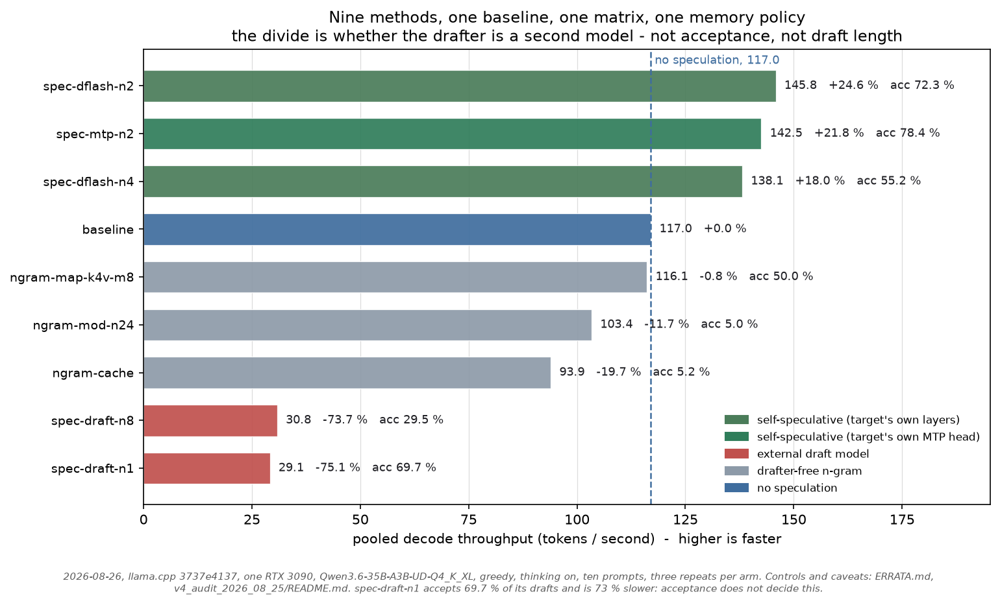
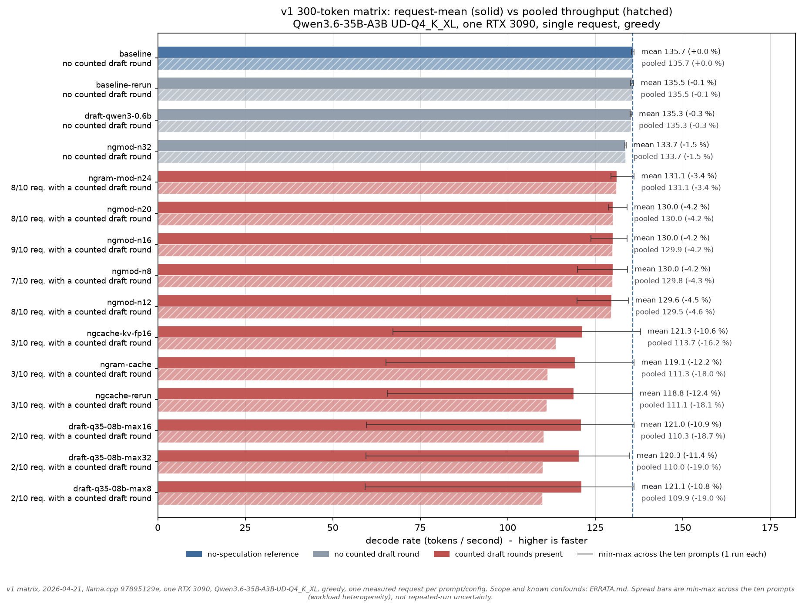
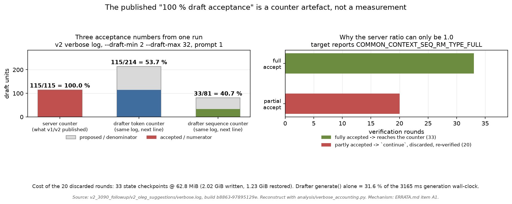
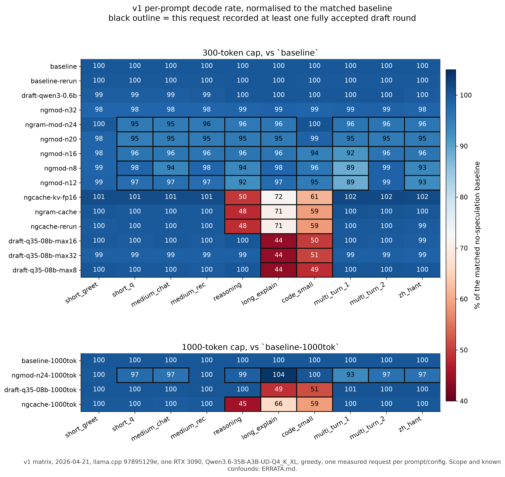

# Archived and re-measured: llama.cpp speculative decoding for Qwen3.6-35B-A3B UD-Q4_K_XL on one RTX 3090

[](https://doi.org/10.5281/zenodo.19776558)

> [!IMPORTANT]
> **Audited 2026-08-25, extended 2026-08-26.** This repository now holds two
> tiers, and they must not be read as one body of evidence.
>
> The **archival tier** is the published v1/v2/v3 runs, collected 2026-04-21 to
> 2026-05-07 at llama.cpp `97895129e`, `bcb5eeb64` and PR-branch `67cb0d507`,
> one run per cell. It is a single-request decode microbenchmark for exactly the
> model files, commits, hardware, prompts and flags listed below. It is not a
> benchmark of all RTX 3090 systems, of all Qwen3.6 quantisations, of all
> speculative-decoding methods, or of end-to-end voice-agent latency.
>
> The **controlled tier** is runs A–T3, collected 2026-08-25/26 on post-merge
> master `3737e4137`: repeated arm-runs with a matched no-speculation baseline
> inside each run, thinking suppression verified per request rather than
> assumed, concurrent client requests verified from request timestamps, full per-request text
> and token ids, and continuous GPU telemetry. Its findings are the ones to
> cite about current llama.cpp, with two limits stated up front rather than
> buried: the same configuration measured **twelve times in one day spans
> 9.4 pp**, in two discrete levels 5.4 pp apart, on byte-identical output
> ([A16](ERRATA.md#a16-two-runs-identical-in-every-recorded-respect-and-byte-identical-in-output-differ-by-34--on-one-arm)),
> so quote the range and not the interval; and **every thinking-off comparison
> here is confounded by output length**
> ([A17](ERRATA.md#a17-the-thinking-off-comparisons-are-not-comparisons-of-the-same-amount-of-work)),
> which flips one published sign. The thinking-on results, which is everything
> in the table below, are unaffected by the second.
>
> The audit **retracted this repository's headline mechanism.** Earlier versions
> reported "100 % draft acceptance yet slower, therefore MoE expert-loading
> overhead". That 100 % is an artefact of how llama.cpp counts acceptance on
> this model class, not a measurement — see
> [The "100 % acceptance" retraction](#the-100--acceptance-retraction). Three
> further defects turned up that no earlier version noticed: the draft model was
> never actually vocabulary-compatible, three quarters of the v1 requests
> returned truncated thinking rather than answers, and `llama-server` plus a
> draft model aborts on this model at `bcb5eeb64`. Every corrected item, with
> the evidence that settles it, is in [`ERRATA.md`](ERRATA.md); the queue that
> closes what is still open is [`RETEST_TODO.md`](RETEST_TODO.md).
>
> **The negative observation survives for the methods v1 tested, and only for
> those.** With an external draft model, speculation still loses badly here, and
> batching widens the gap rather than closing it. With the target's *own* layers
> as the drafter — DFlash, and the model's built-in multi-token-prediction head
> — it wins, by a fifth to a quarter, at short draft windows and one request at
> a time. The width of that band is not rounding. The same DFlash configuration
> was measured **twelve times** on 2026-08-26 and spans **+17.3 % to +26.7 %**,
> on byte-identical output and identical draft counts, while the no-speculation
> reference beside it holds to a CV of 0.42 %. Pooled by block it is two levels,
> +25.7 % and +20.3 %, and only this one arm moves between them
> ([ERRATA A16](ERRATA.md#a16-two-runs-identical-in-every-recorded-respect-and-byte-identical-in-output-differ-by-34--on-one-arm)).
> "Speculative decoding loses on this hardware" was a statement about a regime
> this repository had not separated.

## Result in one sentence

On one RTX 3090, at llama.cpp commit
`97895129e5f2bde94d13dc01ca41ee79e9b629f2`, with
`Qwen3.6-35B-A3B-UD-Q4_K_XL`, greedy decoding, and the ten committed prompts,
every tested condition that recorded speculative activity had lower
request-mean **and** lower pooled decode throughput than its matched
no-speculation reference.

The direction holds *for the conditions v1 tested*. The *explanation* published
alongside it does not. Re-run on a binary where llama.cpp counts acceptance
correctly, real acceptance and decode rate correlate at **r = +0.998** across
the ten prompts — the slowdown tracks low acceptance and draft-path cost, which
is ordinary speculative-decoding economics. The "100 % acceptance yet slower,
therefore an MoE pathology" anomaly this repository was built around does not
exist.

**And the direction is not universal.** On 2026-08-26, eight speculative
configurations and a no-speculation baseline were measured on this card in one
matrix under one memory policy, as a **balanced Latin square**: nine blocks, each
arm appearing exactly once per block and visiting every position exactly once —
verified from the execution log, not from the design. Each change below is
paired against the baseline measured **inside the same block**, and the interval
is over blocks, which is the unit of replication and of resampling.

`analysis/paired_blocks.py` computes two of them: a percentile bootstrap that
resamples whole blocks, and a Student-t interval on the log ratios. **The column
below is the t interval**, which is the wider of the two on every row here — the
bootstrap can only ever resample the nine values it has, so at this block count
it under-covers, and quoting the narrower one would be the wrong direction to
err in. Both are in each run's `paired_blocks.json`.

| arm | pooled tok/s | change | 95 % CI (t, over blocks) | draft/gen ‡ | acceptance † |
|---|---:|---:|---:|---:|---:|
| **`spec-dflash-n2`** | **146.2** | **+26.3 %** | [+25.5 %, +27.1 %] | 0.81 | 72.3 % |
| `spec-mtp-n2` | 141.9 | +22.7 % | [+22.1 %, +23.3 %] | 0.77 | 78.4 % |
| `spec-dflash-n4` | 137.9 | +19.2 % | [+18.5 %, +19.9 %] | 1.24 | 55.2 % |
| **no speculation** | **115.7** | — | — | 0.00 | — |
| `ngram-map-k4v-m8` | 115.4 | −0.3 % | [−0.6 %, +0.0 %] | **0.01** | 50.0 % |
| `ngram-mod-n24` | 103.1 | −10.9 % | [−11.4 %, −10.5 %] | 0.19 | 5.0 % |
| `ngram-cache` | 93.7 | −19.0 % | [−19.4 %, −18.6 %] | 0.17 | 5.2 % |
| `spec-draft-n8` | 30.9 | −73.3 % | [−73.5 %, −73.2 %] | 1.86 | 29.5 % |
| `spec-draft-n1` | 29.2 | **−74.8 %** | [−74.9 %, −74.7 %] | 0.50 | **69.7 %** |

‡ Draft tokens proposed per token generated. It is the column that makes the
acceptance column readable, and it is why `ngram-map-k4v-m8` is not the
half-accepted success its 50.0 % suggests: it drafted **216 tokens across 27 000
generated**, one per 125, so its acceptance rate is 108 of 216 and it neither
helps nor hurts because it almost never fires. `ngram-mod-n24` and `ngram-cache`
are the opposite — they draft on a fifth of tokens and have almost all of it
rejected, which is what a 10–19 % loss is made of.



**It was run twice.** Run O3 is the same nine arms, nine balanced blocks, same
stock binary and same models, five hours later, with the harness asserting the
library hash on **every arm-run** rather than once. All **810 request-pairs are
byte-identical** to O2 — same token ids, same text — and acceptance matches to a
tenth of a point on every arm. What moves is the time:

| arm | O2 | O3 | shift |
|---|---:|---:|---:|
| `spec-dflash-n2` | +26.3 % | **+23.4 %** | **−2.9 pp** |
| `spec-mtp-n2` | +22.7 % | +21.7 % | −1.0 pp |
| `spec-dflash-n4` | +19.2 % | +18.3 % | −0.9 pp |
| `ngram-cache` | −19.0 % | −19.7 % | −0.7 pp |
| `ngram-mod-n24` | −10.9 % | −11.5 % | −0.5 pp |
| `ngram-map-k4v-m8` | −0.3 % | −0.6 % | −0.3 pp |
| `spec-draft-n8` | −73.3 % | −73.5 % | −0.2 pp |
| `spec-draft-n1` | −74.8 % | −75.0 % | −0.2 pp |
| *no speculation, absolute* | *115.7* | *116.5* | *+0.7 %* |

Eight arms move by 0.2 to 1.0 pp. **`spec-dflash-n2` moves by 2.9**, and it did
the same thing between runs T and T3 — 5.2 pp, also on byte-identical output.
Whatever this is, it is specific to that arm and it is reproducible, and nothing
recorded distinguishes the runs:
[ERRATA A16](ERRATA.md#a16-two-runs-identical-in-every-recorded-respect-and-byte-identical-in-output-differ-by-34--on-one-arm).

The design matters and the numbers show it: run O measured the same arms at
three repeats with the arm list merely reversed on odd repeats, which leaves
position confounded with time. Its point estimates were 0.3–1.7 pp away from
these, and for `spec-mtp-n2` its +21.8 % falls **outside** the interval above.

† This table is run O2, and **the intervals in it describe run O2, not the
configuration.** `spec-dflash-n2` was measured **twelve times** on 2026-08-26
under this memory policy, on the same target, drafter and prompts, thinking on,
one request at a time:

| | | | | | |
|---|---|---|---|---|---|
| M1 **+26.7 %** 07:59 | O **+24.6 %** 09:00 | O2 **+26.3 %** 15:37 | T **+25.9 %** 18:26 | T3 **+20.7 %** 20:32 | O3 **+23.4 %** 20:44 |
| U1 **+22.3 %** 22:12 | U2 **+24.2 %** 22:15 | U3 **+17.3 %** 22:18 | U4 **+19.9 %** 22:21 | U5 **+25.6 %** 22:24 | U6 **+24.3 %** 22:27 |

**Range 9.4 pp, SD 2.9.** The no-speculation baseline over the same twelve runs
holds 115.72–117.25 tok/s, a CV of **0.42 %** — the reference is steady and the
arm under test is not. Every one of the twelve produced byte-identical output,
and `draft_n` is 2441 with acceptance 72.3 % in all 43 of their blocks: the
speculative work is the same to the token and only the time differs.

Pooling those 43 blocks, it is **not scatter but two levels** — a high one at
**+25.7 %** (30 blocks, SD 1.18) and a low one at **+20.3 %** (13 blocks, SD
1.63). Eleven runs sit wholly in one level; run O3 crosses between them at block
4, and **in those blocks only this arm moves** — including `spec-dflash-n4`,
the same drafter at twice the draft length, which never leaves ±1.01 % of its
own first block. The level survives the server restart between arm-runs, so a
single measurement lands wherever the state happens to be.

The paired-block interval above is 1.6 pp wide and it is measuring the wrong
variance component. Read the configuration as **+17 % to +27 %**, and the
interval as within-invocation precision only:
[ERRATA A16](ERRATA.md#a16-two-runs-identical-in-every-recorded-respect-and-byte-identical-in-output-differ-by-34--on-one-arm).

O2 is quoted because the documents are built on it and because run O3 replicates
it arm for arm; it is not the lowest — run U3 is, at +17.3 %. Runs K1 and L read about +21 % for the same arm and are
excluded from the comparison above: they ran at `--fit-target 2048`, a different
memory policy, which [`BENCHMARK_ENV.md`](BENCHMARK_ENV.md) records as a variable
across runs. Until 2026-08-26 this footnote quoted run O's +24.6 % as though it
were this table's own figure — it was written when run O *was* the headline table
and was not updated when O2 replaced it. What a three-repeat delta is actually
worth is measured in
[ERRATA A14](ERRATA.md#a14-within-run-repeats-are-not-an-error-bar).

† Server-side acceptance counter. It agrees with llama.cpp's other counter to
0.5 pp on the self-speculative rows and under-reports on the rest — the divergence
tracks the speculative-checkpoint path exactly
([ERRATA A13](ERRATA.md#a13-there-are-two-acceptance-counters-they-disagree-and-the-disagreement-is-exactly-the-checkpoint-path)).
No throughput figure depends on either counter.

A factor of five separates the top from the bottom, and it is **not** explained
by acceptance, by draft length, or by model-versus-n-gram. What it is explained
by, this matrix cannot say: the purpose-built DFlash and MTP draft paths and the
general-purpose 0.8 B drafter differ simultaneously in architecture,
quantisation, parameters activated per proposed token, reuse of the target's
hidden states, rollback behaviour, full-checkpoint policy and acceptance
profile, and nothing here varies them one at a time.

All three are separately loaded draft models — the harness passes `-md <GGUF>`
for every one of them, and upstream describes MTP as a distinct model with its
own context and KV cache even when it comes from the same file. An earlier
version of this section said the divide was "whether the drafter is a second
model"; that is simply false of these arms. `spec-draft-n1` accepts 69.7 % of its drafts —
more than every winning arm but one — and is 75 % slower, because a separate
draft context makes this hybrid target save and restore a full checkpoint on
every partially accepted round — the server reports 82.079 MiB per checkpoint,
772 creates and 709 restores in one arm-run — which DFlash logs zero times at
draft lengths 1 to 16 and MTP zero times at 1 to 8
([ERRATA A12](ERRATA.md#a12-what-the-checkpoint-path-costs-measured-with-timers-in-the-source)).

**The three methods v1 benchmarked are the bottom three rows.** The original
negative finding was right about what it measured. It measured the losing third
of the available methods.

**And it is not a property of those ten prompts.** Every number above and every
number this repository has ever published rests on the same ten. Repeated on a
second set of twenty sharing none of them — long inputs, JSON and SQL, four
languages, arithmetic, two genuinely multi-turn exchanges — the decode speed-up
moves by at most 4.3 pp, and one arm moves *upward*
([runs P and R](v4_audit_2026_08_25/README.md#runs-p-and-r--is-the-win-a-property-of-those-ten-prompts)).
That comparison has to be made on pooled decode rate: the longer prompts put
12.7 % of wall-clock into prompt processing against 6.7 % for the v1 ten, and
aggregate throughput divides by wall-clock, so reading it there would have shown
a collapse that is an artefact of prompt length and not of the method. v1 never tested that method, and the archived v3 attempt at it compared
two different binaries. The sign flips with the draft window — +18.7 % at 4,
−14.8 % at 8, −47.4 % at 16 — so "speculative decoding loses here" was a
statement about draft-window regimes that this repository had not yet separated.

One qualification travels with that number, and with every speculative
measurement here: **speculation is not output-preserving on this build.** The
engine is deterministic — every arm reproduces itself byte-for-byte across
repeats, and the no-speculation baseline reproduces across separate runs — and
against that control, turning speculation on changes the generated text in 27 to
30 of 30 request-pairs. All arms still emit exactly 300 tokens and the baseline's
decode rate varies only 0.8 % across ten very different prompts, so the
throughput comparison stands; but this is a faster computation landing on
slightly different text, not a lossless speedup of the same one
([ERRATA A11](ERRATA.md#a11-speculative-decoding-is-not-output-preserving-on-this-build-and-the-engine-is-deterministic-enough-to-prove-it)).
See [`v4_audit_2026_08_25/README.md`](v4_audit_2026_08_25/README.md#run-j--the-first-configuration-that-is-actually-faster).

The one lever upstream names as the fix — batching — was also tested, and does
not help: no speculation gains +64 % at concurrency 8 while the matched-vocabulary
drafter moves −8 %, so the gap widens rather than closing
([run I](v4_audit_2026_08_25/README.md#run-i--batching-the-lever-upstream-names)).
It does not rescue the winner either. A sweep down to `n_max 1` puts DFlash on a
plateau — +17.1 %, +17.6 %, +17.3 % at 2, 3 and 4, separated by less than the
baseline's own run-to-run SD — and a cliff between 4 and 6; batching then erases
the plateau at four concurrent requests (+0.4 %) and collapses it at eight
(−74.1 %), with draft volume and acceptance barely moving, so it is the draft
*cost* that fails to amortise
([run K](v4_audit_2026_08_25/README.md#run-k--where-the-optimum-is-and-what-batching-does-to-it)).
On this card, speculation pays for one stream at a time or not at all.

And the win belongs to the workload rather than to the method. Repeated with
thinking verifiably off on all 250 requests, `n_max 2` falls from +21.1 % to
+7.6 % and `n_max 4` goes **negative** at −2.7 %, tracking draft acceptance down
with it (72.8 % → 58.5 %, 55.6 % → 40.3 %). Per prompt, step-by-step arithmetic
and Python keep their full gain — their output is constrained and stays ~85–90 %
accepted — while Traditional Chinese free prose goes from +15 % to −25 % as
acceptance falls from 66 % to 29 %. Reasoning text is enumerated, repetitive
planning prose, which is exactly what a drafter predicts well
([run L](v4_audit_2026_08_25/README.md#run-l--the-win-is-a-property-of-the-workload-not-of-the-method)).

Across run L's 60 points acceptance and speed-up correlate at **r = +0.946** and
the line crosses zero at **48.2 % acceptance**. Half those points come from run
L's thinking-off half, where the arms generated different numbers of tokens
([ERRATA A17](ERRATA.md#a17-the-thinking-off-comparisons-are-not-comparisons-of-the-same-amount-of-work));
refitting without the confound moves the crossing to **46.5 %** on the
length-matched prompts and **45.4 %** on the thinking-on half alone, while the
slope moves nearly three times as far in relative terms. The threshold is the
stable quantity and the slope is not, which is the same thing A10 found out of
sample. Read it as **45–48 %**, not as 48. Scored across every arm-run with a matched baseline and enough drafts to define
a rate — 37 of 44, the seven excluded having drafted 10 to 55 tokens in total —
it calls the sign **28 / 29 inside the self-speculative families** and **5 / 6
on the external drafter**, 35 / 37 overall, and the same either way you read
llama.cpp's two disagreeing acceptance counters. The failures are the
informative ones: `spec-draft-n1` reaches **69.7 % acceptance** (100.0 % by the
drafter's own counter) and is **75 % slower**.

So the threshold is not a law about acceptance; it tracks the drafter. What is
measured is that a separate draft context makes this hybrid target log **772
full-checkpoint creates and 709 restores in one ten-prompt arm-run**, at a
reported 82.079 MiB each — a nominal **118.7 GiB** by event count × logged size,
which is an estimate and not measured memory traffic. DFlash logs none of these
events at draft lengths 1 to 16 and MTP none at 1 to 8. What that costs in wall
clock **is** established, by rebuilding llama.cpp with timers around the four
calls: **39.08 s of a 71.4 s excess, 54.7 %**, replicated to 54.6 % in a second
balanced run
([A12](ERRATA.md#a12-what-the-checkpoint-path-costs-measured-with-timers-in-the-source)).
This sentence said "not established here" until 2026-08-26, which was true when
it was written and stopped being true when run T was measured. And the
external drafter is 0.8 B *dense* against a target that activates only ~3 B
parameters per token, so drafting costs a quarter of a target step before any
state management: 17.24 s in `generate()` against 1.89–3.43 s for a head that
reuses the target's own layers
([ERRATA A12](ERRATA.md#a12-what-the-checkpoint-path-costs-measured-with-timers-in-the-source)).



---

## Experiment registry

These experiments differ in host, tool, commit, sampling, and prompt set. They
are not a cumulative body of evidence for one hypothesis and must not be pooled.

| ID | Date | Host / runner | Design | Evidence level |
|---|---|---|---|---|
| **v1 primary matrix** | 2026-04-21 | one GPU of the dual-3090 `s1` host; `llama-server`; commit `9789512` | 19 run labels (14 recorded draft rounds, 5 did not); 10 prompts; one measured request per prompt/config; `temperature=0`; 300-token cap unless noted | Primary descriptive result. No repeated trials per cell. |
| **v2 follow-up** | 2026-04-22 | different single-3090 host; `llama-cli`; commits `9789512` and `bcb5eeb64` | 5 prompts; `temperature=0.5`; 200-token cap; different runner and host | Directional check, not a controlled replication of v1 absolute rates. Thinking control did not work ([D1/D2](ERRATA.md#d1--d2--no-cnv-was-rejected-and-no_think-did-not-disable-thinking)). |
| **Exp 2 code/JSON** | 2026-04-25/26 | v2 host; `llama-cli` at `bcb5eeb64` | 5 prompts × 3 trials × 3 configs | Exploratory only. Intended workload unverified and per-request outputs not committed ([D3](ERRATA.md#d3-exp-2-cannot-be-audited-so-it-cannot-refute-anything)). |
| **v3 DFlash** | 2026-05-07 | v2 host; `llama-cli` | 5 prompts × 1 run × 3 draft-max settings | Exploratory only. Baseline and treatment used **different binaries** ([D4](ERRATA.md#d4-v3-dflash-compares-two-different-binaries)). |

| **v4 audit** | 2026-08-25/26 | one RTX 3090 (`3090` host); `llama-server` at `bcb5eeb64` and `3737e4137` | runs A–L; ABBA arm order, 3–5 repeats per arm, per-request JSON with full text and token ids, continuous GPU telemetry, pre-registered predictions | The controlled tier. Each run carries its own matched no-speculation baseline. |

The v4 runs, and what each one is for:

| run | question | design |
|---|---|---|
| A / B | does the archive reproduce, and does the abort persist? | `bcb5eeb64` vs post-merge `3737e4137`, 30 requests each |
| C / D | thirteen arms, thinking on and verifiably off | 13 arms × 10 prompts × 3 repeats, twice |
| E | is there anything past MoESD's 95-token coverage threshold? | `n_max` 64 / 96 / 128 |
| H | is `p_min` the lever, not draft length? | `p_min` 0 / 0.50 / 0.75 / 0.90 sweep |
| I | does concurrency rescue speculation, as upstream says it should? | 1 / 4 / 8 concurrent client requests, verified from timestamps; server-side batch width not instrumented |
| J | DFlash off vs on, one binary — the A/B v3 never had | 5 arms × 3 repeats, `-fit on` on every arm |
| K | where is the draft-length optimum, and does it survive batching? | `n_max` 1–8 sweep, then the winner at concurrency 4 / 8 |
| L | does the win survive the workload changing? | same 5 arms twice, thinking on and off, 5 repeats |

The v2 / Exp 2 / v3 files remain valuable archival evidence. Their absolute
rates and their causal interpretations must be read inside those limits.

---

## v1 hardware, software, and artefacts

- **GPU used by the benchmark process** — RTX 3090 24 GiB, `CUDA_VISIBLE_DEVICES=1`, SM 8.6.
- **Physical host** — two RTX 3090s, Intel Core i7-11700, 62 GiB RAM, Ubuntu 24.04.4, kernel 6.17. GPU 0 was deliberately left to an Ollama instance; the benchmark process had one card to itself, the host did not, and no continuous utilisation trace was captured ([C4](ERRATA.md#c4-gpu-0-was-running-another-workload)).
- **Driver** — NVIDIA 580.126.09. `nvidia-smi` reports driver support for CUDA 13.0; llama.cpp was built with the **CUDA 12.6** toolkit. These are different things.
- **llama.cpp** — `97895129e5f2bde94d13dc01ca41ee79e9b629f2` (short `9789512`), authored 2026-04-20, post PR #19493.
- **Target** — `Qwen3.6-35B-A3B-UD-Q4_K_XL.gguf` (~21 GiB), from [`unsloth/Qwen3.6-35B-A3B-GGUF`](https://huggingface.co/unsloth/Qwen3.6-35B-A3B-GGUF).
- **Classic draft model** — `Qwen3.5-0.8B-Q4_K_M.gguf` (~508 MiB), from [`unsloth/Qwen3.5-0.8B-GGUF`](https://huggingface.co/unsloth/Qwen3.5-0.8B-GGUF).
- **Fixed server flags** — `-ngl 999 -c 16384 --jinja -fa on -ctk q8_0 -ctv q8_0 --no-webui`.
- **Sampling** — greedy, `temperature=0`.
- **Warm-up** — one 8-token completion before each config's prompt sequence. This is not a full-shape warm-up.
- **Config execution** — server restarted between configs, so KV and prompt-cache state does not bleed across configs.
- Full snapshot: [`BENCHMARK_ENV.md`](BENCHMARK_ENV.md).

Expected SHA-256 of the v1 model files:

```
707a55a8a4397ecde44de0c499d3e68c1ad1d240d1da65826b4949d1043f4450  Qwen3.6-35B-A3B-UD-Q4_K_XL.gguf
bd258782e35f7f458f8aced1adc053e6e92e89bc735ba3be89d38a06121dc517  Qwen3.5-0.8B-Q4_K_M.gguf
ac2d97712095a558e31573f62f466a3f9d93990898b0ec79d7c974c1780d524a  Qwen3-0.6B-Q4_K_M.gguf
```

> [!WARNING]
> **Equal vocabulary size is not vocabulary compatibility.** Both
> Qwen3.6-35B-A3B and Qwen3.5-0.8B declare `vocab_size = 248320`, and this
> repository previously called the pair "vocab-matched". llama.cpp disagreed:
> `common_speculative_are_compatible` fails its **special-token** gate and
> enables the token-translation fallback, so every classic-draft round
> detokenised the context to a string and re-tokenised it for the draft model.
> All classic-draft rows below were measured on that path.
>
> The cause is one missing GGUF key. `Qwen/Qwen3.5-0.8B` has no
> `generation_config.json` upstream (HTTP 404), so the converter wrote no
> `tokenizer.ggml.bos_token_id`, and llama.cpp substitutes the hard-coded
> GPT-2 legacy default `11` against the target's `248044`. Both models declare
> `add_bos_token = false`, so the gate compares a field neither model uses.
>
> **It was fixed and re-measured on 2026-08-25, and it does not explain the
> slowdown:** `--override-kv tokenizer.ggml.bos_token_id=int:248044` flips the
> gate, and `long_explain` moves from 48.4 tok/s to 50–51 tok/s against a
> ~126 tok/s baseline. See
> [A2](ERRATA.md#a2-the-draft-model-was-not-vocabulary-compatible-the-run-used-the-token-translation-fallback).

---

## Metric definitions

llama-server reports, per request,
`predicted_per_second = 1000 × predicted_n / predicted_ms`. `predicted_ms`
covers target decoding plus the speculative proposal, verification, and
bookkeeping. It excludes prompt prefill, queueing, network transport, speech
I/O, and application latency.

Three summaries are reported for every config:

- **Request-mean decode rate** — arithmetic mean of each request's
  `predicted_per_second`. Every prompt weighs the same.
- **Pooled decode throughput** — `1000 × Σ predicted_n / Σ predicted_ms`. Every
  generated token weighs the same. For equal-length outputs this is the
  harmonic mean of the per-request rates.
- **Min–max across prompts** — workload heterogeneity. One measurement per
  prompt/config, so it is **not** repeated-run uncertainty, a standard error,
  or a confidence interval.

`draft_n` and `draft_n_accepted` need their own definition, because they do not
mean what their names suggest — see the next section.

---

## The "100 % acceptance" retraction

**Earlier versions of this README said:** every tested configuration returned
100 % draft acceptance, so "high acceptance → high speedup" fails, and "this is
not a measurement artifact; it is MoE expert-loading overhead on every drafted
token."

**It is a measurement artefact.** On this model the ratio can only ever be 1.0.



Qwen3.6-35B-A3B is a hybrid Gated-DeltaNet / MoE model, so
`common_context_can_seq_rm()` returns `COMMON_CONTEXT_SEQ_RM_TYPE_FULL` — the
context cannot roll back part of a sequence. In `server-context.cpp` at the
tested commit, a partially accepted draft therefore takes an early `continue`
that restores a state checkpoint and skips **both** acceptance counters, then
re-verifies the truncated, already-known-accepted prefix on the next pass. Only
rounds accepted in full ever reach the counters.

The drafter's own counters are printed on the next line of the same log and say
something different:

| counter | value | what it counts |
|---|---:|---|
| server `draft_n_accepted / draft_n` — the published number | **115 / 115 = 100.0 %** | tokens re-verified after truncation to the accepted prefix |
| drafter `#acc tokens / #gen tokens` | **115 / 214 = 53.7 %** | true token-level acceptance |
| drafter `#acc drafts / #gen drafts` | **33 / 81 = 40.7 %** | true draft-sequence acceptance |

Over that run: 53 verification attempts, 33 fully accepted, **20 partially
accepted and thrown away**. Rebuild the table yourself with
`python analysis/verbose_accounting.py`.

**Consequences for reading this repository's data.** In
[`analysis/summary.csv`](analysis/summary.csv), `draft_n` means "draft tokens in
verification rounds that were accepted in full", a quantity guaranteed to equal
`draft_n_accepted`. `draft_n = 0` means "no fully accepted round was recorded",
**not** "speculation did not run". The retracted
`analysis/plot_accept_vs_speed.png` — every one of whose 140 points sat at
exactly 100 % — has been deleted.

**And the original intuition survives, on honest evidence at last.** The
published claim was "100 % acceptance yet slower". That 100 % was the artefact
above. But sweeping `--spec-draft-p-min`, which truncates a draft once the
drafter's confidence drops, produces genuine high-acceptance configurations:

| configuration | real acceptance | pooled tok/s | vs baseline |
|---|---:|---:|---:|
| no speculation | — | 123.8 | — |
| `n_max` 8, `p_min` 0.75 | 80.2 % | **42.8** | **−65.5 %** |
| `n_max` 8, `p_min` 0.90 | **88.2 %** | 42.5 | −65.6 % |
| `n_max` 8, `p_min` 0 | 29.7 % | 32.7 | −73.6 % |

**Nine drafted tokens in ten accepted, correctly counted, and still nearly three
times slower than not speculating.** The intuition was right; the evidence for
it was not, and the MoE conclusion drawn from it was an overreach. `p_min` also
turns out to be the knob that matters rather than `n_max`: at `p_min` 0.75,
`n_max` 32 and `n_max` 128 are byte-identical — 6159 drafted tokens, 70.9 %
acceptance, 42.0 tok/s each. See
[A10](ERRATA.md#a10-the-single-regressor-law-is-falsified-out-of-sample-and-p_min-is-the-lever-that-matters).

**What the same log does support.** It contains a direct cost decomposition
that nobody in the earlier write-ups used. For 200 tokens generated at
63.2 tok/s (≈ 3165 ms):

| term | measured |
|---|---:|
| drafter `generate()` time | **999.6 ms ≈ 31.6 % of the generation wall-clock** |
| speculative checkpoints created | 33 × 62.8 MiB = 2.02 GiB written |
| checkpoints restored after a partial accept | 20 = 1.23 GiB read back |
| verification rounds discarded and redone | 20 of 53 (37.7 %) |

About a third of generation time is the draft model alone, and about 38 % of
verification rounds are paid for twice. That accounts for a slowdown of this
size without any appeal to expert-union loading.

---

## v1 representative results

Ten 300-token requests per config, one measurement each. Deltas are against the
matched no-speculation reference. Descriptive only.

| condition | request-mean | pooled | median | min | requests with a counted draft round |
|---|---:|---:|---:|---:|---:|
| baseline | 135.7 | 135.7 | 135.6 | 135.3 | 0 / 10 |
| baseline-rerun | 135.5 (−0.1 %) | 135.5 (−0.1 %) | 135.4 | 135.1 | 0 / 10 |
| draft-qwen3-0.6b *(vocab 151936, draft never attached)* | 135.3 (−0.3 %) | 135.3 (−0.3 %) | 135.3 | 135.0 | 0 / 10 |
| ngmod-n32 | 133.7 (−1.5 %) | 133.7 (−1.5 %) | 133.6 | 133.5 | 0 / 10 |
| ngram-mod-n24 | 131.1 (−3.4 %) | 131.1 (−3.4 %) | 130.0 | 129.6 | 8 / 10 |
| ngmod-n20 / n16 / n8 / n12 | 129.6 – 130.1 (−4.2 to −4.5 %) | 129.5 – 130.0 (−4.2 to −4.6 %) | 129.1 – 132.0 | 119.8 – 128.8 | 7–9 / 10 |
| ngcache-kv-fp16 *(one-sided control, see below)* | 121.3 (−10.6 %) | **113.7 (−16.2 %)** | 137.8 | 67.3 | 3 / 10 |
| draft-q35-08b-max8 | 121.1 (−10.8 %) | **109.9 (−19.0 %)** | 135.6 | 59.2 | 2 / 10 |
| draft-q35-08b-max16 | 121.0 (−10.9 %) | **110.3 (−18.7 %)** | 135.2 | 59.6 | 2 / 10 |
| draft-q35-08b-max32 | 120.3 (−11.4 %) | **110.0 (−19.0 %)** | 134.1 | 59.5 | 2 / 10 |
| ngram-cache | 119.1 (−12.2 %) | **111.3 (−18.0 %)** | 135.6 | 65.3 | 3 / 10 |
| ngcache-rerun | 118.8 (−12.4 %) | **111.1 (−18.1 %)** | 135.0 | 65.6 | 3 / 10 |

Long-output variants use their own reference, `baseline-1000tok` (request-mean
133.2, pooled 133.1):

| condition | request-mean | pooled | note |
|---|---:|---:|---|
| ngmod-n24-1000tok | 131.1 (−1.6 %) | 131.1 (−1.5 %) | |
| draft-q35-08b-1000tok | 120.2 (−9.7 %) | **106.1 (−20.3 %)** | |
| ngcache-1000tok | 115.9 (−13.0 %) | **98.9 (−25.7 %)** | worst pooled result in the matrix |

Full per-request values: [`analysis/summary.csv`](analysis/summary.csv).
Per-config aggregate with all four summaries and both references:
[`analysis/summary_by_config.csv`](analysis/summary_by_config.csv).

### Per-prompt structure



Black outlines mark requests that recorded at least one fully accepted draft
round. The picture is not the "chat prompts never trigger, structured prompts
collapse" taxonomy this README used to assert:

- **ngram-mod** records draft rounds on the *chat* prompts — `short_q`,
  `medium_chat`, `medium_rec`, `multi_turn_1`, `multi_turn_2`, `zh_hant` — and
  **not** on `code_small` at n = 24. Its cost is a flat ~4 % everywhere.
- **classic draft** records rounds only on `long_explain` and `code_small`, and
  leaves `reasoning` at full baseline speed.
- **ngram-cache** records rounds on `reasoning`, `long_explain`, `code_small`.

Three configurations, three different prompt partitions. Ten hand-written
prompts cannot establish a prompt taxonomy, and the earlier "entirely bimodal
by prompt class" sentence was wrong ([B5](ERRATA.md#b5-the-regression-is-entirely-bimodal-by-prompt-class-is-false-for-the-ngram-mod-family)).

The heatmap also exposes why `ngcache-kv-fp16` is a **one-sided control**: on
the seven prompts with no draft round it runs at 101–102 % of the q8_0
baseline, because fp16 KV is simply faster when speculation is idle. There is
no no-speculation fp16-KV row in the matrix, so that condition cannot separate
a speculation effect from a KV-precision effect, and the old reading — "fp16 KV
does not rescue, so KV quant is not the cause" — does not follow.

---

## What the audit measured on 2026-08-25

Three new measurements were taken on the original v2/v3 bench host. They are
recorded here because two of them bear directly on how the archived data should
be read.

Full data and method: [`v4_audit_2026_08_25/`](v4_audit_2026_08_25/).

**With acceptance measured properly, the anomaly disappears — and the contrast
has to be named.** Upstream has since made the partial-accept path reachable,
so the counter reports real ratios. Two comparisons are available and they
point opposite ways; reporting either without saying which would repeat exactly
the mistake this audit corrects.

*Within one configuration, across prompts*, prompts the drafter predicts well
run faster, almost exactly in proportion. On post-merge master `3737e4137`,
5 repeats of a 13-arm matrix, **six distinct draft lengths each reproduce this
at r ≥ +0.996**, spanning acceptance from 5 % to 83 %. A control makes it hard
to explain away: with no speculation the prompt barely matters, `baseline`
spanning only 1.4 % across the same ten prompts.

| `--spec-draft-n-max` | 1 | 2 | 4 | 8 | 16 | 32 |
|---|---:|---:|---:|---:|---:|---:|
| Pearson r | +0.998 | +0.999 | +0.996 | +0.999 | +0.999 | +0.999 |
| pooled tok/s | 31.1 | 34.2 | **35.6** | 32.1 | 23.7 | 17.3 |
| acceptance | 68.7 % | 60.3 % | 45.4 % | 29.7 % | 15.0 % | 8.0 % |

*Across configurations* the sign flips to r = −0.544, because a configuration
that drafts harder achieves higher acceptance per attempt while paying for far
more drafted tokens. An external 0.8 B drafter proposing 0.50 tokens per
generated token runs at 31.1 tok/s while ngram-cache proposing 0.42 runs at
74.0, so volume is not the whole story either: the per-round cost of the
drafting method is a third, independent term.

**The slowdown is the per-round cost of drafting, times how much is drafted,
divided by how much is accepted.** That is ordinary speculative-decoding
economics. There is no anomaly left, and **no MoE-specific pathology is needed**
— this repository never had evidence for one, and the sweep was extended past
the threshold to check rather than assert. Across `n_max` 1 → 128, spanning
**3.1 % to 98.3 % expected routed-expert coverage**, a single regressor accounts
for the cost:

```
ms per generated token = 27.00 + 4.040 × (draft tokens per generated token)
R² = 0.99303
```

**The step in the residuals at the 95.3 % coverage point is −0.39 percentage
points.** No knee, no break, nothing for a coverage threshold to explain.
Throughput peaks at `n_max` 4 and declines monotonically straight through.
Full detail:
[A7](ERRATA.md#a7-with-acceptance-measured-properly-there-is-no-anomaly-left-to-explain).

**The vocabulary defect is real but is not the cause.** Same binary, same draft
file, same flags, only the BOS override differing:

| binary | arm | request-mean | drafted / accepted |
|---|---|---:|---|
| `bcb5eeb64` | translation fallback, as published | 113.9 | 194 / 194 |
| `bcb5eeb64` | matched via `--override-kv` | 113.5 | 194 / 194 |
| master `3737e4137` | translation fallback | 33.6 | 16590 / 4926 |
| master `3737e4137` | matched via `--override-kv` | 33.7 | 16590 / 4926 |

The drafted and accepted totals are byte-identical across arms on both
binaries, so the translation path was not changing what got drafted. The
negative finding survives, now on a matched path.

**`llama-server` plus a draft model aborts on this model at `bcb5eeb64`.**
Reproducibly, 3 / 3 on the `code_small` prompt, in both arms, immediately after
a partial-accept checkpoint restore:

```
CUDA error: an unsupported value or parameter was passed to the function
  in function ggml_cuda_op_mul_mat_cublas
  #14 server_context_impl::update_slots()
```

The no-speculation arm completes all ten prompts every time. This means v2's
"cross-checked on master `bcb5eeb64`, identical results" is a `llama-cli`
cross-check only — the `llama-server` path that produced every v1 number does
not survive on that commit with a draft attached. It is **fixed on post-merge
master**: all thirty requests complete on `3737e4137`. See
[A6](ERRATA.md#a6-llama-server-plus-a-draft-model-aborts-on-this-model-at-bcb5eeb64).

**Workload shape matters, and it was never controlled.** The audit ran the
comparison Exp 2 was trying to run — the same arms with thinking verifiably on
and verifiably off, 5 repeats each, `thinking_suppressed` recorded per request:

| method | thinking on | thinking off | draft tokens per generated token |
|---|---:|---:|---|
| `ngram-mod` n=24 | −6.8 % | **−0.7 %** | 0.21 → **0.00** |
| `ngram-cache` | −40.0 % | −32.6 % | 0.42 → 0.36 |
| draft model, n_max 8 | −74.0 % | −76.4 % | 1.85 → **2.14** |

With thinking off `ngram-mod` stops drafting entirely and its cost nearly
vanishes; a chain-of-thought trace is the repetitive text an n-gram lookup
feeds on, a direct answer is not. That one is length-independent — zero draft
tokens is zero however long the output — and it stands.

> [!WARNING]
> **The rest of this table is confounded by output length, and one reading of
> it does not survive.** With thinking off the arms stop in different places
> (ERRATA A11), so this compares arms that generated different numbers of
> tokens; with thinking on every request here ran to exactly 300. On the five
> prompts where every arm generated the same 300 tokens:
>
> | | thinking on | thinking off, as above | thinking off, length-matched |
> |---|---:|---:|---:|
> | draft model `n_max 8` | −74.0 % | −76.4 % | **−72.7 %** |
> | its acceptance | 29.7 % | 23.1 % | **30.3 %** |
> | `ngram-cache` | −40.0 % | −32.6 % | **−39.0 %** |
> | its acceptance | 1.8 % | 1.4 % | **1.8 %** |
>
> This paragraph used to read "for the draft model the effect reverses —
> acceptance falls from 29.7 % to 23.0 %, so reasoning traces are *easier* for a
> 0.8 B drafter than real answers". On the length-matched half, acceptance is
> **30.3 %** against 29.7 % with thinking on, and the throughput cost is
> *smaller* with thinking off, not larger. The fall was the short outputs, not
> the workload: acceptance varies along the sequence and a short generation is
> all early tokens.
>
> The matched half is five prompts of ten and not a random five — they are the
> ones long enough that every arm hit the cap — so this is not a corrected value
> either. What it establishes is that the original reading was not supported.
> [ERRATA A17](ERRATA.md#a17-the-thinking-off-comparisons-are-not-comparisons-of-the-same-amount-of-work),
> `analysis/length_matching.py`, and `BENCH_IGNORE_EOS` in the harness for
> measuring it properly next time.

What that implies splits by family, so it cannot be said in one sentence.
Draft-model speculation was measured on its *favourable* workload — thinking
traces are easier to predict and give a better net result — and still lost, so
that finding is more robust than when it was published. ngram methods were
measured on their *unfavourable* one: thinking gives an n-gram lookup much more
to fire on, and firing costs more than it returns, so the historical ngram
figures **overstate** the cost a real-answer workload would produce. Neither
becomes a net win. See
[D3b](ERRATA.md#d3b-workload-shape-does-matter--and-exp-2-pointed-the-wrong-way).

**Three quarters of v1's requests returned no answer.** `message.content` is
empty for 144 of 190 v1 requests, and 19/19 for both `reasoning` and
`code_small` — the 300-token cap was reached inside the thinking block, and
`reasoning_content` was never captured. v1 measured decode throughput on
truncated chain-of-thought, not on answers. See
[A5](ERRATA.md#a5-three-quarters-of-v1s-requests-returned-no-answer-at-all--only-truncated-thinking).

---

## What the v1 data support

- No tested condition that recorded speculative activity exceeded its matched
  no-speculation reference in aggregate, on this setup.
- The published acceptance ratio cannot be used to predict speedup, because it
  is not an acceptance measurement.
- Draft-side cost is large and directly measured: the drafter alone consumed
  ~32 % of generation wall-clock in the one run with a verbose trace, and ~38 %
  of verification rounds in that run were discarded and repeated.
- Deep slow tails are real but config-specific and prompt-specific: 59–67 tok/s
  for particular ngram-cache and classic-draft requests, while the whole
  ngram-mod family stays within 12 % of baseline at its worst.

## What the v1 data do not support

- Any universal statement about Qwen3.6, A3B models, RTX 3090s, consumer
  Ampere, or speculative decoding in general.
- That every run label performed speculation. Five recorded no draft round at
  all, including three baselines and an incompatible-draft control.
- That expert loading, memory bandwidth, quantisation, or any single kernel is
  the root cause. No expert-routing trace, HBM counter, kernel profile, or
  dense / FP16 / cross-GPU factorial control was collected.
- A clean classic-draft effect estimate, because those rows ran on the
  cross-vocabulary translation fallback. Re-measuring with the gate fixed
  recovers only 3–5 %, so the direction holds, but the archived absolute
  numbers are not a matched-path measurement
  ([A2](ERRATA.md#a2-the-draft-model-was-not-vocabulary-compatible-the-run-used-the-token-translation-fallback)).
- A claim about the workload, because 76 % of the requests returned truncated
  thinking rather than an answer, and no version of this benchmark ever
  verified what was being generated
  ([A5](ERRATA.md#a5-three-quarters-of-v1s-requests-returned-no-answer-at-all--only-truncated-thinking)).
- A statement about a *working* speculative path for this model class, because
  the fix for the hybrid-SSM partial-acceptance failure the runs actually hit —
  llama.cpp PR #20075 — was closed without merge
  ([A3](ERRATA.md#a3-the-tested-build-had-a-known-broken-speculative-path-for-this-model-class-and-the-fix-was-never-merged)).
- A production voice-agent recommendation. This measures decode
  microperformance, not streaming TTFT, audio latency, multi-turn cache reuse,
  concurrency, or output quality.
- Behaviour under non-greedy sampling, other seeds, current llama.cpp, or
  untested speculation methods.

---

## Follow-up experiment caveats

### v2 and Exp 2

Different host, `llama-cli` instead of `llama-server`, `temperature=0.5`,
200-token cap, and a different prompt set. Directional at best.

More importantly, the scripts pass `-no-cnv` and append `/no_think`, and the
committed logs show both are inert:

```
--no-conversation is not supported by llama-cli
please use llama-completion instead
```

That line appears in 61 of 62 v2 logs and 30 of 33 v3 logs, and those same logs
then contain `[Start thinking]` and a full reasoning trace. The measured
workload is long chain-of-thought output, not the intended direct answer.

Exp 2 committed only timing summaries — the per-request generated text, token
IDs, and stop reasons were never saved — so its intended "structured,
low-entropy, thinking-off code/JSON" distribution cannot be checked. **Exp 2
therefore does not refute the workload-shape hypothesis.** It shows that the
configurations, as actually executed, were slower for whatever the command
really generated. A valid retest needs `llama-completion` or a verified
chat-template thinking toggle, plus committed outputs.

One thing Exp 2 does establish cleanly: the command is highly repeatable. The
three trial means for the Oleg config are 66.54 / 66.54 / 66.64 tok/s,
SD 0.06 — the published `± 7.57` is spread *between prompts*, not run-to-run
noise.

### v3 DFlash

The historical v3 result was 77.0 tok/s for the best DFlash setting against
138.9 tok/s for its recorded baseline. Treat it as an exploratory datapoint,
not a DFlash effect estimate:

- baseline and Oleg logs report build `b8889-bcb5eeb64`; DFlash logs report
  `b8942-67cb0d507`. **Different binaries.**
- one run per prompt/config;
- the thinking control did not work;
- outputs were not token-identical between conditions;
- no target-precision, draft-precision, dense-model, profiler, or second-GPU
  control.

DFlash PR #22105 was merged upstream on 2026-06-28. That A/B was run on
2026-08-26, and it reverses the sign at short draft windows: on one binary with
a control matching to −0.01 %, `--spec-draft-n-max 4` is **+18.7 %** against no
speculation, while 8 and 16 are −14.8 % and −47.4 %. The archived v3 figure is
what the method looks like at the long windows, measured across a binary change.
Details and controls in
[`v4_audit_2026_08_25/README.md`](v4_audit_2026_08_25/README.md#run-j--the-first-configuration-that-is-actually-faster).

### The vLLM sibling result

[`thc1006/qwen3.6-vllm-2x3090`](https://github.com/thc1006/qwen3.6-vllm-2x3090)
reports a positive vLLM **MTP** result on the same physical hardware. It is
still **not** a matched cross-engine control — two GPUs, tensor parallelism, a
different engine, a different quantisation stack, different flags, a different
protocol — so do not use it to decompose the cause of the llama.cpp result.

But one thing it used to confound is now separated. "llama.cpp loses where vLLM
wins" could have been about the engine or about the method, because the method
vLLM used had never been run under llama.cpp here. It has been now: the same
target's own MTP head, exported with the stock converter, is **+17.5 %** against
a matched baseline in run O and **+18.6 %** in run M. MTP is not what llama.cpp
was failing at — this repository had simply never pointed llama.cpp at it. What
remains between the two results is the engine, the parallelism and the
quantisation stack, and none of those is measured here.

---

## Where the time goes — measured, and not MoE-specific

The audit's re-measurement ([A7](ERRATA.md#a7-with-acceptance-measured-properly-there-is-no-anomaly-left-to-explain))
removed the mystery: decode rate tracks acceptance at r = +0.998 across the
prompt set. What the 2026-08-26 runs add is where the extra time actually goes,
timed in the source rather than inferred from log intervals.

An external 0.8 B drafter spends **71.4 s more in decode** than no speculation
does, over one ten-prompt arm-run of 3000 tokens:

| | seconds | share |
|---|---|---|
| speculative checkpoint save (785) | 17.34 | 24.3 % |
| speculative checkpoint restore (728) | 21.74 | 30.5 % |
| drafter `generate()` | 17.27 | 24.2 % |
| unattributed | 15.05 | 21.1 % |

**More than half of it is state checkpointing** — 39.08 s, reproducible to two
hundredths of a second across four arm-runs, at a median of 21.9 ms per save and
22.4 ms per restore. `spec-dflash-n2` on the same prompts performs **zero** of
these operations, spends 3.41 s drafting, and finishes **5.3 s faster than not
speculating at all**.

Both sides of that comparison are measured at the same depth: all twelve logs
of the run are extracted, four repeats per arm. `baseline` and `spec-dflash-n2`
emit zero checkpoint records in every one of their four arm-runs, and
`spec-draft-n8` emits 785 saves and 728 restores in every one of its four.

The measurement required rebuilding llama.cpp with timers around the four
checkpoint calls, so that run alone is not on a stock binary. It was used as its
own control first: its throughput reproduces the stock build to within 0.54 %,
and to −0.00 % on the arm being attributed. Patch, reasoning and scope in
[ERRATA A12](ERRATA.md#a12-what-the-checkpoint-path-costs-measured-with-timers-in-the-source).

The second term is arithmetic and needs no instrumentation: this is a 35 B model
with roughly 3 B active per token, so a 0.8 B **dense** drafter is not the 1–2 %
of target cost that speculative decoding usually assumes. It is nearer a quarter.

## Reproduction

The historical scripts and raw files are all here, and every host-specific path
is now an environment variable with a documented default. They remain audit
artefacts rather than a one-command reproducer: the v1 warm-up is short, there
is one run per cell, and [D5](ERRATA.md#d5-the-committed-v2-script-does-not-produce-the-committed-v2-directories)
records a provenance gap in v2.

Build the **exact** v1 revision — not current master:

```bash
git clone https://github.com/ggml-org/llama.cpp.git
cd llama.cpp
git checkout 97895129e5f2bde94d13dc01ca41ee79e9b629f2
git submodule update --init --recursive

CUDACXX=/usr/local/cuda-12.6/bin/nvcc cmake -S . -B build \
    -DGGML_CUDA=ON \
    -DCMAKE_CUDA_ARCHITECTURES=86 \
    -DLLAMA_CURL=OFF \
    -DBUILD_SHARED_LIBS=OFF \
    -DCMAKE_BUILD_TYPE=Release
cmake --build build --parallel --target llama-server llama-bench
```

Fetch the artefacts and verify them before benchmarking:

```bash
hf download unsloth/Qwen3.6-35B-A3B-GGUF Qwen3.6-35B-A3B-UD-Q4_K_XL.gguf --local-dir models
hf download unsloth/Qwen3.5-0.8B-GGUF --include '*Q4_K_M*' --local-dir models
sha256sum -c SHA256SUMS
```

Run the matrix and the analysis:

```bash
export LLAMA_SERVER_BIN=$PWD/llama.cpp/build/bin/llama-server
export MODEL_TARGET=$PWD/models/Qwen3.6-35B-A3B-UD-Q4_K_XL.gguf
export MODEL_DRAFT=$PWD/models/Qwen3.5-0.8B-Q4_K_M.gguf
export BENCH_GPU=1                      # CUDA_VISIBLE_DEVICES for the server

bash run_matrix.sh          # baseline + ngram-cache + ngram-mod n=24 + 0.6B control
bash run_p0_matrix.sh       # classic-draft sweep + 1000-token variants + N sweep + kv-fp16

pip install -r requirements.txt
python analysis/plot.py
python analysis/verbose_accounting.py
```

A corrected harness for *new*, controlled runs — one pinned binary for every
arm, ABBA ordering, N repeats, a manifest that hashes the binary and both
models, and per-request capture of the generated text, the reasoning channel,
the stop reason, the full `timings` block, and token IDs via `logprobs` — is
[`bench/retest_runner.py`](bench/retest_runner.py). It is what produced the
audit measurements above. Note that llama.cpp renamed the speculative arguments
after `bcb5eeb64` (`--draft-max` → `--spec-draft-n-max`) and that `--spec-type`
now defaults to `none`, so `-md` alone loads a draft model and never
speculates; the runner's `BENCH_FLAVOR` switch handles both spellings.

### Reproducing the 2026-08-26 runs

Every setting below is recorded in the corresponding `manifest.json`, so this
recipe is checkable against the committed data rather than trusted.

```bash
git clone https://github.com/ggml-org/llama.cpp.git && cd llama.cpp
git checkout 3737e41370da1830a44c663f9929a0f27591ffa6      # the audit binary
cmake -S . -B build -DGGML_CUDA=ON -DCMAKE_CUDA_ARCHITECTURES=86 && cmake --build build -j

export LLAMA_SERVER_BIN=$PWD/build/bin/llama-server
export MODEL_TARGET=.../Qwen3.6-35B-A3B-UD-Q4_K_XL.gguf
export MODEL_DRAFT=.../Qwen3.5-0.8B-Q4_K_M.gguf
export BENCH_FLAVOR=master BENCH_GPU=0 BENCH_MAX_TOKENS=300

# run I - concurrency. Client requests in flight are read back from timestamps;
# --parallel alone allocates slots that an unmodified client never uses.
for C in 1 4 8; do
  BENCH_CONCURRENCY=$C BENCH_REPEATS=3 BENCH_THINK=on \
  BENCH_ARMS=baseline,spec-draft-n8 BENCH_OUT=out/I_conc$C python bench/retest_runner.py
done

# runs J / K / L / M - speculation methods. -fit on is REQUIRED: the BF16
# drafters only load with -ngl unset, and it is applied to every arm including
# the baseline so placement policy never differs between an arm and its control.
BENCH_FIT=on BENCH_CTX=8192 BENCH_FIT_TARGET=2048 BENCH_REPEATS=3 \
MODEL_DFLASH=.../qwen36-dflash-master.gguf \
BENCH_ARMS=baseline,spec-dflash-n1,spec-dflash-n2,spec-dflash-n4,spec-dflash-n8 \
BENCH_OUT=out/K1 python bench/retest_runner.py
```

The two drafters that are not off-the-shelf downloads:

```bash
# DFlash - the archived v3 GGUF lacks `target_layers` and master rejects it
bash bench/convert_dflash.sh

# MTP - export the target's own multi-token-prediction head as a drafter.
# Stock llama.cpp: `supports_mtp_export` is already True for this architecture
# and LLM_ARCH_QWEN35MOE already declares the NEXTN tensors. The staging step
# exists only because conversion/base.py's AWQ guard dispatches on config.json's
# quant_method rather than on the tensors being exported, and every tensor in
# the --mtp export set is unquantised. The script verifies that and refuses if
# it is ever untrue.
python bench/stage_mtp_source.py
python convert_hf_to_gguf.py ~/models/qwen36-mtp-src --mtp --outtype bf16 \
       --outfile qwen36-mtp-bf16.gguf
./build/bin/llama-quantize qwen36-mtp-bf16.gguf qwen36-mtp-q8_0.gguf Q8_0
```

Then check the numbers against the documents:

```bash
python analysis/verify_claims.py     # re-derives every quoted figure, exits non-zero on drift
python analysis/check_links.py       # relative links and heading anchors
python analysis/matrix_report.py v4_audit_2026_08_25/data/matrix_*
python analysis/thermal_report.py v4_audit_2026_08_25/data/gpu_telemetry_*.csv
python analysis/plot_v4_runs.py
```

---

## Data map

| Path | Contents |
|---|---|
| [`ERRATA.md`](ERRATA.md) | every corrected claim, with evidence |
| [`results/`](results/), [`results/verify/`](results/verify/) | v1 raw per-request JSON, 19 run labels |
| [`analysis/summary.csv`](analysis/summary.csv) | v1 flat per-request table |
| [`analysis/summary_by_config.csv`](analysis/summary_by_config.csv) | v1 aggregate: request-mean, pooled, median, min–max, activation |
| [`analysis/plot.py`](analysis/plot.py) | aggregation and charts |
| [`analysis/verbose_accounting.py`](analysis/verbose_accounting.py) | reconstructs the acceptance-counter artefact from a `-v` log |
| [`v2_3090_followup/SUMMARY.md`](v2_3090_followup/SUMMARY.md) | v2 methodology and tables |
| [`v2_3090_followup/v2_*/`](v2_3090_followup/) | 62 v2 raw `llama-cli` logs + one `--verbose` trace |
| [`v2_3090_followup/exp2_codejson_n3/`](v2_3090_followup/exp2_codejson_n3/) | Exp 2 aggregates and script |
| [`v3_dflash_2026_05_07/`](v3_dflash_2026_05_07/) | DFlash logs, tables, script |
| [`BENCHMARK_ENV.md`](BENCHMARK_ENV.md) | hardware, software, commits, hashes for v1/v2/v3, and the v4 memory-policy table |

### The 2026-08-25/26 controlled runs

| Path | Contents |
|---|---|
| [`v4_audit_2026_08_25/README.md`](v4_audit_2026_08_25/README.md) | what each run asked, what it measured, and every control |
| [`v4_audit_2026_08_25/PREREGISTERED_PREDICTION.md`](v4_audit_2026_08_25/PREREGISTERED_PREDICTION.md) | predictions committed to git before the data existed |
| `v4_audit_2026_08_25/data/A_*`, `B_*` | `bcb5eeb64` against post-merge master, 30 requests each |
| `v4_audit_2026_08_25/data/C_*`, `D_*` | the thirteen-arm matrix, thinking on and verifiably off |
| `v4_audit_2026_08_25/data/E_*`, `H_*` | past the MoESD coverage threshold; the `p_min` sweep |
| `v4_audit_2026_08_25/data/matrix_I2_conc{1,4,8}_*` | concurrency, with the client requests in flight recorded |
| `v4_audit_2026_08_25/data/matrix_J2_*` | DFlash off vs on, one binary |
| `v4_audit_2026_08_25/data/matrix_K*` | the draft-length sweep and the winner under batching |
| `v4_audit_2026_08_25/data/matrix_L_think{on,off}_*` | the same arms under both workloads |
| `v4_audit_2026_08_25/data/gpu_telemetry_*.csv` | continuous 5 s GPU traces covering every run |
| `v4_audit_2026_08_25/data/smoke_*` | the gate runs that decide a matrix is safe to start |

Each run directory holds one `manifest.json` (hashing the binary and every
model, and recording the full `BENCH_*` configuration), one
`<arm>__rep<N>.json` per arm-run with full per-request capture, and an
`all_results.json` that is the same content concatenated for convenience.

### Tooling

| Path | Contents |
|---|---|
| [`bench/retest_runner.py`](bench/retest_runner.py) | the controlled harness; it produced every v4 measurement |
| [`bench/convert_dflash.sh`](bench/convert_dflash.sh) | re-converts the DFlash drafter with post-merge master |
| [`bench/stage_mtp_source.py`](bench/stage_mtp_source.py) | stages the checkpoint so `--mtp` can export the MTP head, and verifies the export set is unquantised before doing so |
| [`analysis/verify_claims.py`](analysis/verify_claims.py) | re-derives every quoted figure from committed data **and** greps the documents for it; exits non-zero on any drift |
| [`analysis/check_links.py`](analysis/check_links.py) | relative links and heading anchors |
| [`analysis/matrix_report.py`](analysis/matrix_report.py) | per-arm request-mean, pooled, repeat SD, acceptance, drift, activation |
| [`analysis/thermal_report.py`](analysis/thermal_report.py) | throttle flags and clock drift from a telemetry trace |
| [`analysis/plot_v4_runs.py`](analysis/plot_v4_runs.py) | the batching, draft-length, acceptance-threshold, head-to-head and two-level charts, and `plot_data.json`, which `--check` compares against the data |

---

## Upstream status at the 2026-08-25 audit

Checked against the GitHub API on 2026-08-25.

| PR | Status |
|---|---|
| [#19493](https://github.com/ggml-org/llama.cpp/pull/19493) server: speculative checkpointing | merged 2026-04-19 |
| [#22227](https://github.com/ggml-org/llama.cpp/pull/22227) speculative-simple: checkpoint support | merged 2026-04-22 |
| [#20075](https://github.com/ggml-org/llama.cpp/pull/20075) fix: speculative decoding broken on hybrid SSM/MoE | **closed without merge 2026-04-25** |
| [#22105](https://github.com/ggml-org/llama.cpp/pull/22105) DFlash support | merged 2026-06-28 |

`bcb5eeb64` was master on 2026-04-22 and is described here as a dated snapshot,
not as "current master". Future edits should keep using exact tested SHAs.

---

## Related reading

- [MoESD: Unveil Speculative Decoding's Potential for Accelerating Sparse MoE (arXiv 2505.19645)](https://arxiv.org/html/2505.19645)
- [Utility-Driven Speculative Decoding for Mixture-of-Experts (arXiv 2506.20675)](https://arxiv.org/pdf/2506.20675)
- [MoE-SpeQ (arXiv 2511.14102)](https://arxiv.org/html/2511.14102v1)
- [llama.cpp docs/speculative.md](https://github.com/ggml-org/llama.cpp/blob/master/docs/speculative.md)
- [llama.cpp Issue #20039 — original feature request](https://github.com/ggml-org/llama.cpp/issues/20039)
- [HF discussion #14 on `unsloth/Qwen3.6-35B-A3B-GGUF`](https://huggingface.co/unsloth/Qwen3.6-35B-A3B-GGUF/discussions/14) — the thread that prompted v2
- [vLLM Issue #38182 — Qwen3.5-35B-A3B MTP × prefix-cache interaction](https://github.com/vllm-project/vllm/issues/38182)
- [llama.cpp PR #18039, comment 3755925892](https://github.com/ggml-org/llama.cpp/pull/18039#issuecomment-3755925892) — the maintainer's **SGLang** cross-check of gpt-oss-120b + EAGLE3 on DGX Spark: 0.46–0.71× baseline at batch 1. Different engine, hardware, model and method; same direction. The strongest independent corroboration of this repository's negative finding, and it predates the audit. Its author also names batching, not draft length, as the lever.
- [llama.cpp PR #22105 (DFlash)](https://github.com/ggml-org/llama.cpp/pull/22105) — states the expert-activation effect for MoE targets and the extra target forward per rejected step on hybrid targets, with target-side deferred commit proposed to remove replay

### Open upstream issues in the same territory

Found during the audit. The pre-audit "validation timeline" cited papers and
unrelated issues; these are the same-class implementation reports, and several
concern this exact model family.

| Issue | Why it matters here |
|---|---|
| [#24055](https://github.com/ggml-org/llama.cpp/issues/24055) — context checkpoints always invalidated on hybrid/recurrent models | The checkpoint machinery this audit measured: 1639 checkpoints of 101.3 MiB for a single 300-token request |
| [#25004](https://github.com/ggml-org/llama.cpp/issues/25004) — recurrent: support equal splits for recurrent-state rollback | The rollback path behind [A1](ERRATA.md#a1-100--draft-acceptance-is-a-counter-artefact-not-a-measurement) and [A6](ERRATA.md#a6-llama-server-plus-a-draft-model-aborts-on-this-model-at-bcb5eeb64) |
| [#24670](https://github.com/ggml-org/llama.cpp/issues/24670) — draft-mtp not activating on Turing with a hybrid SSM+attention **Qwen3.6-35B-A3B** | This repository's exact target model |
| [#25117](https://github.com/ggml-org/llama.cpp/issues/25117) — DFlash regression on AMD APU with a **quantized MoE target**, ~2× slower than baseline | An independent report of v3's direction, on different hardware |
| [#27572](https://github.com/ggml-org/llama.cpp/issues/27572) — draft-mtp acceptance collapses to 0.0 under `-np N` | A known concurrency failure mode; any batching measurement must check acceptance did not collapse rather than assume it |
| [#27569](https://github.com/ggml-org/llama.cpp/issues/27569) — cap the draft context batch instead of inheriting the target's | Bears on long-draft configurations such as the `n_max` 128 arm |
- [`thc1006/qwen3.6-vllm-2x3090`](https://github.com/thc1006/qwen3.6-vllm-2x3090) — sibling repository, different engine and hardware topology

---

## Licence

- **Code and documentation** — MIT, see [`LICENSE`](LICENSE).
- **Benchmark data** — CC0-1.0, scoped by [`DATA_LICENSE`](DATA_LICENSE), full
  text in [`LICENSES/CC0-1.0.txt`](LICENSES/CC0-1.0.txt).

## Citation

Machine-readable metadata is in [`CITATION.cff`](CITATION.cff). Cite the DOI
above for the archived release, and state which version you are citing —
pre-audit releases (v1.0 – v3.0) contain the claims retracted in
[`ERRATA.md`](ERRATA.md).

## Author

Hsiu-Chi Tsai (`thc1006`) · `hctsai1006@cs.nctu.edu.tw` ·
[github.com/thc1006](https://github.com/thc1006)
