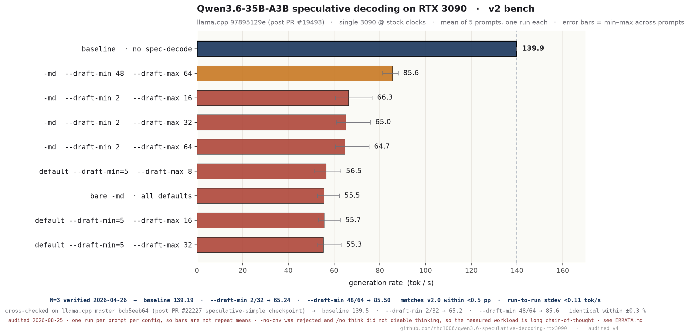

# v2 follow-up bench (2026-04-22)

> [!WARNING]
> **Rescoped by the 2026-08-25 audit.** The measurements below are archived and
> every aggregate was re-derived from the raw logs and reproduced exactly. Three
> of the conclusions did not survive:
>
> 1. **"100 % draft acceptance is genuine" is wrong.** The ratio is 1.0 by
>    construction. On this hybrid Gated-DeltaNet target the context reports
>    `COMMON_CONTEXT_SEQ_RM_TYPE_FULL`, so a partially accepted round takes an
>    early `continue` in `server-context.cpp` that skips both acceptance
>    counters and re-verifies the truncated prefix. Only fully accepted rounds
>    reach the counter. The drafter's own counters, printed one line below the
>    quoted `1.00000 (115 accepted / 115 generated)` in the same
>    `verbose.log`, say **115 of 214 generated draft tokens were accepted —
>    53.7 %**, and 33 of 81 drafts — 40.7 %. See [`../ERRATA.md`](../ERRATA.md) A1.
> 2. **The draft model was not vocabulary-matched.** The same log shows
>    `common_speculative_are_compatible` failing and llama.cpp falling back to
>    token translation. Cause: `Qwen/Qwen3.5-0.8B` has no
>    `generation_config.json` upstream, so its GGUF carries no
>    `tokenizer.ggml.bos_token_id` and llama.cpp substitutes the hard-coded
>    GPT-2 legacy default `11` against the target's `248044`. Both models set
>    `add_bos_token = false`, so the field that gates speculation is one
>    neither model uses. See [`../ERRATA.md`](../ERRATA.md) A2.
> 3. **`/no_think` did not disable thinking and `-no-cnv` was rejected.**
>    61 of 62 logs in this directory contain
>    `--no-conversation is not supported by llama-cli` followed by
>    `[Start thinking]` and a full reasoning trace. The measured workload is
>    long chain-of-thought output. The real switches on this build are
>    `-rea off` / `--reasoning-budget 0`. See [`../ERRATA.md`](../ERRATA.md) D1/D2.
>
> A further provenance gap: the committed `bench_3090_oleg.sh` writes config
> directories named `02_srogmann_ngmod_n24` / `03_oleg_draft_2_32` /
> `04_oleg_draft_2_16`, while the committed data is `02_oleg_draft_2_32` /
> `03_oleg_draft_2_16` / `04_draft_2_64`. The script is therefore not the one
> that produced the logs, no script is committed for `v2_controls/` or
> `v2_master_cross_check/`, and no log records its own argv. See
> [`../ERRATA.md`](../ERRATA.md) D5.


Response to [Oleg-dM's comment on HF discussion #14](https://huggingface.co/unsloth/Qwen3.6-35B-A3B-GGUF/discussions/14).
Fresh bench on a single RTX 3090 covering the commenter's suggested
`--draft-min 2 --draft-max 32`, a control sweep of `--draft-min=5`
defaults, srogmann-style `--draft-min 48 --draft-max 64`, plus a
cross-check on current llama.cpp master `bcb5eeb64`
(post PR #22227 `speculative-simple: add checkpoint support`).



## Headline numbers (tok/s, N=5 per config, same 3090, stock clocks)

| | mean | vs baseline |
|---|---:|---:|
| **baseline** (no spec-decode) | **139.9** | — |
| `--draft-min 48 --draft-max 64` (srogmann-style) | 85.6 | **−39 %** |
| `--draft-min 2 --draft-max 32` (commenter's suggestion) | 65.0 | −54 % |
| default `--draft-min=5 --draft-max 8/16/32` | 55.3–56.5 | −60 % |

Cross-check on master `bcb5eeb64`: identical within ±0.3 % noise.

## Why it still loses

1. ~~**100 % draft acceptance is genuine**~~ — **RETRACTED.** The ratio is
   a counter artefact (see the banner above): 1.0 by construction on this
   model. True acceptance in that run is 115 / 214 = 53.7 % of generated
   draft tokens. The draft was also *not* vocab-matched — llama.cpp ran it
   through the token-translation fallback. Acceptance was never measured, so
   it cannot be ruled in or out as the bottleneck.
2. **Draft-path and state-management overhead is large and measured.** In
   the one run with a verbose trace, the drafter's `generate()` alone took
   999.6 ms of a ~3165 ms generation wall-clock (31.6 %), 20 of 53
   verification rounds were discarded and redone, and each discarded round
   paid a 62.8 MiB state checkpoint plus its restore. The expert-union story
   is a hypothesis; nothing here measures expert routing.
3. **Counter-intuitive finding:** larger draft windows (48 / 64) lose
   *less* than shorter ones, because they amortise the verify cost
   across more speculated tokens. The opposite of the "wasted
   compute" intuition.

## File index

| File | Purpose |
|---|---|
| [`SUMMARY.md`](SUMMARY.md) | Full methodology, setup, and result tables |
| [`plot_v2_configs.png`](plot_v2_configs.png) | Headline bar chart (above) |
| [`plot_v2.py`](plot_v2.py) | Chart generator (matplotlib) |
| [`results_v2.json`](results_v2.json) | Machine-readable per-config and per-prompt results |
| [`extract_results.py`](extract_results.py) | Extractor that produces `results_v2.json` from the `.log` files |
| [`bench_3090_oleg.sh`](bench_3090_oleg.sh) | Reproducible bash script (requires the two GGUFs locally) |
| [`v2_oleg_suggestions/`](v2_oleg_suggestions) | 4 configs × 5 prompts + `verbose.log` per-token dump |
| [`v2_controls/`](v2_controls) | 5 control configs × 5 prompts (default `--draft-min=5` sweep + srogmann + bare `-md`) |
| [`v2_master_cross_check/`](v2_master_cross_check) | 3 configs × 5 prompts on master `bcb5eeb64` |

## Reproduce

```bash
# (1) install llama.cpp at 97895129e or current master, build with CUDA arch 86
# (2) download model files
hf download unsloth/Qwen3.6-35B-A3B-GGUF Qwen3.6-35B-A3B-UD-Q4_K_XL.gguf --local-dir ~/models
hf download unsloth/Qwen3.5-0.8B-GGUF --include '*Q4_K_M*' --local-dir ~/models
# (3) run
bash bench_3090_oleg.sh
```

Environment snapshot for this bench is appended to the top-level
[`BENCHMARK_ENV.md`](../BENCHMARK_ENV.md#v2-benchmark-environment-follow-up-bench-2026-04-22).

## Conclusion

**No speculative decoding configuration tested here was a net win for
`Qwen3.6-35B-A3B-UD-Q4_K_XL` on this RTX 3090** — note the target is
UD-Q4_K_XL; `Q4_K_M` is the 0.8 B *draft* model. This holds regardless of commit,
regardless of `--draft-min` / `--draft-max`, regardless of whether
you're measuring the "always-active" regime (this v2 bench, 55–85
tok/s) or the "active-plus-skipped mixture" regime (v1 bench, mean
120 with bimodal tail 59).

H100 / H200 / NVLinked pairs may flip the sign. Dual-3090 with PCIe
crossing between main-GPU and draft-GPU makes it worse (per Oleg's
80 → 25 tok/s observation on his own dual-GPU setup).

---

See also:
- [main repo README](../README.md) — original v1 bench + v2 UPDATE banner
- [CHANGELOG.md](../CHANGELOG.md)
- [HF discussion #14](https://huggingface.co/unsloth/Qwen3.6-35B-A3B-GGUF/discussions/14)
- original llama.cpp PR: [#19493](https://github.com/ggml-org/llama.cpp/pull/19493)
- current-master spec-decode PR: [#22227](https://github.com/ggml-org/llama.cpp/pull/22227)
