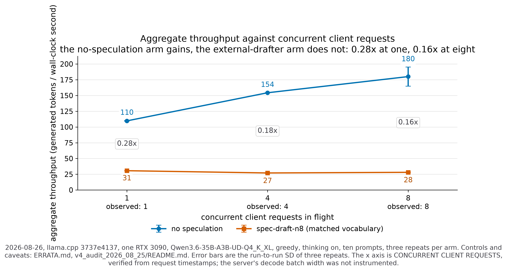
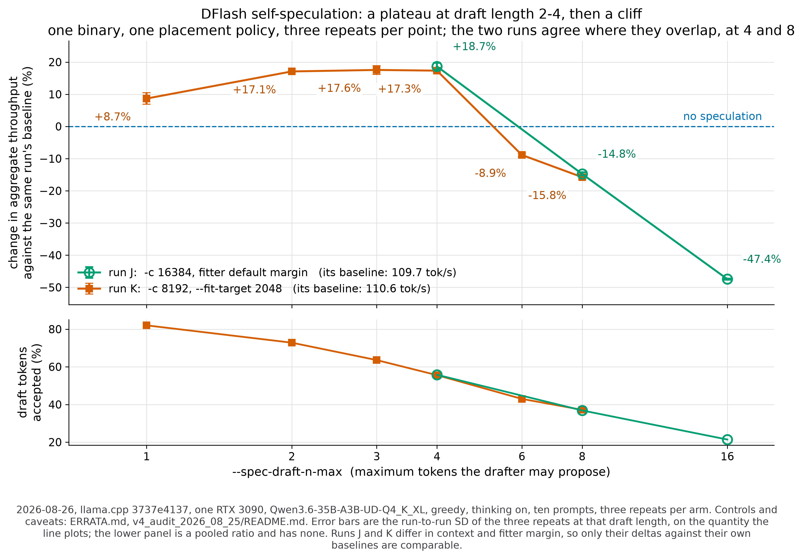
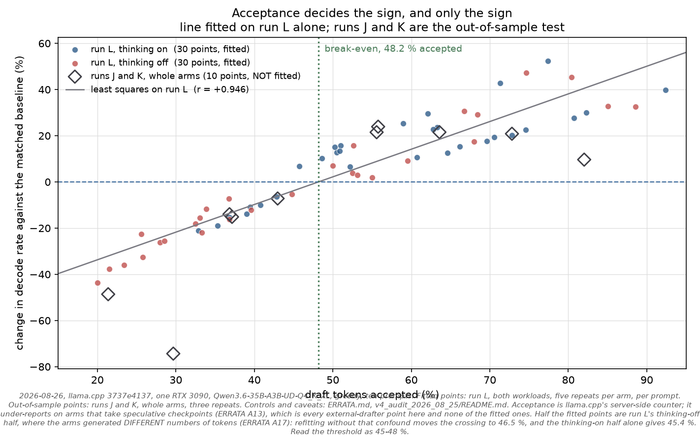

# v4 — audit measurements, 2026-08-25

New measurements taken during the audit, on the same physical host that
produced v2 and v3. They exist to settle three questions the archived data
could not:

1. Was the draft model's vocabulary incompatibility responsible for the
   slowdown? (**No.**)
2. Is the published "100 % draft acceptance" a real measurement? (**No** — and
   upstream has since fixed the counter, which proves it.)
3. Does the `llama-server` speculative path still work on this model?
   (**Not at `bcb5eeb64`. Yes on post-merge master.**)

Harness: [`../bench/retest_runner.py`](../bench/retest_runner.py) — one pinned
binary per run, ABBA arm ordering, N repeats, and a manifest recording the
binary's sha256, both model sha256s, the complete argv, and GPU telemetry
before and after every arm. Per request it keeps the generated text, the
reasoning channel, the stop reason, the whole `timings` block, and token IDs via `logprobs` (near-complete: `probs_output` drops trailing stop-word tokens, `server-context.cpp:2036-2039`, so the list can run a few short of `predicted_n`, which stays the authority for token counts).

> The runs on this page were taken **before** two harness defects were fixed,
> and their JSON shows it: `tokens` is empty in every row, because the first
> version asked for `return_tokens`, which the OAI chat serialiser silently
> drops. Their `content` is empty and `reasoning_content` is full in every
> baseline row — first-hand confirmation of [ERRATA A5](../ERRATA.md), and a
> reminder that **these measurements are of thinking generation, not answers.**
> Later runs use the verified `enable_thinking: false` control.

Common to both runs: `Qwen3.6-35B-A3B-UD-Q4_K_XL` target,
`Qwen3.5-0.8B-Q4_K_M` draft, `-ngl 999 -c 16384 --jinja -fa on -ctk q8_0
-ctv q8_0`, greedy, 300-token cap, the ten v1 prompts, draft window 4–8.

The three arms differ in one thing only:

| arm | what it is |
|---|---|
| `baseline` | no draft model |
| `draft-max8-translate` | draft attached; llama.cpp's compatibility gate fails and it uses the token-translation fallback — this is what every published number in this repository was measured on |
| `draft-max8-matched` | identical, plus `--override-kv tokenizer.ggml.bos_token_id=int:248044`, which makes the gate pass |

---

## Run A — `bcb5eeb64`, the binary v2 used

`data/A_bcb5eeb64_legacy/`, 2 repeats, binary sha256 `32c16754e053da2f…`

| arm | request-mean | pooled | min | accepted / drafted | completed |
|---|---:|---:|---:|---:|---|
| baseline | 123.0 | 122.9 | 116.2 | — | 2 / 2 |
| draft, translation fallback | 113.9 | 100.3 | 48.4 | 194 / 194 = **100.0 %** | **0 / 2** |
| draft, matched vocabulary | 113.5 | 101.0 | 50.0 | 194 / 194 = **100.0 %** | **0 / 2** |

Two things to read off this table.

**The 100 % reproduces exactly**, in both arms, on demand. It is the counter
artefact described in [`../ERRATA.md`](../ERRATA.md) A1, not a property of the
draft model.

**Neither draft arm finished.** Both aborted on the `code_small` prompt, 2 / 2,
with the same CUDA error, immediately after a partial-accept checkpoint
restore — see `data/abort_evidence_bcb5eeb64.txt`:

```
slot update_slots: n_draft=6, accepted=6           <- 6 < 6+1, partial
slot update_slots: restoring speculative checkpoint (size = 65864420)
srv  update_slots: decoding batch, n_tokens = 7
ggml-cuda.cu:97: CUDA error: an unsupported value or parameter was passed
  cublasSgemm_v2(..., CUBLAS_OP_T, CUBLAS_OP_N, row_diff, src1_ncols, ne10, ...)
  #14 server_context_impl::update_slots()
```

The baseline arm completes every time. This means v2's "cross-checked on master
`bcb5eeb64`, identical results" is a `llama-cli` cross-check only — the
`llama-server` path that produced every v1 number does not survive on that
commit with a draft attached.

The `baseline` numbers in this run are depressed (123 rather than ~133) because
its first repeat overlapped a compile on the same host. The arm contrast is
unaffected: both draft arms ran after the compile finished, and ABBA ordering
puts them in the same conditions.

---

## Run B — post-merge master `3737e4137`, with speculation actually enabled

`data/B_master_3737e4137/`, 3 repeats, binary sha256 `b6a5c490bb932ffa…`

llama.cpp renamed the speculative arguments after `bcb5eeb64`
(`--draft-max` → `--spec-draft-n-max`) and `--spec-type` now defaults to
`none`. A first attempt with `-md` alone produced a suspiciously clean "no
crash, no slowdown" result; the server log showed **zero `generate_draft`
calls and `draft_n = 0` on all thirty requests**. On master, `-md` loads a
draft model and never speculates unless `--spec-type` is given. That run is
discarded; this one passes `--spec-type draft-simple`.

| arm | request-mean | pooled | min | accepted / drafted | completed |
|---|---:|---:|---:|---:|---|
| baseline | 132.9 | 133.3 | 131.7 | — | 3 / 3 |
| draft, translation fallback | 33.6 | 32.6 | 26.9 | 4926 / 16590 = **29.7 %** | 3 / 3 |
| draft, matched vocabulary | 33.7 | 32.6 | 26.3 | 4926 / 16590 = **29.7 %** | 3 / 3 |

**The abort is gone.** All thirty requests complete in both draft arms.

**The acceptance counter is fixed.** It now reports 29.7 %, not 100 %. This is
independent confirmation of ERRATA A1: the historical 1.0 was the counter being
unreachable on a `COMMON_CONTEXT_SEQ_RM_TYPE_FULL` context, and once upstream
made partial rounds reachable, real ratios appear.

**Speculation now runs on every prompt.** In v1 only 2 of 10 requests recorded
a draft round; here all 10 do.

---

## Answer 1 — the vocabulary defect is real, and it is not the cause

The two arms are byte-identical in what they draft: `16590` drafted and `4926`
accepted, in **both**, and the same per-prompt pairs (`154/576`, `140/647`,
`211/404`, …). The throughput difference is +0.3 % overall, and per prompt it
ranges from −1.2 % to +3.7 % — noise.

So: llama.cpp genuinely was running the token-translation fallback, this
repository's "vocab-matched" claim was genuinely false, and fixing it changes
nothing material. The negative finding survives, now measured on a matched
path. See [`../ERRATA.md`](../ERRATA.md) A2 for the root cause — the draft
model's upstream repo has no `generation_config.json`, so its GGUF carries no
`tokenizer.ggml.bos_token_id`, and llama.cpp substitutes the hard-coded GPT-2
legacy default `11` against the target's `248044`, over a field that neither
model uses because both set `add_bos_token = false`.

## Answer 2 — with acceptance measured properly, there is no anomaly

Per prompt on master, matched arm, mean of 3 repeats:

| prompt | baseline | with draft | vs baseline | real acceptance |
|---|---:|---:|---:|---:|
| reasoning | 132.7 | 45.5 | −65.7 % | 52 % |
| code_small | 132.7 | 45.5 | −65.7 % | 50 % |
| zh_hant | 133.0 | 35.3 | −73.5 % | 35 % |
| medium_rec | 133.3 | 36.4 | −72.7 % | 35 % |
| long_explain | 132.8 | 31.3 | −76.4 % | 28 % |
| short_greet | 133.0 | 31.0 | −76.7 % | 27 % |
| multi_turn_2 | 132.5 | 29.5 | −77.7 % | 24 % |
| short_q | 133.3 | 27.8 | −79.1 % | 22 % |
| medium_chat | 133.1 | 27.3 | −79.5 % | 20 % |
| multi_turn_1 | 132.6 | 27.1 | −79.6 % | 20 % |

**Pearson r between real acceptance rate and decode rate = +0.998 across the
ten prompts.**

That is the headline correction. This repository's central claim was an
*anomaly*: 100 % acceptance yet slower, therefore something MoE-specific must
be destroying the speedup. Once acceptance is measured rather than assumed,
acceptance and speed are almost perfectly correlated, exactly as ordinary
speculative-decoding economics predicts. There is no anomaly to explain. The
slowdown on this hardware is low acceptance plus draft-path cost, and it needs
no MoE-specific pathology.

`analysis/plot_accept_vs_speed.png` — every one of whose 140 points sat at
exactly 100 %, making this relationship invisible — has been deleted.

---

## Runs C and D — the thirteen-arm matrix, and the workload the archive never controlled

`data/C_master_matrix_think_on/` and `data/D_master_matrix_think_off/`, both on
post-merge master `3737e4137`, 5 repeats, ABBA-ordered, one pinned binary.
Continuous GPU telemetry for the whole 110 minutes is in
`data/gpu_telemetry_20260825.csv`.

Reproduce the tables with:

```bash
python analysis/matrix_report.py v4_audit_2026_08_25/data/C_master_matrix_think_on
python analysis/matrix_report.py v4_audit_2026_08_25/data/D_master_matrix_think_off
python analysis/thermal_report.py v4_audit_2026_08_25/data/gpu_telemetry_20260825.csv
```

### C — thinking on, thirteen arms

| arm | pooled tok/s | vs baseline | acceptance | draft tokens per generated token | run-to-run SD |
|---|---:|---:|---:|---:|---:|
| `baseline-kvfp16` | 125.7 | **+1.9 %** | — | 0 | 0.37 |
| `baseline` | 123.4 | — | — | 0 | 2.08 |
| `ngram-simple` | 118.1 | −4.2 % | 4.3 % | 0.06 | 0.88 |
| `ngram-mod` n=24 | 115.0 | −6.8 % | 4.8 % | 0.21 | 0.59 |
| `ngram-cache` | 74.0 | −40.0 % | 1.8 % | 0.42 | 2.48 |
| `ngram-cache-kvfp16` | 70.9 | −42.5 % | 2.0 % | 0.44 | 1.08 |
| draft model n_max 4 | **35.6** | −71.1 % | 45.4 % | 1.12 | 0.08 |
| draft model n_max 2 | 34.2 | −72.2 % | 60.3 % | 0.74 | 0.06 |
| draft model, v1's config | 32.3 | −73.8 % | 29.7 % | 1.84 | 0.56 |
| draft model n_max 8 | 32.1 | −74.0 % | 29.7 % | 1.85 | 0.54 |
| draft model n_max 1 | 31.1 | −74.8 % | 68.7 % | 0.50 | 0.07 |
| draft model n_max 16 | 23.7 | −80.8 % | 15.0 % | 3.58 | 0.86 |
| draft model n_max 32 | 17.3 | −86.0 % | 8.0 % | 6.84 | 0.04 |

The run-to-run SD column is the one honest `±` in this repository: the spread
of five whole-prompt-set repeats, 0.04–2.48 tok/s. The historical `±27–31` was
spread *between prompts*.

Two entries in that column need reading carefully. `baseline`'s 2.08 is almost
entirely its cold-start first repeat — excluding it the SD is 0.47. But
`ngram-cache`'s is not: 77.9, 74.7, 75.8, 72.3, 72.0 tok/s, still 1.86 after
dropping rep 0, and drifting downward. It is the least reproducible arm in the
matrix by a wide margin, and this audit does not have an explanation for it.
Every other arm sits between 0.03 and 0.48 once the cold start is removed.

Three things fall out.

**The best draft length is 4, and it is still 71 % below baseline.** The sweep
is not monotone — cost rises and acceptance falls as the window widens, and
n_max 1 is worse than n_max 2 because a full drafter forward pass buys at most
one token. The peak is real but shallow: per-repeat SD is 0.055 and 0.076 for
n_max 2 and 4, against a 1.4 tok/s gap.

**Drafting volume is not the whole cost.** An external drafter proposing 0.50
tokens per generated token runs at 31.1 tok/s; `ngram-cache` proposing 0.42
runs at 74.0. The per-round cost of the *method* is a third, independent term —
a 0.8 B forward pass every round versus a table lookup.

**The fp16-KV control the v1 matrix lacked.** fp16 KV is 1.9 % faster than
q8_0 with no speculation running, and 4.2 % worse with `ngram-cache` on. See
[`../ERRATA.md`](../ERRATA.md) B7.

### D — the same arms with thinking verifiably off

`thinking_suppressed` is recorded per request: 50/50 in D, 0/50 in C. Output
lengths in D run 22–300 tokens because completions now finish naturally.

| method | thinking on (C) | thinking off (D) | draft tokens per generated token |
|---|---:|---:|---|
| `ngram-mod` n=24 | −6.8 % | **−0.7 %** | 0.21 → **0.00** |
| `ngram-cache` | −40.0 % | −32.6 % | 0.42 → 0.36 |
| draft model n_max 8 | −74.0 % | −76.4 % | 1.85 → **2.14** |

With thinking off `ngram-mod` never drafts at all — zero draft tokens across
fifty requests — and its cost nearly disappears. A chain-of-thought trace is
long and formulaic, which is what an n-gram lookup feeds on; a direct answer is
not. For the draft model the effect runs the other way: acceptance falls from
29.7 % to 23.0 %, so reasoning traces are *easier* for a 0.8 B drafter than
real answers.

This is the comparison Exp 2 believed it had made. Its conclusion was not
merely unverifiable, it was backwards for the methods where shape matters most.
And it means **every historical number in this repository was measured on the
workload that favours speculation, and speculation still lost.**

### Thermals and drift

1317 telemetry samples over 110 minutes, 1272 under load:

- `power.limit` = `power.default_limit` = `power.max_limit` = 350 W — **not overclocked**
- 58–75 °C, mean 64.7, against a ~83 °C throttle point
- 1800–1965 MHz of a 2100 MHz maximum, mean 1937
- `hw_power_brake` never active; `sw_thermal` fires on **2** samples of 1272 and
  `hw_thermal` on **1**, at 64–65 °C and with the clock at 1950, 1950 and
  1935 MHz against a run maximum of 1965 — so none of the three carried a
  meaningful downclock. (An earlier version of this line said "the one
  `sw_thermal` sample … at its run maximum". Both halves were wrong; see
  [ERRATA C4b](../ERRATA.md#c4b-stock-clocks-was-measured-once-before-the-load).)

The baseline is repeated five times across the run, so drift is testable from
the measurement itself: 126.6, 122.2, 122.6, 121.8, 121.6 tok/s. That is not
progressive decline — it is a cold-start first repeat, +3.7 % against a tail
that then varies by 0.89 %. Three other arms measured across the same repeats
show no such step (+0.35 % to +0.47 %), because only the first arm of the first
repeat starts on an idle, cool card.

---

## Run I — batching, the lever upstream names

Upstream's standing answer to "speculative decoding loses on a MoE target" is
that the regime is wrong: the win is supposed to appear when the GPU is not
already saturated by a single stream, i.e. under batching (ERRATA A9). Run I
tests that directly on this host, with the matched-vocabulary drafter at
`--spec-draft-n-max 8` — the arm closest to what v1 ran.

**First, the harness had to be fixed.** The first attempt at this run measured
nothing. `BENCH_CONCURRENCY` passed `--parallel N -cb` to the server, which
allocated N slots, and then the client issued the ten prompts one at a time, so
N−1 slots sat idle. The tell was in the data before any code was read: the c=4
arm-runs took 44 s and 118 s against c=1's 44 s and 116 s. Four times the
nominal concurrency at identical wall-clock is a client batch size of one. That
attempt is discarded, not reported.

The runner now dispatches through a thread pool and records how many **client**
requests were outstanding at once, derived from the request timestamps. That is
**not** the server's decode batch width and is not offered as one: a server that
processed every request serially would still show all of their HTTP windows
overlapping while the later ones sat in its queue. What it does establish is the
negative case this run was re-done for — a value of 1 would mean the client
never had more than one request outstanding. It equals the configured level in
all eighteen arm-runs:

| level | requested | observed client requests in flight |
|---|---|---|
| c=1 | 1 | 1, 1, 1, 1, 1, 1 |
| c=4 | 4 | 4, 4, 4, 4, 4, 4 |
| c=8 | 8 | 8, 8, 8, 8, 8, 8 |

Measuring what the server actually batched needs instrumentation of active
sequences and batch/ubatch token counts per decode, which is queued in
[`../RETEST_TODO.md`](../RETEST_TODO.md) and not done here.

Aggregate throughput — 3000 generated tokens divided by wall-clock over the
ten-prompt set, mean of three repeats:

| concurrency | no speculation | `spec-draft-n8` | speculation ÷ baseline |
|---|---|---|---|
| 1 | 109.7 ± 0.57 | 30.6 ± 0.14 | 0.28× |
| 4 | 154.3 ± 0.27 | 27.0 ± 0.73 | 0.18× |
| 8 | 180.0 ± 15.21 | 28.1 ± 0.66 | 0.16× |



**Batching helps the target and does nothing for the drafter.** No speculation
gains +40.6 % at c=4 and +64.0 % at c=8. Speculation moves −11.7 % and −8.4 %
over the same range. The gap therefore widens with batching rather than
closing: 0.28× → 0.18× → 0.16×.

On this host, at this model and draft window, batching is not the missing
regime. That is a negative result about one arm on one card, not a refutation
of the upstream argument in general — but it is the specific configuration this
repository has been reporting, measured in the regime it was told to measure it
in.

Two caveats, both against the strength of the result:

- ± is the run-to-run SD of three repeats. At c=8 it is 15.21 because one
  baseline repeat came in at 197.5 against 171.2 twice. Ten prompts over eight
  slots is one full wave plus a wave of two, so wall-clock there is sensitive to
  which prompts land in the short tail; c=4, at 2.5 waves, is the cleaner
  measurement. The conclusion survives either way — the *slowest* c=8 baseline
  repeat is still +56 % over c=1, and speculation never moves at all.
- The prompt set is fixed at ten. A batching benchmark would normally hold the
  arrival rate, not the request count, constant.

### The failure mode that did not happen

llama.cpp issue #27572 reports draft acceptance silently collapsing to 0 under
`-np N`. It did not occur here, and that was checked rather than assumed:

| level | drafted | accepted | counted ratio | requests with `draft_n = 0` |
|---|---|---|---|---|
| c=1 | 5547 / rep | 1646 | 29.7 % | 0 / 10 |
| c=4 | 5572–5691 | 1608–1641 | 28.3–29.5 % | 0 / 10 |
| c=8 | 5656–5687 | 1607–1625 | 28.3–28.7 % | 0 / 10 |

Acceptance is flat across concurrency. Speculation is losing under batching
because the target's own batched decode gets much cheaper while the draft cost
does not, not because the drafter stopped working.

---

## Run J — the first configuration that is actually faster

This is the DFlash A/B that ERRATA D4 says v3 never had: one binary
(`b6a5c490…`), one placement policy, one drafter, three repeats per arm, DFlash
off and on.

Two things had to be true first. The archived v3 drafter GGUF is rejected by
post-merge master for lacking `target_layers`; the re-converted file carries it
(`dflash.target_layers = [2, 11, 20, 29, 38]`). And the BF16 drafter only loads
with `-ngl` unset, because pinning it makes `common_fit_params` abort instead of
adjusting the parameters the caller left unset — so `BENCH_FIT=on` applies to
**every** arm in the run, the baseline included, and placement policy stays
constant across the comparison.

That last decision is a confound if `-fit on` quietly handicaps the control, so
it is checked directly:

| control | aggregate |
|---|---|
| baseline, `-ngl 999` pinned (run I, c=1) | 109.72 ± 0.57 |
| baseline, `-fit on` (run J) | 109.70 ± 0.18 |
| difference | **−0.01 %** |

Both load `41/41` target layers to GPU; the DFlash arm additionally loads `9/9`
drafter layers. The control is not being handicapped.

| arm | pooled | aggregate | vs no speculation | drafted | acceptance |
|---|---|---|---|---|---|
| **`spec-dflash-n4`** | **151.6** | **130.2 ± 1.21** | **+18.7 %** | 11 070 | 55.8 % |
| no speculation | 122.3 | 109.7 ± 0.18 | — | 0 | — |
| `spec-dflash-n8` | 105.2 | 93.5 ± 0.56 | −14.8 % | 18 114 | 36.8 % |
| `spec-dflash-n16` | 62.8 | 57.7 ± 0.19 | −47.4 % | 31 728 | 21.4 % |
| `spec-draft-n8` (matched vocab) | 31.4 | 30.5 ± 0.18 | −72.2 % | 16 641 | 29.7 % |



**DFlash at `n_max 4` is +18.7 % on aggregate throughput and +24.0 % pooled.**
It is the first configuration in this repository that beats not speculating,
and it is not an average that hides losers — it wins on all ten prompts
individually:

| prompt | no speculation | `dflash-n4` | `dflash-n8` | `dflash-n16` |
|---|---|---|---|---|
| `short_greet` | 122.4 | 156.2 | 108.5 | 60.6 |
| `short_q` | 122.3 | 150.9 | 87.2 | 52.4 |
| `medium_chat` | 121.8 | 141.1 | 93.2 | 53.9 |
| `medium_rec` | 121.8 | 160.9 | 125.7 | 83.7 |
| `reasoning` | 121.8 | 178.4 | 128.9 | 94.7 |
| `long_explain` | 122.0 | 140.8 | 95.5 | 52.7 |
| `code_small` | 121.8 | 189.4 | 170.8 | 96.7 |
| `multi_turn_1` | 121.7 | 141.3 | 96.2 | 58.7 |
| `multi_turn_2` | 121.9 | 132.0 | 87.5 | 53.9 |
| `zh_hant` | 121.4 | 138.4 | 99.5 | 55.2 |

(per-request decode rate, mean of three repeats)

The sign flips with draft length, and it flips fast: +18.7 % at 4, −14.8 % at 8,
−47.4 % at 16, with acceptance falling 55.8 % → 36.8 % → 21.4 % as the window
grows. The archived v3 result — DFlash slower — is what this looks like at
`n_max 8` and 16. v3 measured n_max 4 as well, but across a binary change, and
read the difference as a DFlash effect.

### The configuration that produced it does not start reliably

Run J's fifteen arm-runs all completed — no crashes, no retries. But the same
`-c 16384` DFlash configuration, on the same binary and models forty minutes
later, aborted at its first decode:

```
ggml_backend_cuda_buffer_type_alloc_buffer: allocating 120.28 MiB on device 0:
    cudaMalloc failed: out of memory
srv  update_slots: decode() failed: failed to allocate compute pp buffers
```

Run J's telemetry peaks at 23946 MiB of 24576 with the drafter resident —
630 MiB of headroom, 2.6 % of the card — and a 120 MiB allocation still failed,
so the true transient peak is above what five-second sampling can see. With
`-fit on` the fitter sizes the target against whatever it reads as free at
startup, and whether the drafter then fits is decided in that margin.

Run J's numbers are what they are: fifteen clean arm-runs with a matched
control. But **the configuration is marginal on a 24 GiB card**, and anyone
reproducing it should expect to lower the context. Run K does exactly that —
`-c 8192` for every arm including its own baseline — which is why K's absolute
rates are not comparable with J's and K carries its own control.

The harness now fails fast on this: `wait_health` watches the process instead
of polling for its full 300-second timeout, so a dead arm costs ~20 seconds to
discover rather than five minutes per repeat.

### Every measurement of the same quantity, with its power

The number this repository headlines should not be the one with the fewest
repeats behind it. All six measurements of the DFlash plateau:

| run | arm | repeats | Δ aggregate | Δ pooled | configuration |
|---|---|---|---|---|---|
| J | `n_max 4` | 3 | **+18.7 %** | +23.9 % | `-c 16384`, fitter default margin |
| K1 | `n_max 2` | 3 | +17.1 % | +20.9 % | `-c 8192`, `--fit-target 2048` |
| K1 | `n_max 3` | 3 | +17.6 % | +21.6 % | `-c 8192`, `--fit-target 2048` |
| K1 | `n_max 4` | 3 | +17.3 % | +21.5 % | `-c 8192`, `--fit-target 2048` |
| L, thinking on | `n_max 2` | **5** | +16.7 % | **+21.1 %** | `-c 8192`, `--fit-target 2048` |
| L, thinking on | `n_max 4` | **5** | +16.1 % | +20.9 % | `-c 8192`, `--fit-target 2048` |

Aggregate spans +16.1 % to +18.7 %; pooled spans +20.9 % to +23.9 %. The two
metrics differ by about 4 pp throughout because aggregate divides by wall-clock,
which includes prompt processing and HTTP overhead that speculation does not
touch; pooled divides by decode time and does not.

Run J's +18.7 % is the top of the aggregate range and has the fewest repeats
behind it. It is reported because it is where the effect was first isolated
under a matched control, not because it is the best estimate. The best estimate
is the five-repeat row.

**What this does and does not establish.** It establishes that on this host,
this target, this drafter and this prompt set, a self-speculative method at a
short draft window beats no speculation by roughly a fifth, with a matched
control and three repeats. It does not establish that the number transfers: the
window is one draft length on one card, thinking is on throughout, and ten
prompts is ten prompts. The draft-length optimum is bracketed from below in run
K, because three points that straddle a peak cannot say where the peak is.

---

## Run K — where the optimum is, and what batching does to it

Run J put `n_max 4` at +18.7 % and `n_max 8` at −14.8 %, which locates the peak
at or below 4 and says nothing about where. Run K brackets it from 1, and then
asks of the winning arm the question run I asked of the matched-vocabulary one.

Everything here is at `-c 8192` with `--fit-target 2048`, applied to every arm
including the baseline, for the reason in the previous section: at the fitter's
default margin the DFlash configuration does not start reliably. Absolute rates
are therefore not comparable with run J's; the deltas against each run's own
baseline are.

| `n_max` | aggregate | run-to-run SD | pooled | vs no speculation | acceptance |
|---|---|---|---|---|---|
| — (no speculation) | 110.6 | 2.10 | 123.3 | — | — |
| 1 | 120.2 | 1.97 | 135.2 | +8.7 % | 82.0 % |
| 2 | 129.5 | 0.13 | 149.0 | +17.1 % | 72.8 % |
| **3** | **130.0** | 1.49 | 149.9 | **+17.6 %** | 63.6 % |
| 4 | 129.8 | 0.51 | 149.8 | +17.3 % | 55.6 % |
| 6 | 100.8 | 0.63 | 114.5 | −8.9 % | 43.0 % |
| 8 | 93.2 | 0.63 | 104.6 | −15.8 % | 37.2 % |

**There is no peak, there is a plateau and then a cliff.** `n_max` 2, 3 and 4
land at 129.5, 130.0 and 129.8 — separated by less than the run-to-run SD of the
baseline, so calling any one of them "the optimum" would be reading noise. What
the sweep does establish is the shape: one token of draft is not enough
(+8.7 %), two to four are worth about +17 %, and by six the arm is already
losing. The sign change sits between 4 and 6, not between 4 and 8 as run J's
coarser grid suggested.

Run K also **replicates run J** at the two draft lengths they share, from a
different context and a different fitter margin:

| `n_max` | run J | run K |
|---|---|---|
| 4 | +18.7 % | +17.3 % |
| 8 | −14.8 % | −15.8 % |

### Batching destroys it

| | no speculation | `spec-dflash-n4` | vs baseline |
|---|---|---|---|
| 1 request in flight | 110.6 | 129.8 | **+17.3 %** |
| 4 in flight | 154.1 ± 0.48 | 154.7 ± 3.35 | +0.4 % |
| 8 in flight | 153.2 ± 0.61 | 39.6 ± 1.47 | **−74.1 %** |

The advantage is gone at four concurrent requests and the arm collapses at
eight, reproducibly — SD 1.47 on 39.6 across three repeats.

**It is not that the drafts get worse.** Draft volume per generated token and
acceptance barely move across the three levels; only the clock does:

| level | drafted per generated token | acceptance | aggregate |
|---|---|---|---|
| 1 in flight | 1.234 | 55.6 % | 129.8 |
| 4 in flight | 1.243 | 55.0 % | 154.7 |
| 8 in flight | 1.305 | 51.2 % | 39.6 |

The draft work is not being shared across the batch, so its cost scales with the
batch while the target's per-token cost falls. That is the same shape run I
found for the matched-vocabulary drafter, reached by a different method.

Two things checked rather than assumed before reading that −74.1 %:

- **Not context exhaustion.** `-c 8192` across eight slots is 1024 tokens each,
  and the requests report `n_tokens = 328` at release. The speculative
  checkpoint machinery never fired: zero checkpoints created, zero restored. The
  only log warnings are `truncating draft to N tokens`, which is ordinary `p_min`
  truncation, and the `discard` count is identical in both arms.
- **The baseline itself is constrained at this context**, and that is stated
  rather than hidden: run K's c=8 baseline plateaus at 153.2 where run I's, at
  `-c 16384`, reached 180.0. That is a cross-run difference in absolute rate. The
  −74.1 % is a within-run contrast against the 153.2 measured beside it.

---

## Run L — the win is a property of the workload, not of the method

Workload shape has moved a result in this repository before: `ngram-mod` went
from −6.8 % to −0.7 % between the think-on and think-off matrices and drafted
zero tokens in the latter (ERRATA D3b). A headline measured with thinking on has
to be shown with it off.

Run L runs the same five arms twice, five repeats each, at the same context and
fitter margin, differing only in `enable_thinking`. **Pooled** throughput is the
metric here: with thinking off the outputs are shorter *and differ in length by
arm* — median 96 tokens for the baseline against 83 for `dflash-n4` — because
speculation changes the generated text (A11), and aggregate throughput would mix
decode rate with output length.

> [!WARNING]
> **This section used to continue "Pooled is tokens over decode time and does
> not", and that is wrong.** Pooled removes the *wall-clock* dependence on
> output length; it does not make two arms comparable when they generated
> different numbers of tokens, because decode rate falls as the KV cache grows.
> Restricting run L's thinking-off comparison to the five prompts where every
> arm generated exactly 300 tokens moves `spec-dflash-n4` from **−2.7 %** to
> **+14.1 %** — the sign below flips — and moves every other model-drafting arm
> in the four thinking-off runs by +2.5 pp to +16.8 pp.
> [ERRATA A17](../ERRATA.md#a17-the-thinking-off-comparisons-are-not-comparisons-of-the-same-amount-of-work)
> has the full table and `analysis/length_matching.py` recomputes it. The
> thinking-**on** columns are unaffected: every request there generated exactly
> 300 tokens, and the same restriction moves them by 0.00 pp. The harness now
> has `BENCH_IGNORE_EOS` to force the hard cap; the numbers below predate it and
> are left as measured.

| arm | thinking ON | | thinking OFF | |
|---|---|---|---|---|
| | pooled | vs base | pooled | vs base |
| no speculation | 122.9 | — | 124.1 | — |
| `spec-dflash-n2` | 148.8 | **+21.1 %** | 133.5 | **+7.6 %** |
| `spec-dflash-n4` | 148.5 | +20.9 % | 120.7 | **−2.7 %** |
| `spec-dflash-n6` | 114.8 | −6.6 % | 93.4 | −24.7 % |
| `spec-draft-n8` | 30.6 | −75.1 % | 27.5 | −77.8 % |

Thinking was verifiably suppressed on 250/250 requests in the left half and on
0/250 in the right, measured from the reasoning channel rather than assumed from
the flag.

**The win survives, and shrinks by two thirds.** At `n_max 2` it goes from
+21.1 % to +7.6 %. At `n_max 4` — the configuration run J headlined — it goes
**negative**, −2.7 %. Acceptance falls with it: 72.8 % → 58.5 % at `n_max 2`,
55.6 % → 40.3 % at `n_max 4`.

### Which prompts lose it, and why

`spec-dflash-n2`, per prompt, both halves:

| prompt | ON: acc / Δ | OFF: acc / Δ |
|---|---|---|
| `reasoning` | 82.3 % / +30 % | 85.1 % / **+33 %** |
| `code_small` | 92.4 % / +40 % | 88.6 % / **+33 %** |
| `short_greet` | 72.8 % / +20 % | 68.0 % / +17 % |
| `long_explain` | 70.6 % / +19 % | 59.5 % / +9 % |
| `short_q` | 69.6 % / +18 % | 52.5 % / +4 % |
| `multi_turn_2` | 60.7 % / +11 % | 53.1 % / +3 % |
| `medium_rec` | 80.7 % / +28 % | 55.0 % / +2 % |
| `medium_chat` | 64.6 % / +13 % | 44.8 % / −5 % |
| `multi_turn_1` | 74.6 % / +23 % | 39.6 % / **−12 %** |
| `zh_hant` | 66.1 % / +15 % | 28.6 % / **−25 %** |

Ten of ten prompts win with thinking on; seven of ten with it off. The two that
keep their full gain are the two whose output is most constrained — step-by-step
arithmetic and Python — and their acceptance barely moves. The one that loses
most is Traditional Chinese free prose, where acceptance falls from 66 % to 29 %.

Reasoning text is planning prose: enumerated, repetitive, formulaic. A drafter
predicts it well. Direct answers are shorter and less templated, and Chinese
free prose least templated of all. **The speed-up is not a property of DFlash;
it is a property of how predictable the text being generated is**, and the
thinking channel happens to be very predictable text.

### Acceptance sets the sign — and only the sign

Across all 60 points in run L — ten prompts, three draft lengths, two workloads
— acceptance and speed-up correlate at **r = +0.946**, and the least-squares
line crosses zero at **48.2 % acceptance**. Below it 24 of 25 points are slower;
above it 35 of 35 are faster.



ERRATA A10 is what stops that being written down as a law: a single-regressor
fit that looked excellent in sample was falsified out of it. So this one was
pushed at runs J and K, which it never saw and which used a different context
and a different fitter margin:

Scored over **every** arm-run for which both an acceptance figure and a matched
baseline exist — 44 of them — with one exclusion stated up front: seven
`ngram-map` arm-runs drafted between **10 and 55 tokens in total**, and a
percentage computed over ten tokens is not a rate. There is a clean gap in the
data at that point; every other arm-run drafted at least 586. The remaining 37:

| family | sign predicted correctly |
|---|---|
| self-speculative (DFlash and MTP) | **28 / 29** |
| drafter-free n-gram | 2 / 2 |
| **external 0.8 B drafter** | **5 / 6** |
| all | **35 / 37** |

**And that scorecard does not depend on which acceptance counter you read.**
A13 shows the server counter under-reports on any path that takes a speculative
checkpoint. Rescoring with the speculator's own counter gives the same 35 / 37
and the same two misses. Without the minimum-sample exclusion it does not: the
score moves from 41/44 to 37/44 and four `ngram-map` verdicts flip, because on
ten drafted tokens the two counters read 0.0 % and 70.0 % for the same arm-run.
Excluding them is not tidying — it is refusing to score a rate that has no
denominator.

The two misses are the informative ones:

| arm | acceptance | measured | why it is interesting |
|---|---|---|---|
| `spec-mtp-n4`, thinking off | 49.5 % | −8.2 % | sits **1.3 pp above** the boundary; a threshold that never missed near its own boundary would be suspicious |
| `spec-draft-n1` | 69.7 % server, **100.0 %** drafter | **−75.1 %** | the external drafter, which is the entire point |

Mean magnitude error +8.1 pp, worst **+52.2 pp**.

**The two failures are the informative ones**, and they were only found because
the first version of this test drew its out-of-sample set from runs J and K,
which contain the external drafter only at 29.7 % acceptance — below the
threshold, where it agreed. Run C swept that drafter down to `n_max 1`:

| arm | acceptance | measured | threshold says |
|---|---|---|---|
| `spec-draft-n1` | **68.7 %** | **−74.8 %** | faster — **wrong** |
| `spec-draft-n2` | 60.3 % | −72.2 % | faster — **wrong** |
| `spec-draft-n4` | 45.4 % | −71.1 % | slower — ok |

**The threshold transfers; the slope does not.** At `n_max 1` the line predicts
+40.5 % from 82 % acceptance and the arm delivers +9.7 %, because one drafted
token per round cannot buy much however often it lands. The worst miss is
`spec-draft-n8` at +52.2 pp — a separate 0.8 B draft model pays a full forward
pass per drafted token where DFlash reuses the target's own layers, so its cost
per unit of acceptance is not the same quantity at all. Even there the sign was
right.

So the usable statement is narrower than it first looked: **within a
self-speculative family on this target, a configuration is worth running when it
clears roughly 48 % draft acceptance.** It is not a statement about acceptance in
general. An external 0.8 B drafter is 75 % slower at 68.7 % acceptance, because
it pays a fixed per-round cost that no acceptance rate can amortise — a full
checkpoint the server reports at 82.079 MiB, saved and restored, plus a dense
forward pass against a target that activates only ~3 B parameters. That cost is measured in
[ERRATA A12](../ERRATA.md#a12-what-the-checkpoint-path-costs-measured-with-timers-in-the-source),
and it is why the threshold holds inside one family and not across them.

---

## Thermals across the 2026-08-26 runs

Every run carried its own continuous `nvidia-smi` trace, and each was checked
rather than assumed, because a five-hour session on one card is exactly where a
throttling artefact would hide.

| run | loaded samples | temperature | SM clock | first half → second half |
|---|---|---|---|---|
| I + J | 539 | 55–73 °C (mean 63.4) | 1695–1965 MHz (mean 1939) | — |
| K | 317 | 53–74 °C (mean 64.0) | 1695–1980 MHz (mean 1937) | −0.05 % |
| L | 421 | 50–74 °C (mean 64.4) | 1695–1965 MHz (mean 1942) | −0.24 % |

The card is never overclocked (350 W stock limit throughout) and never near its
~83 °C throttle point. The dominant flag under load is `0x4`, `SwPowerCap` — the
350 W board limit doing its job — in roughly half the loaded samples, identically
across arms within a run. **One** sample in the I+J trace additionally carries
`0x20`, `SwThermalSlowdown`; that is a software flag and a single sample of 539,
the same transient behaviour ERRATA C4b recorded on 2026-08-25. No hardware
throttle bit — `HwSlowdown`, `HwThermal`, `HwPowerBrake` — is ever set in any of
the three traces. Clock drift between the first and second half of each run is
within 0.25 %, so none of the deltas above can be a decline in the card.

(The first version of this paragraph said `0x4` was the only flag that ever
appears. The regression checker caught it, after its own throttle mask was
corrected: `0xE0` counted `SwThermal` as hardware and missed `HwSlowdown`
entirely. Hardware is `0x8 | 0x40 | 0x80`.)

---

## Run M — the method the vLLM sibling uses, now measured here too

The vLLM result on this same physical hardware is an **MTP** result. Until MTP
ran under llama.cpp on this card, "llama.cpp loses where vLLM wins" confounded
the engine with the speculation method. Nothing was blocking it: the target's
own multi-token-prediction head is in the checkpoint (785 plain BF16 `mtp.*`
tensors, `text_config.mtp_num_hidden_layers = 1`), master's converter exports it
with `--mtp`, and `LLM_ARCH_QWEN35MOE` already declares the seventeen `NEXTN`
tensors. It had simply never been run. The head is 3.7 GB at BF16 and cannot sit
beside a 21 GB target on a 24 GB card, so it is quantised.

Both families in one matrix, one policy, three repeats — aggregate throughput:

| arm | aggregate | vs no speculation | acceptance |
|---|---|---|---|
| **`spec-dflash-n2`** | **127.3** | **+23.2 %** | 72.3 % |
| `spec-mtp-n2` | 122.5 | **+18.6 %** | 78.4 % |
| `spec-dflash-n4` | 119.9 | +16.1 % | 55.2 % |
| `spec-mtp-n1` | 118.4 | +14.6 % | 89.0 % |
| `spec-mtp-n4` | 111.5 | +8.0 % ‡ | 61.4 % |
| no speculation | 103.3 | — | — |
| `spec-mtp-n8` | 71.4 | −30.9 % | 41.4 % |

‡ **This row did not replicate and should not be used.** Measured again at five
repeats (run Q) the same arm reads +2.0 % on pooled decode rate against this
run's +10.5 %, and a third measurement on the extended prompt set reads +2.7 %.
Everything that could differ between the two runs was checked and is identical,
including the recorded argv, the drafter's sha256, the memory fitter's choices,
the per-prompt draft counts, the acceptance and the card's temperature and
clocks. The row is left in place because deleting a measurement that was made is
not the same as correcting it — see
[A14](../ERRATA.md#a14-within-run-repeats-are-not-an-error-bar).

**MTP works, and DFlash is better.** Both peak at `n_max 2`; MTP has the higher
acceptance at every length and still loses on throughput, because its head is a
full MoE layer plus `lm_head` while DFlash's is smaller.

### The drafter-precision objection, tested

"You quantised the drafter" is the first thing to say about any MTP number here,
since DFlash ran at BF16. So the same arms were run with a **Q4_K_M** head
instead of Q8_0:

| arm | Q8_0 drafter | Q4_K_M drafter |
|---|---|---|
| `spec-mtp-n2` | +18.6 % (acc 78.4 %) | **+22.3 % (acc 79.4 %)** |
| `spec-mtp-n4` | +8.0 % (acc 61.4 %) | +1.2 % (acc 60.6 %) |

At `n_max 2` the **more** aggressively quantised drafter is **faster**, at
essentially unchanged acceptance — the head is cheaper to run and the drafts are
just as good. So quantisation is not hiding an MTP advantage; if anything it is
one.

The `n_max 4` row appeared to move the other way by 6.8 pp at unchanged
acceptance, and this section originally reported that as measured and
unexplained. **Five repeats of each drafter dissolved it**: the Q8_0 arm was the
one that did not replicate, and with it re-measured the Q4_K_M head is ahead at
*both* draft lengths. See run Q below.

### Thinking off, and batching

| | thinking on | thinking off (5 repeats, pooled) |
|---|---|---|
| `spec-mtp-n2` | +18.6 % | **+11.4 %** (acc 67.5 %) |
| `spec-dflash-n2` | +23.2 % | +8.5 % (acc 58.4 %) |
| `spec-mtp-n4` | +8.0 % | −8.2 % (acc 49.5 %) |

The ranking **flips**: with thinking on DFlash leads, with it off MTP does. MTP
keeps more of its acceptance when the text stops being planning prose, which is
what a head trained on the target's own hidden states should do.

Under batching MTP degrades far more gracefully than DFlash:

| requests in flight | DFlash `n4` | MTP `n2` |
|---|---|---|
| 1 | +17.3 % | +18.6 % |
| 4 | +0.4 % | **+3.4 %** |
| 8 | **−74.1 %** | **−7.6 %** |

DFlash collapses at eight concurrent requests; MTP loses eight per cent. Both
lose their advantage, but only one of them falls off a cliff.

---

## Run N — the two methods nobody had run, and they do nothing

`ngram-map-k` and `ngram-map-k4v` need no draft model, so they were the cheapest
available test of whether "short drafts win" is about draft volume or about
DFlash in particular. Six arms, at the upstream default `size_m 48` and at 8
and 4:

| arm | aggregate | vs baseline | draft tokens over 30 requests | acceptance (server / drafter) |
|---|---|---|---|---|
| no speculation | 109.4 | — | 0 | — |
| `ngram-map-k` (default `m48`) | 107.6 | −1.6 % | 144 | 0.0 % / 14.5 % |
| `ngram-map-k-m8` | 107.6 | −1.6 % | 24 | 0.0 % / 53.3 % |
| `ngram-map-k-m4` | 107.5 | −1.7 % | 12 | 0.0 % / 70.0 % |
| `ngram-map-k4v` (default) | 107.3 | −1.9 % | 144 | 0.0 % / 14.5 % |
| `ngram-map-k4v-m8` | 108.6 | −0.7 % | 24 | 0.0 % / 53.3 % |
| `ngram-map-k4v-m4` | 108.0 | −1.2 % | 12 | 0.0 % / 70.0 % |

**They almost never engage**, and that is measured on the one quantity here that
neither counter can distort. The speculator's `generate()` is called **3271
times** across the thirty requests and returns a draft **twice**. The 144 draft
tokens are three lookup hits — `144/48`, `24/8`, `12/4` all give exactly three.

The acceptance column carries two numbers because the two counters disagree, and
this arm is the worst case in the repository: the server reports **0.0 %** and
the drafter's own counter reports up to **70.0 %**. That divergence is not
specific to ngram-map — it appears on every path that takes a speculative
checkpoint and on none that does not
([A13](../ERRATA.md#a13-there-are-two-acceptance-counters-they-disagree-and-the-disagreement-is-exactly-the-checkpoint-path)).
An earlier version of this section reported the 0.0 % alone and called it
"acceptance"; that was wrong.

The draft-length question cannot be asked of a method that drafts twice in 3271
opportunities, so run N answers a different question than it was designed to: on
this workload the ngram-map families are a no-op costing one to two per cent.
That is a clean negative for two of the eleven `--spec-type` values and it closes
the coverage question, but it contributes nothing to the volume argument.

---

## Run O2 — the same matrix as a balanced Latin square

Run O below was three repeats with the arm list reversed on odd repeats. That is
forward/reverse/forward: the first arm sits at position 1 on two of the three, so
**arm position stays confounded with time**, and the run-to-run SD printed beside
each figure came from repeats that shared a position. An external review was
right that this cannot be called an estimator precision, and
[A14](../ERRATA.md#a14-within-run-repeats-are-not-an-error-bar) had already
measured one arm whose between-run spread was 8.5 pp against a within-run SD of
0.53.

O2 is the same nine arms over **nine blocks**, rotated by block index so every
arm occupies every position exactly once. That was checked before the run from
the schedule and after it **from the execution log**, which records the order
each block actually ran in:

```
block 0: baseline        spec-draft-n1 … ngram-map-k4v-m8
block 1: spec-draft-n1   spec-draft-n8 … baseline
…
block 8: ngram-map-k4v-m8 baseline     … ngram-mod-n24
```

Each figure is paired against the baseline measured **inside the same block**,
and the interval is a bootstrap and a t interval over blocks, the unit of
randomisation:

| arm | pooled tok/s | change | 95 % CI | acceptance † | draft tokens |
|---|---:|---:|---:|---:|---:|
| **`spec-dflash-n2`** | **146.2** | **+26.3 %** | [+25.5 %, +27.1 %] | 72.3 % | 21 969 |
| `spec-mtp-n2` | 141.9 | +22.7 % | [+22.1 %, +23.3 %] | 78.4 % | 20 916 |
| `spec-dflash-n4` | 137.9 | +19.2 % | [+18.5 %, +19.9 %] | 55.2 % | 33 489 |
| **no speculation** | **115.7** | — | — | — | 0 |
| `ngram-map-k4v-m8` | 115.4 | −0.3 % | [−0.6 %, +0.0 %] | 50.0 % | 216 |
| `ngram-mod-n24` | 103.1 | −10.9 % | [−11.4 %, −10.5 %] | 5.0 % | 5 184 |
| `ngram-cache` | 93.7 | −19.0 % | [−19.4 %, −18.6 %] | 5.2 % | 4 698 |
| `spec-draft-n8` | 30.9 | −73.3 % | [−73.5 %, −73.2 %] | 29.5 % | 50 112 |
| `spec-draft-n1` | 29.2 | **−74.8 %** | [−74.9 %, −74.7 %] | **69.7 %** | 13 410 |

**Balancing moved every estimate.** Against run O: +1.7 pp for `spec-dflash-n2`,
+0.9 for `spec-mtp-n2`, +1.2 for `spec-dflash-n4`, and smaller shifts elsewhere.
For `spec-mtp-n2` run O's +21.8 % falls **outside** the interval above. The
ordering of the arms is unchanged, and the conclusions that rest on the ordering
are unaffected — but the numbers themselves were carrying a position effect.

**This is also the first run produced by the repaired harness**, and it is the
first directory the integrity checker calls *attested* rather than *legacy*: the
port was verified free before the server was spawned, liveness is checked before
a health response is accepted, the manifest records the ordering mode and the
exact prompt tag set, `RUN_COMPLETE.json` was written last, and every one of the
81 arm-runs records the PID and the build read back out of that server's own
startup log — a single identity, `build 10622 (3737e4137)`, across all of them.
`matrix_report --strict` accepts it.

† Server-side acceptance counter; see the note under run O.

---

## Run O — the same matrix at three repeats, superseded by O2

Kept because it was published and because the difference between the two is the
point. Its design and its numbers are below; where they disagree with O2, O2 is
the one to cite.

## Run O — every method, one baseline, one policy

Runs C through N each answer one question well and sit at different contexts and
fitter margins, so every cross-method statement so far has had to be assembled
from deltas. This is the within-run comparison: nine arms, one baseline measured
beside all of them, `-c 8192`, `--fit-target 3072`, ABBA ordering, three
repeats, thinking on.

| arm | pooled tok/s | Δ pooled | aggregate tok/s | Δ aggregate | acceptance † | draft tokens |
|---|---:|---:|---:|---:|---:|---:|
| **`spec-dflash-n2`** — self-speculative | **145.8** | **+24.6 %** | 126.6 | +21.1 % | 72.3 % | 7 323 |
| `spec-mtp-n2` — the target's own MTP head | 142.5 | +21.8 % | 122.8 | +17.5 % | 78.4 % | 6 972 |
| `spec-dflash-n4` | 138.1 | +18.0 % | 119.6 | +14.5 % | 55.2 % | 11 163 |
| **no speculation** | **117.0** | — | **104.5** | — | — | 0 |
| `ngram-map-k4v-m8` | 116.1 | −0.8 % | 103.8 | −0.7 % | 50.0 % | 72 |
| `ngram-mod-n24` | 103.4 | −11.7 % | 93.5 | −10.5 % | 5.0 % | 1 728 |
| `ngram-cache` | 93.9 | −19.7 % | 85.9 | −17.8 % | 5.2 % | 1 566 |
| `spec-draft-n8` — external 0.8 B drafter | 30.8 | −73.7 % | 29.8 | −71.5 % | 29.5 % | 16 704 |
| `spec-draft-n1` — same drafter, one token | 29.1 | **−75.1 %** | 28.2 | −73.0 % | **69.7 %** | 4 470 |

† Server-side counter. It agrees with the speculator's own counter to within
0.5 pp on the three self-speculative rows, which take no speculative
checkpoints, and under-reports on the four rows that do — `spec-draft-n1` reads
69.7 % here and 100.0 % from the drafter, `ngram-map-k4v-m8` 50.0 % against
77.3 %. See [A13](../ERRATA.md#a13-there-are-two-acceptance-counters-they-disagree-and-the-disagreement-is-exactly-the-checkpoint-path).
No throughput figure in this table depends on either counter.

Three things this table settles that no earlier table could.

**The purpose-built draft paths win and the general-purpose external drafter
loses, on the same card in the same hour.** The spread is 145.8 down to 29.1
pooled, a factor of five, and it is not explained by acceptance, by draft length
or by the n-gram/model distinction.

It is also **not** explained by "whether the drafter is a second model", which an
earlier version of this section claimed. All three families load a separate
drafter GGUF through `-md`, and upstream describes MTP as a distinct model with
its own context and KV cache even when it is exported from the target's own
checkpoint. These arms differ at once in architecture, quantisation, parameters
activated per proposed token, reuse of the target's hidden states, rollback
behaviour, full-checkpoint policy and acceptance profile. Run O varies none of
those one at a time, so it establishes an **observational ranking for this
setup** and does not isolate a cause.

**The acceptance threshold is falsified inside a single matrix.**
`spec-draft-n1` sits at **69.7 % acceptance**, higher than every winning arm
except `spec-mtp-n2`, and is **75 % slower** on pooled decode rate, 73 % on aggregate. No reading of acceptance alone
survives that row. What separates it from `spec-dflash-n2` at 72.3 % is the
772 checkpoint saves and 709 restores it pays and DFlash does not
([A12](../ERRATA.md#a12-what-the-checkpoint-path-costs-measured-with-timers-in-the-source)).

**v1's methods are the three worst rows.** `ngram-cache`, `ngram-mod-n24` and
the external drafter are what this repository originally benchmarked, and they
occupy the bottom of the table. The original negative finding was correct about
what it measured; it measured the losing third of the available methods.

---

## Runs P and R — is the win a property of those ten prompts?

Every number above rests on the same ten prompts. 226 arm-runs of them. An
artefact of that mix would be invisible across all of them because they all
share it, and no number of repeats or arms fixes that. Runs P and R put the same
arms on a second, deliberately different set of **twenty** prompts: a long input
with a short required output, JSON and SQL with structure to hit, a regex to
explain, code in Rust, Python and shell, arithmetic with a checkable answer, a
logic puzzle, four languages, open-ended prose, three instruction-following edge
cases, and **two genuinely multi-turn exchanges** — which the v1 set never had
(C3). The gate on the run checked that the multi-turn history actually reached
the model, by requiring it to recall a name and a GPU stated four turns earlier.

### The metric has to change, and that is not a detail

The extended prompts are longer: **4323 prompt tokens against 1035**, so prompt
processing is **12.7 %** of wall-clock instead of **6.7 %**. Aggregate throughput
divides by wall-clock and therefore carries that term. Speculation does nothing
for prompt processing, so a set with more of it mechanically compresses the
aggregate delta — for reasons that have nothing to do with the method.

Read on aggregate, the result looks like a collapse. Read on **pooled** decode
rate, which is tokens over decode time and is the only quantity comparable
across prompt sets, it is close to flat:

| arm | v1 ten, pooled | extended twenty, pooled | shift | *(aggregate, not comparable)* |
|---|---|---|---|---|
| `spec-dflash-n2` | +24.6 % | **+20.3 %** | −4.3 pp | *+21.1 % → +10.0 %* |
| `spec-dflash-n4` | +18.0 % | **+21.3 %** | **+3.3 pp** | *+14.5 % → +6.2 %* |
| `spec-mtp-n2` | +21.8 % | **+21.0 %** | −0.8 pp | *+17.5 % → +3.7 %* |
| `spec-draft-n8` | −73.7 % | −73.1 % | +0.6 pp | *−71.5 % → −69.9 %* |

**The result generalises.** Across two prompt sets sharing no prompt, the decode
speed-up moves by at most 4.3 pp and one arm moves *upward*. Had this been
written up on aggregate it would have read "the win halves on a different prompt
set", which is false and would have been a metric artefact of exactly the kind
this repository exists to catch.

Three things were checked before trusting that comparison, because "use the
other metric" is the sort of move that can be made to say anything:

- **`predicted_ms` contains the draft cost**, so pooled does not quietly exclude
  the thing being measured. Decode plus prompt accounts for 96–99 % of
  wall-clock in every arm, and `spec-draft-n8` spends **292.1 s** of decode
  against the baseline's 76.9 s — if drafting sat outside `predicted_ms` that arm
  would look faster, not four times slower.
- **Every request in both sets reaches the 300-token cap** (`finish_reason:
  length`, 30/30 and 60/60), so the two sets generate identical token counts and
  differ only in how much prompt precedes them.
- **The new prompts do not inflate acceptance.** `spec-dflash-n2` accepts 72.3 %
  on the v1 ten and 72.8 % on the extended twenty; `spec-mtp-n2`, 78.4 % and
  77.3 %. A set written by the same hand that wrote the analysis could have been
  tuned to be predictable; measurably it is not.

The workload control repeats on the new set too. Thinking off, pooled:

| arm | v1 ten (run M3) | extended twenty (run R) |
|---|---|---|
| `spec-dflash-n2` | +8.5 % | **+8.6 %** |
| `spec-mtp-n2` | +11.4 % | **+13.2 %** |
| `spec-draft-n8` | −75.1 % | −74.6 % |

So the prompt *mix* barely matters and the *workload* matters a great deal: the
same arms lose two thirds of their advantage when thinking is off, on both sets.

---

## Run Q — the anomaly this repository could not explain, resolved

Run M reported a Q4_K_M MTP head at `n_max 4` moving 6.8 pp against Q8_0 at
unchanged acceptance, with run-to-run SDs that did not cover it, and said so
rather than explaining it. Five repeats of each drafter dissolve it:

| arm | drafter | 3 repeats (M1 / M4) | **5 repeats (run Q)** | difference |
|---|---|---|---|---|
| `spec-mtp-n2` | Q8_0 | +22.1 % | **+21.6 %** | 0.5 pp |
| `spec-mtp-n2` | Q4_K_M | +26.6 % | **+27.0 %** | 0.4 pp |
| `spec-mtp-n4` | Q4_K_M | +3.6 % | **+3.6 %** | 0.0 pp |
| `spec-mtp-n4` | Q8_0 | **+10.5 %** | **+2.0 %** | **8.5 pp** |

Three of the four reproduce to within 0.5 pp. The fourth does not, and **the
non-reproducing measurement is the one that created the anomaly.** A third,
independent measurement of that same arm on the extended prompt set (run P)
reads **+2.7 %**, so +2.0 %, +2.7 % and +3.6 % cluster and run M1's +10.5 % is
the outlier.

With it removed the picture is simple and consistent: **the Q4_K_M head is
better than the Q8_0 head at both draft lengths** — +27.0 % against +21.6 % at
`n_max 2`, +3.6 % against +2.0 % at `n_max 4`. The smaller head drafts about as
well and costs less to run. There is no anomaly to explain; there was one
measurement that did not replicate — which is a different and more useful thing
to know, and it is what [A14](../ERRATA.md#a14-within-run-repeats-are-not-an-error-bar) is about.

---

## What is settled, and what is not

Settled by runs A–O, each against a matched no-speculation baseline measured
beside it:

- the acceptance artefact and its upstream fix (A1), the vocabulary defect (A2),
  the abort (A6), the workload the archive never controlled (A5, D3b)
- **nine of master's eleven `--spec-type` values measured**; the other two,
  `draft-eagle3` and `draft-dspark`, are blocked for reasons read out of the
  source, not assumed
- self-speculation wins on this card and external speculation loses, by a factor
  of five, in one matrix (run O)
- the mechanism, measured rather than argued: state checkpointing that only the
  external-drafter path pays (A12)
- batching does not rescue speculation and widens the gap (run I); it removes
  DFlash's advantage entirely and MTP's partly (runs K, M)
- the win is a property of the workload as much as the method: it halves with
  thinking off, and the DFlash/MTP ranking flips (runs L, M)
- speculation is not output-preserving on this build, against a determinism
  control that holds in every run (A11)

Not settled, and honestly out of reach here:

| gap | why it is still open |
|---|---|
| three repeats on most arms | five on runs L and M3, **nine on run O2**, the balanced matrix the headline uses |
| one host, one card, one quantisation | nothing here separates the model, the quantisation and the GPU |
| ~~`n_max 4` under a Q4_K_M MTP head~~ | **closed by run Q.** It was one Q8_0 measurement that did not replicate, not a drafter-precision effect ([A14](../ERRATA.md#a14-within-run-repeats-are-not-an-error-bar)) |
| ~~ten prompts~~ | **closed by runs P and R.** Twenty different prompts, sharing none with the v1 set, move the decode speed-up by at most 4.3 pp |
| ~~`multi_turn_1` / `multi_turn_2`~~ | **closed for new runs.** The extended set carries two genuinely multi-turn exchanges, gated on the model recalling four-turn-old context. The v1 tags keep their names and their behaviour so archived joins still work |
| between-run reproducibility | median 0.56 pp over ten independently repeated pairs, and one pair at 8.5 pp that resisted every check ([A14](../ERRATA.md#a14-within-run-repeats-are-not-an-error-bar)) |
| ~~the wall-clock cost of checkpointing~~ | **closed by runs T and T3.** The timers upstream left commented out at `server-context.cpp:2963` and `:2967` were uncommented and three more added: **39.08 s of a 71.4 s excess, 54.7 %**, replicated at 54.6 % in a second balanced run ([A12](../ERRATA.md#a12-what-the-checkpoint-path-costs-measured-with-timers-in-the-source)) |
| the unattributed 21 % of the external drafter's excess decode time | 54.7 % is checkpoint work and 24.2 % is the drafter's own `generate()`; the remainder is verification of discarded tokens and scheduling, in unknown proportion. The figure was "the other 76 %" before the timers existed |
| why two runs of the same configuration differ by 3.4 % on one arm | identical binary, identical models, identical fit, identical clocks, byte-identical output ([A16](../ERRATA.md#a16-two-runs-identical-in-every-recorded-respect-and-byte-identical-in-output-differ-by-34--on-one-arm)). Nothing recorded distinguishes them |
| every thinking-off comparison here | the arms generated different numbers of tokens, and controlling for it moves each model-drafting arm by +2.5 to +16.8 pp and flips one published sign ([A17](../ERRATA.md#a17-the-thinking-off-comparisons-are-not-comparisons-of-the-same-amount-of-work)). `BENCH_IGNORE_EOS` measures it properly; no archived run used it |
| expert routing | never instrumented, and after A7 and A12 nothing demands it |

Absolute rates must not be compared across runs that differ in `-ngl`, `-c` or
`--fit-target`; the table in [`../BENCHMARK_ENV.md`](../BENCHMARK_ENV.md) says
which is which. The no-speculation baseline is also ~8 % faster on master than
on `bcb5eeb64` on the same host.

## Files

This table listed two of the run directories and the harness. There are 33.

| Path | Contents |
|---|---|
| `data/<run>/` | one directory per run — `manifest.json`, one `<arm>__rep<n>.json` per arm-run, and `RUN_COMPLETE.json` on the runs the harness validated. 33 directories, 613 arm-runs. |
| `data/matrix_O2_latin_*/`, `data/matrix_O3_latin_*/` | the balanced nine-arm matrix the README leads with, and its five-hours-later replication on the same stock binary — 810 of 810 request-pairs byte-identical. Each carries its own `paired_blocks.json` |
| `data/matrix_T_timers_*/`, `data/matrix_T3_timers_*/` | the two source-timed checkpoint runs behind [ERRATA A12](../ERRATA.md#a12-what-the-checkpoint-path-costs-measured-with-timers-in-the-source) and [A16](../ERRATA.md#a16-two-runs-identical-in-every-recorded-respect-and-byte-identical-in-output-differ-by-34--on-one-arm), with `checkpoint_timers.json` and the SHA-256 of every log they were extracted from |
| `data/checkpoint_timers_20260826.json` | run T's twelve timer records, four repeats per arm |
| `data/gpu_telemetry_*.csv` | the continuous nvidia-smi traces the thermal claims are computed from, one per session. `analysis/thermal_report.py` reads all three schemas the audit recorded |
| `data/acceptance_counter_comparison.json` | the two acceptance counters, side by side ([A13](../ERRATA.md#a13-there-are-two-acceptance-counters-they-disagree-and-the-disagreement-is-exactly-the-checkpoint-path)) |
| `data/A_bcb5eeb64_legacy/` | manifests and per-request JSON, run A |
| `data/B_master_3737e4137/` | manifests and per-request JSON, run B |
| `data/abort_evidence_bcb5eeb64.txt` | the CUDA abort in context, both arms |
| `patches/checkpoint_timers.patch` | the only non-stock binary in this repository, with the reasoning beside it |
| `../bench/retest_runner.py` | the harness |
| `../bench/collect_evidence.sh` | builds the SHA-256 manifest and archive for the ~3 GB of server logs, which are too large to commit |
| `../analysis/` | the checkers: `verify_claims.py`, `check_data_integrity.py`, `paired_blocks.py`, `matrix_report.py`, `plot_v4_runs.py` |

The server logs themselves are **not** committed — 3.1 GB across 37 run
directories. Each attested run records `server_log_sha256` per arm-run, so a
published archive can be tied back to these files byte for byte.
